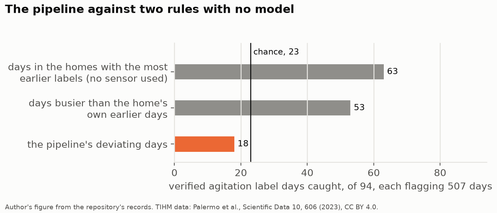
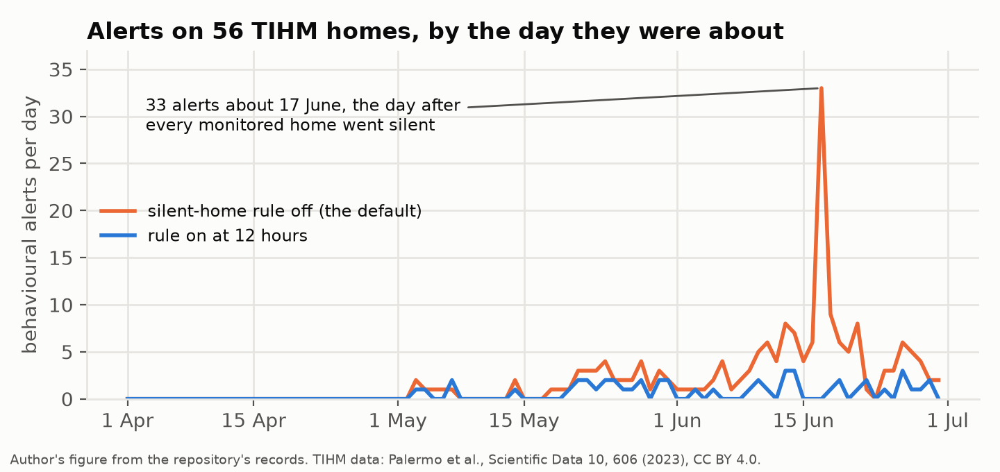
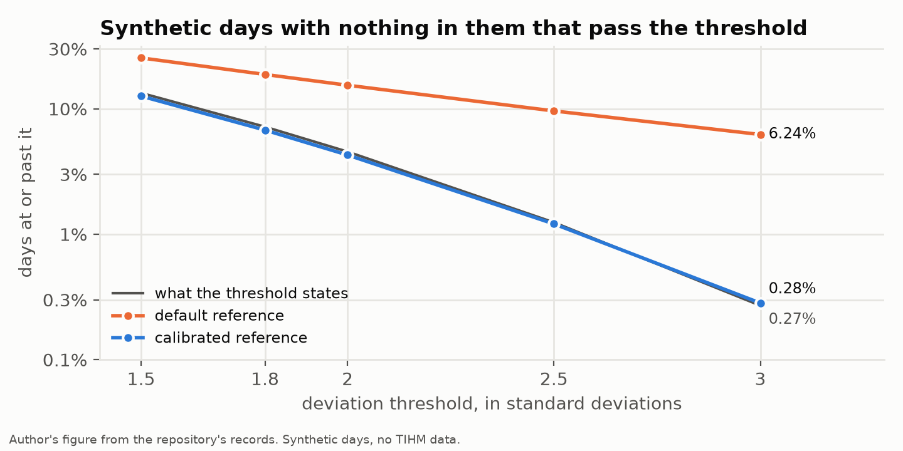
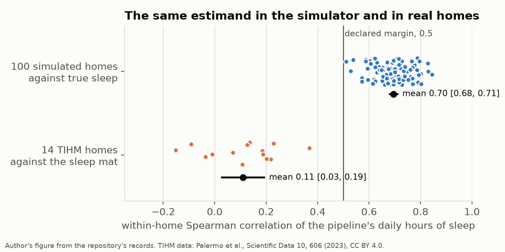

# A Home Monitoring Pipeline, From Its Simulator to 56 Homes of People Living With Dementia

*An open pipeline that worked in its own simulator, run on public data from the homes of people living with dementia and set beside the sleep mats under their mattresses.*

The pipeline in this article estimates, from motion sensors and door contacts alone, how many hours of each day a person spends asleep. In 100 simulated homes that estimate rose and fell with the true hours from one day to the next, at a mean within-home correlation of 0.70. In 14 homes of people living with dementia, set beside a mat under the mattress that the pipeline never sees, the same correlation was 0.11. Every alert the pipeline raises about sleep is built on that estimate.

Ambient monitoring of older people rests on an appealing idea. Put motion sensors in the rooms and contacts on the doors, learn what an ordinary day looks like for the person who lives there, and raise an alert when the days start to drift. Nothing has to be worn or filled in, and the aim is to notice a change in sleep or in night-time trips to the bathroom before it leads to a fall or an admission.

The idea is easy to demonstrate and hard to test. A demonstration needs a home, often a simulated one, in which a change was put in on purpose and then found. A test needs homes nobody designed, a measurement the system never sees, and a definition of success written down before anyone looks at the comparison. Reviews of the field keep pointing at the distance between the two. A systematic review of smart home and home health monitoring technologies for older adults kept 48 of 1,863 papers, rated the technology readiness of the field as low, and found that its strongest evidence came from a single randomised trial ([Liu et al., 2016](https://doi.org/10.1016/j.ijmedinf.2016.04.007)). A review published this year of sensors for the behavioural and psychological symptoms of dementia included 17 studies, described the evidence as small and predominantly observational, and concluded that it offers "limited clinimetric validation" ([Abdul Jabbar et al., 2026](https://doi.org/10.1159/000551112)).

This article follows one pipeline from the demonstration to the test. It is open source and it is mine. A state filter reads the sensor events and infers what the resident is doing, the day is summed into hours asleep, in the kitchen, in the bathroom and away from home, each day is compared with the person's own history, and an alert is raised when a day or a run of days falls outside it. In the simulator it was written against, it works. On the TIHM dataset, 56 homes of people living with dementia monitored in 2019 by a clinical team ([Palermo et al., 2023](https://doi.org/10.1038/s41597-023-02519-y)), it failed in four ways that could each be measured. Every number below that is not credited to a paper comes from a record in the [repository](https://github.com/DiogoRibeiro7/behavioral-sensing-research). The four comparisons the article rests on each ran under a protocol committed before the comparison was made, and where a number comes from a description chosen after a result had been read, the text says so.

## The pipeline and what the simulator said

The repository's simulator produces homes with a bedroom, a kitchen, a bathroom, a living room and a front door, a resident who sleeps, cooks, washes and goes out, and sensors that fire at rates written into the code. For the tests below the simulated homes were reduced to the sensors that report only when something happens, motion and door contacts, because that is all the TIHM homes have. The pipeline runs online, as it would in a deployment, and closes each day at local midnight.

The detection study injects a step change in sleep. From a fixed day the resident wakes 1.6 hours earlier and makes 1.2 more bathroom trips a night. On 400 simulated homes, the pipeline with its default settings raised an alert about the hours of sleep within 21 days of the change in 293 homes, 73% [69%, 77%], with a median delay of eleven days. The same homes left unchanged raised one in that window in 42, 11% [8%, 14%]. Over the 84 simulated days, the unchanged homes produced 0.0074 alerts about sleep per person-day, and the homes with the change 0.027.

A figure like 73% is easy to quote, and it is a result about the simulator. The simulated resident sleeps in a bedroom whose sensor fires at a rate I chose, wakes at times drawn from distributions I wrote down, and never leaves without the door contact noticing. The pipeline's observation model and the simulator were written with the same assumptions about how often sensors fire, so the simulator tests the pipeline only where those assumptions hold.

## Fifty-six real homes

The TIHM dataset holds the sensor events of 56 homes of people living with dementia between April and June 2019, together with alerts that the study's clinical monitoring team verified, among them alerts for agitation. The homes have motion sensors in or at the rooms and contacts on the entrance doors and the fridge. In 17 of them a mat under the mattress recorded each minute the person was in bed. The pipeline was run on every home with its declared settings and nothing fitted, over 2,850 monitored days. Its protocol was committed before any of its output was compared with a label. The labels themselves had been analysed before, and the protocol says so.

The pipeline raised 183 behavioural alerts, 156 of them about the hours of sleep. That is 0.064 alerts per monitored person-day [0.046, 0.084], and 0.055 for sleep alone. Set beside the 400 simulated homes above, in a comparison made after the run, that is more than seven times the rate in the unchanged homes and about twice the rate in those with the change. The reference the protocol declared, from an earlier and smaller simulator run, gives smaller ratios, of about five and a half and 1.7. A high rate would matter less if the alerts fell where the clinical team had confirmed something. They fell there no more often than on other days. Days with an alert were 5.3% of the 94 evaluable days with a verified agitation label and 8.5% of the other evaluable days, a difference of −3.2 percentage points [−7.9, +1.9]. The pipeline's deviation score ranked a home's label days above its other days with a concordance of 0.466 [0.410, 0.530], where a coin would score 0.5, and the interval includes it.

This is a hard comparison for the pipeline, and it is worth saying why. The labels are alerts that an earlier model raised and the monitoring team then verified, so a day without a label may still have held an episode, and most of the pipeline's alerts were about sleep. They are still the only behavioural events in the dataset that a clinical team confirmed, and an alert that reaches a carer has to be worth reading on days like these.

One yardstick for a detector's flags is a rule with no model, given the same number of flags. The pipeline flagged 507 days as deviating. Flagging the 507 days on which a home was busiest compared with its own earlier days caught 53 of the 94 agitation label days. A rule that reads no sensor at all, flagging the days in the homes whose earlier days had most often been labelled, caught 63. The pipeline caught 18, and flagging 507 days at random would be expected to catch 23.

*Figure 1. Verified agitation label days caught, out of 94, when each method flags the same 507 days. The vertical line is the expected catch of flagging days at random. Author's figure from the repository's records. TIHM data by Palermo et al. (2023), CC BY 4.0.*

The rule that reads no sensor did well because agitation in this cohort clusters. Of the days that followed a day with an agitation label, a quarter carried a label themselves, against 3% of other days, and five homes hold more than half of the agitation label days in the dataset. On this cohort that was worth more than anything the pipeline drew from the motion sensors. The sensors did carry information about these days, since the busy-day rule caught 53 of them, though labels that began as another model's alerts may favour rules that resemble it. The pipeline's daily summaries did not pass that information on to its flags. In a description made after the run, its deviating days were quiet ones, with a mean event-count score of −1.17, and the label days were busy ones, at +0.86. Part of that gap comes from the silent days of the next section, which the same description counts as 18% of the deviating days.

The label comparison says the alerts did not track what the clinical team confirmed, and it cannot say why. Each of the next three sections tests one link in the chain on its own, the sensors' silences, the threshold, and the feature every sleep alert is built on, under its own protocol.

## When a home goes quiet

Counted after the protocol's results had been read, 128 of the 2,850 monitored days were days on which no sensor of the home reported anything. The pipeline counted every one of them as a usable day and inferred a median of 23.8 hours of sleep on them. A filter that receives no evidence settles in the state that predicts no evidence, and in this observation model that state is sleep. The released activity file holds activations alone, with no sensor that reports on a schedule and no record of whether the equipment relaying the events was working, so the pipeline's sensor-health checks, which can call a sensor silent only when it has a declared reporting interval, had nothing to go on and raised no alert in the whole run.

The same description shows that on 16 June 2019 all 47 homes being monitored that day were silent. The dataset paper reports a failure of the data collection server, which it dates to 14 June, and in the released file the drop falls on 15 to 17 June. Treating these as one event is an inference. The alerts about 17 June, the day the data came back, were 33 of the run's 183.

*Figure 2. Behavioural alerts on the 56 TIHM homes, by the day each alert was about, with the silent-home rule off (the default) and on at twelve hours. Author's figure from the repository's records. TIHM data by Palermo et al. (2023), CC BY 4.0.*

The fix is an opt-in rule. When no sensor of a home has reported for a declared horizon, the home is treated as not observed from its last observation onwards, the silent time is left out of the day's summary, and a day that lost any time this way is not given to the baseline. An alert, repeated once every cooldown while the silence lasts, says that the home may be empty, its resident may need help, or nothing may be arriving. It does not choose between them, because nothing in the data can.

The rule was built from the TIHM finding, so TIHM could not also be its evidence. It was tested on 100 paired simulated homes under a protocol frozen before any of them had been run with the rule on. A 60-hour outage of a whole home raised 2.76 more behavioural alerts per home than the same home without it [2.36, 3.15]. The rule at twelve hours removed 3.04 alerts per home from the outage window [2.68, 3.39], which left the home with 0.28 fewer alerts in that window than without the outage [0.13, 0.44]. In 8,400 person-days of homes with no fault and no change it changed no alert. It also had a cost the protocol was built to catch. After an outage, fewer homes met the detection definition for a real change with the rule on, 76 of 100 against 91, and the pre-specified verdict on that comparison was inconclusive.

Set side by side after the run, the arms suggest that part of that cost is an artefact. With the rule off, an outage with no change behind it met the same detection definition in 38 of 100 homes, and with the rule on in 8. Some of the 91 were the outage being counted as a detection, and the 76 sit beside the 75 detected when there was no outage at all.

On TIHM, as a description and not a test, the rule at twelve hours removed 147 of the 183 alerts, added 13, and left 49. It refused 322 of the 2,850 monitored days, in 48 of the 56 homes, and raised 324 alerts that a home had gone silent, 145 of them inside the two stretches in which every monitored home was silent at once. The burden moved from one kind of alert to another, and fewer behavioural alerts on these homes are not by themselves better ones. In the simulated homes with no fault, no home was silent for twelve hours. The TIHM homes often were, and without the rule this pipeline reported those hours as the resident's sleep.

## A threshold that fires twenty-three times too often

The personal baseline flags a day whose deviation from the person's reference reaches 3, which on Gaussian days is a rate of 0.27%. The reference for a day is the median and spread of the earlier days, and once four of them fall on the day's own weekday, of those days alone, so early in a deployment it rests on a handful of values. A spread estimated from four values is often far too small, and dividing by a small number turns ordinary days into extreme ones.

The size of the effect was measured on synthetic days, independent Gaussian draws given to the baseline directly, with no change in them to find. That measurement was made before the threshold protocol was frozen, so it describes the problem and tests nothing. The default reference passed its threshold of 3 on 6.24% of days, 23 times the rate the threshold states, and on 16.0% of days with four days of the weekday behind it. A rate of 6.24% is what a Gaussian value passes at about 1.86 standard deviations. The configuration said three.

*Figure 3. Share of independent Gaussian days at or past each deviation threshold, against the rate each threshold states. The default reference passes 3 on 6.24% of days, the calibrated reference on 0.28%. Author's figure from the repository's records, drawn from synthetic days only.*

The fix is an opt-in calibrated reference. Its centre stays weekday-aware, its scale is pooled over every retained day, and the deviation is reported as the Gaussian value as unusual as the day is under a Student t whose degrees of freedom grow with the days behind it. On the same synthetic days it passes 3 on 0.28%, which says little, because it was designed on series of that kind. On the protocol's unchanged simulated homes, run after the freeze, it passed 3 on 0.35% of the evaluable days of sleep [0.28%, 0.44%].

A threshold that means what it says fires far less, at everything. At the declared thresholds the calibrated reference raised 3 false alerts in 400 simulated homes against the default's 342, and it caught the step change, net of false detections, in 0.04 of homes against 0.63. The fair comparison is at equal false alerts, so the protocol compared the two where the calibrated reference's operating curve had the default's 0.855 false alerts per home over 84 days. There it caught the step change, net of false detections, in 0.72 of homes against 0.63, a difference of +0.09 [+0.03, +0.16]. For a smaller step and for a gradual change it showed no gain.

On TIHM, as a description, the default reference passed 3 on 17.4% of the evaluable days of sleep and the calibrated one on 8.1%, thirty times the stated rate. With the silent-home rule also on, the two were 10.9% and 1.7%, so most of the calibrated reference's excess went with the days touched by silence. What remains, still six times the stated rate, may come from real days being far from the independent Gaussian draws the score assumes, which was not tested. That leaves the feature the threshold is applied to, which the next section sets beside a sleep mat.

## The number every detection is counted on

Every simulated detection in this article, and every detection in the repository's alerting studies, was counted on a single feature, the hours of a day the state filter gives to sleeping. Until this comparison, nothing in the repository had set that number beside a measurement of sleep. The sleep mats in 17 TIHM homes made it possible, because the pipeline never sees them.

The protocol for the comparison was frozen and pushed before any value of the pipeline was set beside any record of the mat, after two reviews, of the draft and then of its revision, which between them read the mat's file, the activity timestamps and the published TIHM records, and ran no pipeline on TIHM. The first found that the server failure of mid-June fell on days the mat had observed in 11 of the 14 homes with enough data, and the second that partly silent days at its edges were still in the analysis, so the primary analysis leaves out every day touched by a silence of the whole home of twelve hours or more. The primary criterion asks whether the pipeline's hours of sleep rise and fall with the mat's from one day to the next within a home, measured by the mean within-home Spearman correlation, against a margin of 0.5 declared in advance. If the two were jointly Gaussian within a home, at that correlation a day the pipeline called three standard deviations unusual would be expected to be about one and a half on the mat, so the threshold would mean half of what it says.

In the 14 homes with at least two weeks of matched days, the mean within-home correlation was 0.11 [0.03, 0.19]. Read the same way, at 0.11 a day the pipeline calls three standard deviations unusual would be expected to be about a third of one on the mat. The same estimand on 100 simulated homes, against the simulator's own record of when the resident slept, was 0.70 [0.68, 0.71]. The two distributions do not touch. The lowest simulated home was at 0.51 and the highest real home at 0.37.

*Figure 4. Within-home Spearman correlation between the pipeline's daily hours of sleep and a reference, for 100 simulated homes against the simulator's true sleep and for 14 TIHM homes against the sleep mat. Black points and bars are the means and their 95% intervals over homes. Author's figure from the repository's records. TIHM data by Palermo et al. (2023), CC BY 4.0.*

In level the two did not agree either. The pipeline gave 3.95 more hours of sleep a day than the mat [+1.54, +6.37], and 1.97 more than the mat's hours in bed [−0.01, +3.94], an interval that includes zero. Looked at home by home after the run, that mean is pulled up by one home, one of three in which the mat staged most of the time in bed as awake, where the pipeline's median was 19.9 hours of sleep a day against the mat's 2.2 hours asleep and 8.1 in bed. In the median home the pipeline gave about 2.4 hours more sleep a day than the mat. On the 19 silent days the mat observed, the pipeline's median was 23.8 hours and the mat's 8.4.

The deviations, which are what an alert is made of, agreed even less. When the mat's sleep was passed through the same personal baseline, the two sets of deviations correlated at 0.03 [−0.04, 0.11] over 12 homes, with the pipeline's baseline given its silent days too. On 46 days the pipeline's deviation reached 3. The mat's deviation pointed the same way on 31 of them and also reached 3 on 4.

Hour by hour, the sensors did see the night. Within a home, the activity in an hour and the mat's minutes in bed in the same hour correlated at −0.54 on average, much of it probably the plain rhythm of day and night. What the daily total did not carry was how one night differed from the same person's other nights, which is all a personal baseline looks at.

The low correlation is not explained by the mat's oddest homes or by its clock. Without the three homes in which the mat stages less than 60% of the time in bed as asleep, the mean correlation was 0.07 [−0.01, 0.16], though the gap in level narrowed to 2.55 hours [1.86, 3.23]. The dataset does not say which clock either file uses, so the mat's clock was moved an hour each way, which gave 0.10 with the clock an hour earlier and 0.13 with it an hour later. The mat is not a gold standard and its sleep stages are the device's own, so part of the disagreement may be the mat's. My reading of the rest, which these records do not test, is that what the pipeline calls sleep is mostly time without movement in view of a sensor, and that in these homes such time and sleep rise and fall for different reasons.

## What this does not show

This is one cohort, of people living with dementia, monitored for at most three months in 2019, with sleep mats in 17 of 56 homes and enough matched days in 14. The pipeline is mine and so is the simulator, so the gap between them is a gap in my work before it is anything else. The only system evaluated here is my own. No commercial product was tested, and nothing here is a finding about the equipment or software used to collect the TIHM data.

The mat is not validated here either, and its stages may be wrong. The alert-burden protocol was written after the labels had been analysed, which the protocol records, and the rule that beats the pipeline with no sensor may owe its advantage to how and where the clinical team chose to look, which is a property of the labels more than of the homes. The two fixes were tested only in simulation, and on TIHM they are described and not tested. Another pipeline, with another observation model or another reference, may not fail in the same places, which is why the generalisation at the end of the next section is labelled a conjecture.

## What a claim about ambient monitoring has to survive

Two of the four failures, the silent homes and the feature, were invisible in the simulator for one reason. The simulator and the model were written by the same hand, so they agreed about how often a sensor fires and what a quiet hour means. The threshold's failure could have been seen on any data by measuring its rate on days with no change in them, and until this work it had not been measured. The comparison with clinical labels could not be made in a simulator at all.

The silent home and the small spread also belong to the data and to arithmetic, so any system built on activations alone and a personal baseline has to answer them somehow. A stream of activations by itself cannot tell an empty home from data collection that has stopped, and a spread estimated from four days is often far too small, whoever estimates it. The other two, what a day's summary measures and whether its alerts beat a rule with no model, depend on the pipeline, and another pipeline may do better on both.

Anyone deciding whether to act on such a system's alerts or deploy it can ask for four numbers measured on real homes. Start with silence, and ask what the system reports on a day when nothing reports, and whether an outage alone can meet its own definition of a detection. Here a silent home was read as a sleeping one, the alerts after the largest outage were the biggest single cluster in the run, and in simulation an outage with no change behind it met the detection definition in 38 homes out of 100. The threshold comes next, with how often it fires on data known to hold no change. The feature under the alerts follows, set beside an independent measurement within each person from one day to the next, since a personal baseline only ever compares a person with themselves and a correlation across people or an agreement in averages cannot speak to that. Last, the alerts have to beat a rule with no model at the same number of flags. On this cohort the pipeline lost to a rule that reads no sensor at all.

The silent days and the threshold's rate on days with no change in them need only data a developer already holds. The other two need an independent measurement or a labelled cohort, which is where the real cost of an evaluation lies. All four need the claim written so that it can fail, with its margin fixed before the comparison. They also cut both ways. A pipeline that passed all four on real homes would deserve far more trust than the reviews above give the field as a whole.

I offer the following as a conjecture, untested here. It concerns published evaluations as a body and names no system, because any system can be put through the checks. Where a passive home monitoring method for older people has been validated only in simulation, in a staged home or in homes its developers designed, I expect that the within-person correlation between its core daily feature and an independent measurement in real homes would usually fall below the margin of 0.5 used here, and that its alerts, at a matched number of flags, would not reliably beat a rule with no model. Within-person comparisons in real homes their developers did not design, reported for most such methods and mostly above 0.5, would refute the first part. Comparisons at an equal number of flags on real cohorts, which the methods mostly win, would refute the second. A systematic review finding either kind of report to be common would refute the weaker claim beneath both, that these checks are rarely published at all.

## Reproducing it

The repository holds the code, the frozen protocols with their digests, the planning trials behind the sleep-mat protocol, the records each run wrote, and the results pages generated from those records, among them [the alert-burden results](https://github.com/DiogoRibeiro7/behavioral-sensing-research/blob/develop/docs/TIHM_ALERT_BURDEN_RESULTS.md), [the silent-home results](https://github.com/DiogoRibeiro7/behavioral-sensing-research/blob/develop/docs/SILENT_HOME_RESULTS.md), [the threshold-calibration results](https://github.com/DiogoRibeiro7/behavioral-sensing-research/blob/develop/docs/THRESHOLD_CALIBRATION_RESULTS.md) and [the sleep-mat results](https://github.com/DiogoRibeiro7/behavioral-sensing-research/blob/develop/docs/SLEEP_MAT_RESULTS.md). The figures in this article are drawn from the committed records by `articles/home-monitoring-tests/make_figures.py`, which also writes every number the article quotes from those records and their protocols, unrounded, to a file beside it.

The data are TIHM, by Palermo et al., *Scientific Data* 10, 606 (2023), under CC BY 4.0, and are available from Zenodo at [doi.org/10.5281/zenodo.7622128](https://doi.org/10.5281/zenodo.7622128). As the dataset's GitHub repository asks, Surrey and Borders Partnership NHS Foundation Trust and Howz are acknowledged. Neither had any part in this analysis, and nothing in it is a statement about either. The dataset is not redistributed in the repository.

## References

Abdul Jabbar, K., Ting, S. Q., Choo, S. Y., Munro, Y. L., Tan, S. M. and Rawtaer, I. (2026). Can sensor technologies accurately detect and monitor behavioural and psychological symptoms of dementia? A systematic review. *Dementia and Geriatric Cognitive Disorders Extra*, 16(1), 21-45. [https://doi.org/10.1159/000551112](https://doi.org/10.1159/000551112)

Liu, L., Stroulia, E., Nikolaidis, I., Miguel-Cruz, A. and Rios Rincon, A. (2016). Smart homes and home health monitoring technologies for older adults: A systematic review. *International Journal of Medical Informatics*, 91, 44-59. [https://doi.org/10.1016/j.ijmedinf.2016.04.007](https://doi.org/10.1016/j.ijmedinf.2016.04.007)

Palermo, F., Chen, Y., Capstick, A., Fletcher-Lloyd, N., Walsh, C., Kouchaki, S., True, J., Balazikova, O., Soreq, E., Scott, G., Rostill, H., Nilforooshan, R. and Barnaghi, P. (2023). TIHM: An open dataset for remote healthcare monitoring in dementia. *Scientific Data*, 10, 606. [https://doi.org/10.1038/s41597-023-02519-y](https://doi.org/10.1038/s41597-023-02519-y)
