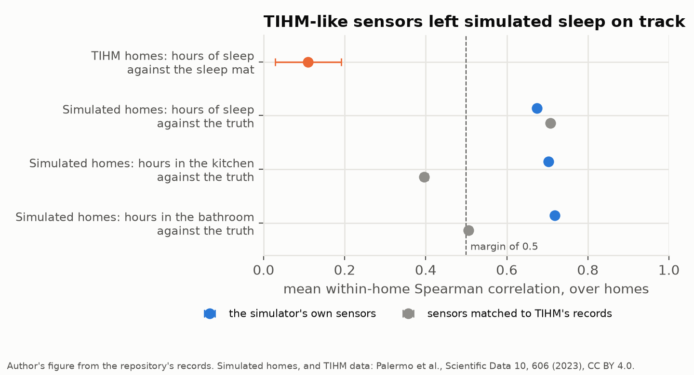
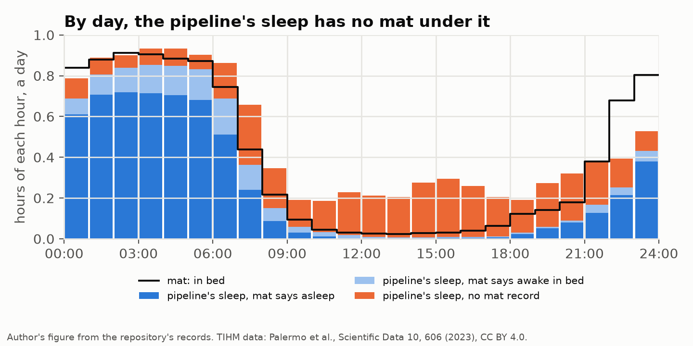
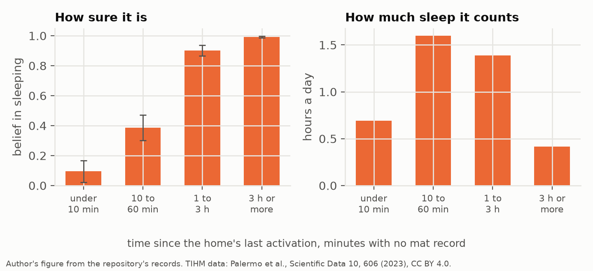
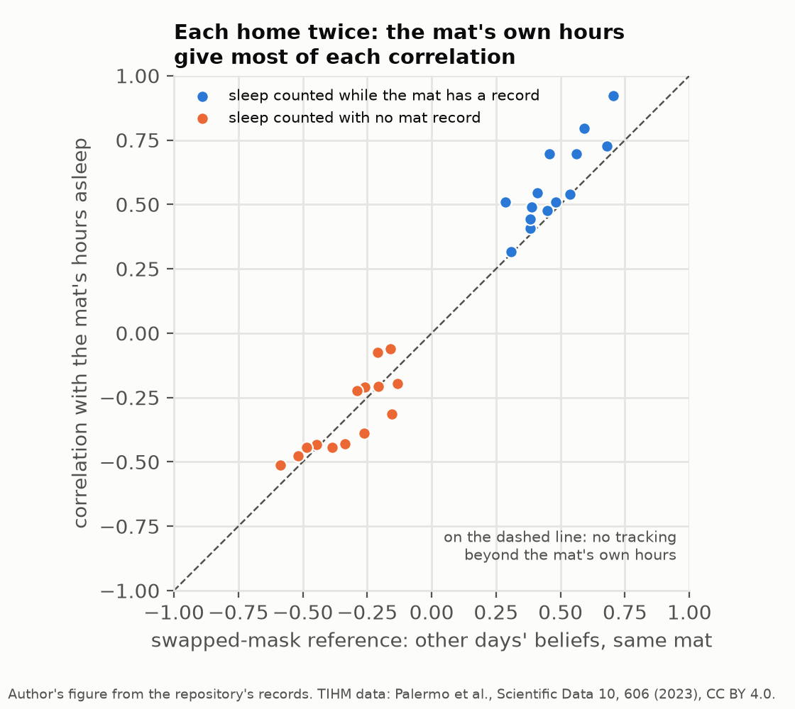

# Inferred Sleep Against a Sleep Mat: Calibrating the Simulator, Then Decomposing the Disagreement

*An open home monitoring pipeline counted four more hours of sleep a day than the mats under its residents' mattresses. Making its simulator's sensors look like the real ones left simulated sleep on track; setting its belief beside the mat minute by minute showed where the extra hours sit.*

In the [previous article](https://medium.com/@diogo-ribeiro-1975/a-home-monitoring-pipeline-from-its-simulator-to-56-homes-of-people-living-with-dementia-e04ce8361cf8) a pipeline that infers, from motion sensors and door contacts, how many hours of each day a person sleeps was set beside an under-mattress sleep mat in 14 homes of people living with dementia. Within a home, from one day to the next, the two moved together at a mean Spearman correlation of 0.11 [0.03, 0.19]. In 100 homes of the simulator the pipeline was written against, the same correlation with the simulator's own record of sleep was 0.70 [0.68, 0.71]. On average the pipeline also gave 3.95 hours a day more sleep than the mat. Every alert it raises about sleep is built on that daily number, so a disagreement this large says something about what the number measures.

A gap between a simulator and real homes has two broad explanations. The simulated sensors may be too clean, so that the inference only works on data nobody will ever collect. Or the real days may hold something the simulator never produces, whatever the sensors look like. The two call for different work, and they can be separated. This article does it in two steps, both built on the same open code and the same public data, the TIHM dataset of 56 homes monitored in 2019 ([Palermo et al., 2023](https://doi.org/10.1038/s41597-023-02519-y)). The first step changes the simulator's sensors until they look more like TIHM's and asks whether the simulated sleep then breaks. The second leaves the simulator behind and asks, minute by minute in the real homes, where the pipeline's sleep and the mat's part company.

The first step ran under a protocol frozen before any of its 400 simulated homes was run with the new sensors. The second describes a comparison that had already been read; its plan was frozen before any of it was computed, but it tests nothing. Every number below that is not credited to a paper comes from a record in the [repository](https://github.com/DiogoRibeiro7/behavioral-sensing-research).

## The simulator's sensors were too clean

The simulator places a resident in a home with a bedroom, a kitchen, a bathroom, a living room and a front door, decides what that resident does through each day, and then lets each room's motion sensor fire at a rate that depends on whether the resident is there and how active they are. The rates are written into the code. Nothing in that design had ever been compared with a real sensor log, and TIHM's activity file is one.

Read for its sensors alone, it shows three things the simulator did not do. No two activations of one motion sensor in TIHM are less than 61 seconds apart; the shortest gap is exactly 61 seconds in the bathroom, the bedroom, the hallway, the kitchen and the lounge, which looks like a sensor that ignores movement for a minute after it fires. The door and fridge contacts log most openings twice, with 44% to 59% of their gaps under a minute and a median of 7 to 9 seconds between the two rows. Third, the rooms interleave: in the median TIHM home 63% of motion activations follow an activation of another room, where the simulator gave 7%. Fifty-four of the 56 homes have a hallway sensor in the log, and the simulator had none; it also fired 241 times a day in the living room of its median home, against TIHM's 77.

I wrote a sensor profile that can impose these properties on the simulator's homes after their days have been drawn, so the same resident lives the same day under either set of sensors. It has a hold-off, a hallway sensor that reports at each change of room, contact openings logged as two rows a few seconds apart, and a spill-over rate at which every motion sensor of a room the resident is not in fires while the resident is at home and awake. The hallway rule and the spill-over are one explanation of the interleaving among several; more movement between rooms, or a second person at home, would fit the same statistics. The hold-off was set to TIHM's 61 seconds. The spill-over rate, and a multiple of the in-room rates, were chosen on a grid as the point whose simulated records came nearest TIHM's on eight summary statistics: the activations a day in each of five rooms, the share of activations that follow another room's, the bedroom's activations at night, and the median gap between activations of one sensor less than ten minutes apart. Nearness was the sum of squared log ratios of the medians over homes.

This is the idea behind the method of simulated moments ([McFadden, 1989](https://doi.org/10.2307/1913621)), without its asymptotics: choose the simulator's parameters so that what it produces matches what was observed, on the statistics you can measure. The minimum turned out to be flat. The nearest grid point, spill-over at two activations an hour per room with the in-room rates left unchanged, and the second-nearest, at two and a half, were almost equally near, so the second was run as well, on a hundred of the homes, to see whether the choice mattered.

The chosen profile brought half of the eight statistics within about a tenth of TIHM's and left the others off. The share of activations after another room's rose to 57% and the median short gap to 137 seconds, against TIHM's 153, while the living room still fired 158 times a day, twice TIHM's rate, and the bedroom at night barely moved.

The protocol fixed what would be read before any of the study's homes was run with the new sensors. The detection of a step change in sleep, the result the pipeline's simulated validation rests on, had to lose no more than a tenth of the homes, with the interval for the difference above −0.10. The hours of sleep had to keep following the simulator's truth at a mean within-home correlation above 0.5, the margin the sleep-mat comparison had used. And the near-zero kitchen and bathroom hours the pipeline gives in TIHM homes would count as reproduced if the matched homes' daily medians fell below a quarter of an hour in the kitchen and three minutes in the bathroom. The 400 simulated homes of the published threshold study were run again. Under the simulator's own sensors all 800 runs, two arms per home, reproduced the published alerts home by home, which is the check that the rerun was the same experiment.

## What the realistic sensors changed, and what they did not

The detection survived, and in fact improved. Net of the false detections the pipeline makes in the same homes with nothing changed, it found the step change in 0.70 of homes against 0.63, a paired difference of +0.07 [+0.01, +0.13], at the cost of more false alerts, 1.02 a home against 0.86 over twelve weeks. On the first hundred homes, the second-nearest profile gave a gain of +0.14 [+0.02, +0.26].

The hours of sleep kept following the truth. Their mean within-home correlation was 0.71 [0.70, 0.71] under the matched sensors, against 0.67 under the simulator's own; the 0.70 above comes from the sleep-mat comparison's 100 simulated homes, run with the ten-minute step used on TIHM rather than the threshold study's fifteen, and the two are close. The sensor properties matched here do not by themselves turn a sleep estimate that tracks into one that does not. The kitchen and bathroom estimates were less robust, falling from 0.70 to 0.40 and from 0.72 to 0.51.

Their levels fell further. The pipeline's pooled daily median of bathroom activity dropped to 0.01 hours, against a true 0.28 and TIHM's 0.00, and kitchen activity to 0.68 hours, against a true 1.96 and TIHM's 0.06, so by the protocol's definition the collapse was not reproduced: the bathroom met its ceiling, the kitchen did not. The mechanism is visible in the beliefs. The default observation model expects the motion sensor of a room the resident is not in to stay almost silent, so every spill-over activation is strong evidence against being in the kitchen or the bathroom, and after a step in which only the kitchen's motion sensor fired, the pipeline's belief in kitchen activity fell from 0.71 under the simulator's sensors to 0.28. In the simulator, the sensors alone are enough to produce the bathroom's collapse, and only part of the kitchen's.

The conclusion is narrow: matching moments rules out only what was matched. The simulator now has TIHM's hold-off, a hallway, paired contacts and roughly TIHM's room interleaving, and its sleep estimate still follows the truth. Whatever makes the estimate fail to follow the mat in real homes, it is not those properties acting alone on the simulator's residents. That pointed the next step away from the simulator and towards the real days.

## Setting the belief beside the mat

The pipeline does not output a number of hours directly. Every ten minutes it updates a belief over seven states (away, active at home, inactive at home, sleeping, awake in bed, in the bathroom, in the kitchen), and each step's belief is taken to describe the ten minutes since the step before. A day's hours of sleep are the sum, over its steps, of the belief in sleeping times the length of the interval, which makes the daily number decomposable. Spread each step's belief over the minutes its interval covers, and every minute of a day carries a small amount of the pipeline's sleep, which can be set beside whatever else is known about that minute.

The mat records a minute at a time, and the dataset paper describes its readings as coming once a minute while the person is in bed, on top of the device ([Palermo et al., 2023](https://doi.org/10.1038/s41597-023-02519-y)). Each record carries a sleep stage computed by the device, awake, light, deep or REM. A minute therefore falls into one of three classes: the mat says asleep, the mat says awake in bed, or the mat has no record. The third class is the one to be careful with. On the days used here the mat also recorded on the day before and the day after, so the device was in service, but a minute with no record may still be an empty bed, a person asleep in a chair, someone lying away from the sensor, or a mat that stopped recording for a while. A review of the mat's file on its own found 75 stretches of three hours or more without records beginning between 22:00 and 05:00, 61 of them in one home. Nothing in the file separates these cases, so the text below says "no mat record" and not "out of bed".

The plan for this description was written after the sleep-mat comparison had been read, revised after independent review, and frozen and pushed before any value of the description was computed; only its checks had been rehearsed. It fixed the homes and days, the 14 homes and 705 days of the comparison's primary analysis, which leaves out any day touched by a silence of the whole home of twelve hours or more. It fixed every quantity to be computed, under two clocks for the mat, and the checks the run had to pass before reporting anything. The first of those checks matters most. The minute-by-minute spreading reproduced every matched day's hours in every state, as the pipeline's own daily summary computes them, to within 1.4 × 10⁻¹³ hours, and with the mat's clock as recorded the decomposition gives back the comparison's published 3.95 hours exactly.

## Where the extra hours sit

With the mat's clock as recorded, the pipeline counted 11.346 hours of sleep a day and the mat 7.393, each a mean over the 14 homes. The difference of 3.953 hours splits exactly into three parts. The pipeline counted 4.096 hours of sleep in minutes with no mat record and 1.338 hours while the mat said the person was awake in bed, and it did not count 1.481 hours of the sleep the mat recorded: 4.096 + 1.338 − 1.481 = 3.953.

Most of the first part is daytime. Of the 4.10 hours counted with no mat record, 3.20 fall between 07:00 and 22:00. The figure shows the day hour by hour. Through the night the pipeline's sleep sits largely on minutes the mat also calls sleep, with a band counted while the mat says awake. From ten in the morning to six in the evening the mat records, on average, under four minutes in bed an hour, and the pipeline still puts eleven to eighteen minutes of every hour into sleep. The bars at midnight and at 23:00 are lower by construction, because the pipeline's daily summary counts the ten minutes across midnight in neither day.

Means over 14 homes hide how uneven the homes are. The median home's excess over the mat was 2.38 hours a day. One home's was 17.20, of which 12.40 hours were counted with no mat record; the pipeline put that resident asleep for most of every day. Without the three homes in which the mat stages less than 60% of the time in bed as asleep, that home among them, the excess falls to 2.55 hours and the sleep counted with no record to 3.36, so the pattern does not depend on them.

What the pipeline believes in each class says the same thing from the other side. While the mat said asleep, its belief in sleeping averaged 0.81, with most of the rest on being inactive at home. While the mat had no record, the belief was spread out, 0.42 on inactive at home, 0.28 on sleeping, 0.17 on active at home and 0.10 on away. Averaged over those minutes, a modest share of belief sits on sleep, but the minutes are many, and the next section shows that almost half of the hours they add up to come where the belief is close to certain.

## The pipeline reads a quiet home as a sleeping one

What decides that share is how long the home has been silent. For each minute with no mat record, the context is the sensor that last reported before the step whose belief covers that minute, and how long before. The belief in sleeping averaged 0.10 within ten minutes of an activation, 0.39 from ten minutes to an hour, 0.90 from one to three hours and 0.99 after three. Of the 4.10 hours counted with no record, 2.29 fall within the first hour of quiet, where the belief is modest but the minutes are many, and the rest come later, when the pipeline is nearly certain.

By the sensor that last reported, 1.40 hours a day of that sleep follow the bedroom's motion sensor, with a mean belief of 0.56, and 1.07 follow an exit door, front or back, 0.79 of them an hour or more after it. Neither can be read only one way. Time after the bedroom sensor with no mat record could be someone resting in the bedroom away from the mat, a nap the device did not log, or a mat that stopped; time after a door could be a resident who went out, but a door contact has no direction, and the same record follows someone coming in and sitting down, or a visitor leaving. What the pipeline does is clear even where the person's state is not. When the sensors stop, its belief moves to sleep, and the longer they stop the surer it becomes.

Wrist actigraphy has the same weakness for the same reason. It infers sleep from the absence of movement, and against polysomnography it detects sleep well and wake poorly: in one comparison of the two its sensitivity for sleep was 0.965 and its specificity, the share of wake it recognised as wake, was 0.329 ([Marino et al., 2013](https://doi.org/10.5665/sleep.3142)). Quiet wakefulness looks like sleep to a device that only sees stillness. A pipeline built on motion sensors in rooms works like an actigraph the size of a house that nobody wears, and it misreads quiet wakefulness in the same way, with the added difficulty that a silent house may hold nobody at all.

## A correlation the mat produces by itself

The decomposition also says which part of the pipeline's sleep carries the day-to-day signal. Split the pipeline's daily sleep into the part counted while the mat has a record and the part counted when it does not, and correlate each with the mat's hours of sleep within each home. The first part correlates at 0.576 on average, the second at −0.315. It is tempting to read the first number as tracking: within the mat's own hours, the pipeline's sleep follows the mat well.

It does not show that. The part counted on the mat is a sum over minutes the mat itself chose. On a night the mat records ten hours in bed there are more minutes to sum over than on a night it records six, so the sum rises with the mat's hours even if the pipeline's belief in every minute were the same constant, carrying no information about that night at all. The negative correlation of the other part is the same arithmetic in reverse. Pearson described this kind of correlation in 1897, for ratios that share a denominator ([Pearson, 1897](https://doi.org/10.1098/rspl.1896.0076)); here the shared component is the mat's own record of time in bed.

The plan therefore fixed a reference that keeps the shared component and removes the tracking. Each day's minute-by-minute belief is set beside every other day's mat, through every cyclic shift of the days, and the same correlation is computed and averaged over the shifts. If the pipeline knew nothing about a particular night beyond what it knows about nights in general, the correlation on the true pairing would be expected to equal this reference. For the part counted on the mat the reference is 0.473, and the true pairing beats it by +0.10 [+0.05, +0.15] on average, by more than zero in all 14 homes. For the part counted with no record the reference is −0.317, and the true pairing beats it by +0.00 [−0.05, +0.05].

So there is a signal beyond the reference, positive in every home, and it sits in the minutes the mat records, which are mostly the night's. Within them, the pipeline's belief follows the night's sleep a little beyond what the length of the night explains. Outside them, its sleep follows the mat no better than any other day's would.

## Which part moves the daily number

A personal baseline compares each day's number with the same person's earlier days, so what matters for an alert is not the level of the daily hours but what moves them from day to day. The day-to-day variance of the pipeline's hours of sleep splits exactly into the covariance of the total with each part, and the two shares sum to one. Averaged over homes, 0.68 [0.54, 0.83] of that variance moves with the sleep counted when the mat has no record, and 0.32 with the sleep counted on the mat. Without the three homes the mat stages mostly awake, the first share rises to 0.79.

Taken together, these give the 0.11 a description that the simulator could not have provided. The pipeline's daily sleep is a mixture of two components: one counted while the mat records, mostly at night, which tracks the mat a little, and one counted when it has no record, mostly by day, which tracks it no better than the reference. The second is the larger source of variation, so the night's signal is diluted by quiet hours counted as sleep. The pipeline's daily hours correlate with the day's number of sensor activations at −0.71. That is partly built in, since sleep is inferred from the absence of activations, but it describes what the number largely reflects in these homes: how quiet the day was.

The simulator is not built to produce this. Its residents are always somewhere a sensor can see, and a resident who is in and awake, even one sitting still for hours before lunch, keeps the room's sensor firing several times an hour, so a simulated home is never silent while someone is up. It has no naps, and no home that goes quiet for an hour for reasons the plan has no state for. Matching the sensors could not supply days the generator does not generate.

## Two clocks

One more thing moves the minute-level picture, though it barely moves the daily one. The sleep-mat comparison had found hourly activity most opposed to the mat's time in bed when each mat record was counted an hour later than its timestamp, narrowly, at −0.58 against −0.54 as recorded. That is what a mat clock in UTC would produce in a British summer, so the plan computed everything under both clocks. With the mat an hour later, the sleep the pipeline counts with no record but within 30 minutes of a mat record falls from 0.73 to 0.32 hours a day, the mat's sleep the pipeline does not count falls from 1.48 to 0.97 hours, and the on-mat part beats its reference by +0.18 [+0.09, +0.26], above zero in 12 of the 14 homes.

That is consistent with a mat clock an hour behind. On its own, it is also consistent with a pipeline that is late to call bedtime and late to call waking, since both would put pipeline sleep just past the edges of the mat's nights. The data cannot separate the two, and the main finding does not depend on it. Under the shifted clock the daily correlation with the mat's sleep is 0.15 against 0.11, and the share of daily variance moving with the sleep counted with no mat record is 0.70, against 0.68 as recorded.

## What carries over

Some of this is specific to one pipeline and one cohort. The method is not, and it has three parts that I would now apply to any passive monitoring feature before trusting its validation.

The first is to calibrate the simulator's observation model against whatever can be measured in real sensor logs before using simulated detection as evidence, and to be precise about what the calibration rules out. Here it ruled out the hold-off, the hallway, the paired contacts and the room interleaving as causes of the sleep failure acting alone on the simulator's residents, and it reproduced the bathroom's collapse, which made it worth doing. It could not rule out anything about behaviour, and a matched simulator that passes is not evidence that the real homes will.

The second is to decompose a disagreement with an exact identity before modelling it. A daily number that is a sum over time can be split over time, and the split has to add back to the published difference to the last decimal. Most of the explanation above came from asking where in the day the extra hours sit, and from the four hours that turned out to sit where the reference has no record.

The third is to suspect any correlation computed on a subset that the reference itself selected. Conditioning the pipeline's sleep on the mat's minutes made it correlate with the mat at 0.58 for reasons that had little to do with the pipeline. A reference that keeps the mask and breaks the pairing, here by swapping days, is cheap to compute, and it turned a convincing number into a small one that survives in every home.

For this pipeline the implication is specific. As far as the mat can tell, its sleep feature behaves in these homes more like a measure of quiet than of sleep, so an alert about a change in sleep is likely to be an alert about a change in how quiet the days were. Telling rest by day, absence and sleep apart may need information these event sensors do not give, such as the direction of a door's crossing or a sensor in the bed, or a model that gives more weight to the resident being out after a silence that follows an exit door. That is a conjecture, and a change built on it would need its own frozen test on homes other than these 14, which have now been read too closely to test anything on.

I add a second conjecture, also untested, about methods of this kind in general. For pipelines that infer sleep in older people's homes from motion and door events alone, I expect that most of the day-to-day variation in inferred sleep would come from time a bed sensor does not record as in bed, and that the part a bed sensor does record would track it only modestly once its own length is accounted for. Published within-person comparisons in real homes, in which the inferred sleep outside a bed sensor's records is small or tracks it, would refute this.

## What this does not show

The mat is not a gold standard. Its stages are the device's own and are not validated here, and a minute without a record may be a person asleep somewhere else, so none of this says which of the pipeline and the mat is right about any particular minute. The 14 homes are homes of people living with dementia in one study in one country, the pipeline ran at its default settings, and the minute-level description was planned after the daily comparison had been read; it describes, it does not test. The matched-sensor result is a statement about the simulator. And the pipeline is mine, so another pipeline, with another observation model, may not fail in the same places, although the arithmetic of quiet hours read as sleep is not peculiar to it.

## Reproducing it

The repository holds the sensor profile, the frozen matched-sensor protocol with its planning record, the frozen plan of the minute-level description, the records both runs wrote and the pages generated from them, [the matched-sensor results](https://github.com/DiogoRibeiro7/behavioral-sensing-research/blob/develop/docs/MATCHED_SENSORS_RESULTS.md) and [the sleep-gap results](https://github.com/DiogoRibeiro7/behavioral-sensing-research/blob/develop/docs/SLEEP_GAP_RESULTS.md). The figures here are drawn from the committed records by `articles/sleep-mat-decomposition/make_figures.py`, which also writes every repository number the article quotes, unrounded, to a file beside it. The [first article](https://medium.com/@diogo-ribeiro-1975/evaluating-a-home-monitoring-alert-pipeline-on-the-tihm-dementia-dataset-f763cebd96f1) in this series ran the pipeline's alerts on the TIHM homes, and the [second](https://medium.com/@diogo-ribeiro-1975/a-home-monitoring-pipeline-from-its-simulator-to-56-homes-of-people-living-with-dementia-e04ce8361cf8) tested its silences, its threshold and its sleep feature.

The data are TIHM, by Palermo et al., *Scientific Data* 10, 606 (2023), under CC BY 4.0, available from Zenodo at [doi.org/10.5281/zenodo.7622128](https://doi.org/10.5281/zenodo.7622128). As the dataset's GitHub repository asks, Surrey and Borders Partnership NHS Foundation Trust and Howz are acknowledged. Neither had any part in this analysis, and nothing in it is a statement about either. The dataset is not redistributed in the repository.

## References

Marino, M., Li, Y., Rueschman, M. N., Winkelman, J. W., Ellenbogen, J. M., Solet, J. M., Dulin, H., Berkman, L. F. and Buxton, O. M. (2013). Measuring sleep: Accuracy, sensitivity, and specificity of wrist actigraphy compared to polysomnography. *Sleep*, 36(11), 1747-1755. [https://doi.org/10.5665/sleep.3142](https://doi.org/10.5665/sleep.3142)

McFadden, D. (1989). A method of simulated moments for estimation of discrete response models without numerical integration. *Econometrica*, 57(5), 995-1026. [https://doi.org/10.2307/1913621](https://doi.org/10.2307/1913621)

Palermo, F., Chen, Y., Capstick, A., Fletcher-Lloyd, N., Walsh, C., Kouchaki, S., True, J., Balazikova, O., Soreq, E., Scott, G., Rostill, H., Nilforooshan, R. and Barnaghi, P. (2023). TIHM: An open dataset for remote healthcare monitoring in dementia. *Scientific Data*, 10, 606. [https://doi.org/10.1038/s41597-023-02519-y](https://doi.org/10.1038/s41597-023-02519-y)

Pearson, K. (1897). Mathematical contributions to the theory of evolution: On a form of spurious correlation which may arise when indices are used in the measurement of organs. *Proceedings of the Royal Society of London*, 60, 489-498. [https://doi.org/10.1098/rspl.1896.0076](https://doi.org/10.1098/rspl.1896.0076)
