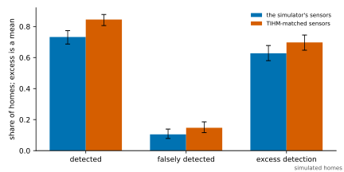
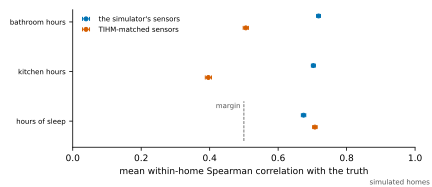
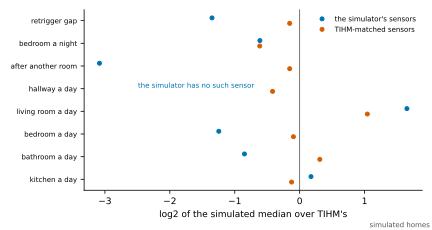

# The simulator's homes with TIHM's sensors: results

The frozen [matched-sensor protocol](MATCHED_SENSORS_PROTOCOL.md), run as declared. This page is generated entirely from `artifacts/matched_sensors/matched-sensors.json` by `sensor_modeling.datasets.matched_sensors_summary.render_page`, and a test checks that the committed page is exactly that rendering.

**Status: pre-specified simulation study. The profile's hold-off is TIHM's, and two of its settings were chosen to match eight moments of TIHM's sensor records, in the planning record; its form is this project's, written after a pilot. No pipeline output under spill-over or under the chosen profile has been read for any home. Nothing in the pipeline is changed or fitted. Every result is a statement about the simulator.**

- **Protocol digest.** `c2910ff274040cacb4726df7bb7bd770602b9b8d82ddc7313ebdbc8f48b34921`.
- **Run.** Commit `e7d41db`, recorded 2026-10-09T21:27:38.974663+00:00.
- **Homes.** 400, each in both arms under the standard and the matched profiles.
- **Code changed since the freeze.** None.

## The check

All 800 runs of the standard profile raised, home by home and arm by arm, the alerts the published threshold-calibration record gives under the default reference.

## The criteria

| Criterion | Reading | What decided it |
| --- | --- | --- |
| C1 The detection survives the matched profile | **survives** | E1 = +0.07 [+0.01, +0.13]; margin -0.10 |
| C2 The hours of sleep still follow the truth | **follows** | matched E4 = 0.71 [0.70, 0.71] over 400 homes; margin 0.50 |
| C3 The kitchen and bathroom collapse is reproduced | **not reproduced** | pooled-day medians 0.68 [0.67, 0.68] h in the kitchen and 0.010 [0.010, 0.010] h in the bathroom; ceilings 0.25 and 0.05 h |

## Detection of the step change (E1, E2)

| Profile | Detected | Falsely detected | Excess detection |
| --- | --- | --- | --- |
| standard | 293 (73.3% [68.7, 77.4]) | 42 (10.5% [7.9, 13.9]) | 0.63 [0.58, 0.68] |
| matched | 338 (84.5% [80.6, 87.7]) | 59 (14.8% [11.6, 18.6]) | 0.70 [0.65, 0.75] |

Matched minus standard, a mean over 400 homes of a paired difference: excess detection +0.07 [+0.01, +0.13], detected +0.11 [+0.06, +0.16], falsely detected +0.04 [+0.00, +0.08]. Median delay of a detection, in days: standard 11.0 [10.0, 11.0], matched 10.0 [9.0, 10.0].

Counting only alerts of a decrease:

| Profile | Detected | Falsely detected | Excess detection |
| --- | --- | --- | --- |
| standard | 293 (73.3% [68.7, 77.4]) | 26 (6.5% [4.5, 9.4]) | 0.67 [0.62, 0.72] |
| matched | 338 (84.5% [80.6, 87.7]) | 39 (9.8% [7.2, 13.1]) | 0.75 [0.70, 0.79] |

## False alerts (E3)

In the stable arm every behavioural alert is a false one. Alerts about each feature are per person-day, over 33,600 person-days.

| Profile | False alerts per home | `away_hours` | `sleeping_hours` |
| --- | --- | --- | --- |
| standard | 0.86 [0.75, 0.97] | 0.0027 [0.0020, 0.0035] | 0.0074 [0.0064, 0.0086] |
| matched | 1.02 [0.91, 1.14] | 0.0021 [0.0015, 0.0028] | 0.0101 [0.0088, 0.0113] |

## How each feature follows the truth (E4)

The mean over homes of the within-home Spearman correlation between the pipeline's value and the simulator's truth on each profile's matched days of the stable arm.

| Feature | Standard | Matched | Matched minus standard |
| --- | --- | --- | --- |
| `sleeping_hours` | 0.67 [0.67, 0.68] | 0.71 [0.70, 0.71] | +0.03 [+0.03, +0.04] |
| `kitchen_activity_hours` | 0.70 [0.70, 0.71] | 0.40 [0.39, 0.41] | -0.31 [-0.32, -0.30] |
| `bathroom_activity_hours` | 0.72 [0.71, 0.72] | 0.51 [0.50, 0.51] | -0.21 [-0.22, -0.20] |

## Hours a day (E5)

Pooled-day medians over every matched day of every home. The truth is on the standard profile's matched days.

| State | Truth | Standard | Matched |
| --- | --- | --- | --- |
| `away` | 1.30 | 0.89 | 0.49 |
| `home_active` | 4.10 | 3.50 | 2.29 |
| `home_inactive` | 7.75 | 8.64 | 11.94 |
| `sleeping` | 8.21 | 7.91 | 7.40 |
| `bed_awake` | 0.23 | 0.53 | 0.49 |
| `bathroom_activity` | 0.28 | 0.24 | 0.01 |
| `kitchen_activity` | 1.96 | 1.64 | 0.68 |

The mean over homes of each home's mean difference, pipeline minus truth, in hours:

| Feature | Standard | Matched |
| --- | --- | --- |
| `sleeping_hours` | -0.19 [-0.20, -0.18] | -0.69 [-0.70, -0.68] |
| `kitchen_activity_hours` | -0.33 [-0.33, -0.33] | -1.27 [-1.27, -1.26] |
| `bathroom_activity_hours` | -0.08 [-0.08, -0.08] | -0.26 [-0.26, -0.26] |

## What became of the verdicts (E7)

In the stable arm. A verdict held back at the gate is one whose day's coverage times attribution was under the confidence gate.

| Profile | Change verdicts | Raised an alert | Held back at the gate | Held back otherwise | Burst notices | Attribution at a day's close |
| --- | --- | --- | --- | --- | --- | --- |
| standard | 342 | 342 | 0 | 0 | 0 | 0.635 [0.635, 0.635] |
| matched | 422 | 409 | 0 | 13 | 0 | 0.479 [0.479, 0.479] |

## The belief after a room's activations alone (E8)

In the stable arm, the mean belief at the end of the steps whose window held motion activations of one room's sensor and of no other motion sensor.

| After kitchen alone | Steps | `away` | `bathroom_activity` | `bed_awake` | `home_active` | `home_inactive` | `kitchen_activity` | `sleeping` |
| --- | --- | --- | --- | --- | --- | --- | --- | --- |
| standard | 260,424 | 0.01 | 0.00 | 0.00 | 0.03 | 0.14 | 0.71 | 0.10 |
| matched | 63,364 | 0.03 | 0.00 | 0.01 | 0.01 | 0.29 | 0.28 | 0.37 |

| After bathroom alone | Steps | `away` | `bathroom_activity` | `bed_awake` | `home_active` | `home_inactive` | `kitchen_activity` | `sleeping` |
| --- | --- | --- | --- | --- | --- | --- | --- | --- |
| standard | 65,194 | 0.03 | 0.27 | 0.01 | 0.00 | 0.16 | 0.00 | 0.53 |
| matched | 43,057 | 0.05 | 0.01 | 0.02 | 0.00 | 0.38 | 0.00 | 0.55 |

## The sensor records beside TIHM's (E6)

Medians over homes. TIHM's are from the planning record; the two profiles' are from the stable records of the study's homes.

| Moment | TIHM | Standard | Matched |
| --- | --- | --- | --- |
| kitchen motion activations a day | 86.57 | 97.74 | 79.45 |
| bathroom motion activations a day | 29.04 | 16.11 | 36.02 |
| bedroom motion activations a day | 41.00 | 17.29 | 38.37 |
| living-room motion activations a day | 76.60 | 240.77 | 157.81 |
| hallway motion activations a day | 66.58 | – | 49.85 |
| share of motion activations after another room's | 0.63 | 0.07 | 0.57 |
| bedroom motion activations a night, 00:00 to 06:00 | 5.73 | 3.75 | 3.74 |
| median gap between one sensor's activations under ten minutes apart, seconds | 152.50 | 59.81 | 137.09 |

## The sensitivity profile (E9)

The planning record's second-nearest grid point, presence scale 1.00 and spill-over 2.50 an hour, against the standard profile on the study's first 100 homes.

| Profile | Detected | Falsely detected | Excess detection |
| --- | --- | --- | --- |
| standard | 70 (70.0% [60.4, 78.1]) | 8 (8.0% [4.1, 15.0]) | 0.62 [0.51, 0.72] |
| sensitivity | 86 (86.0% [77.9, 91.5]) | 10 (10.0% [5.5, 17.4]) | 0.76 [0.67, 0.84] |

Excess detection, sensitivity minus standard: +0.14 [+0.02, +0.26]. Within-home correlation with the truth, standard and sensitivity: `sleeping_hours` 0.67 [0.66, 0.68] and 0.70 [0.69, 0.71]; `kitchen_activity_hours` 0.70 [0.68, 0.71] and 0.35 [0.33, 0.37]; `bathroom_activity_hours` 0.72 [0.71, 0.73] and 0.49 [0.47, 0.51].

## Notes

- Pre-specified: the protocol was frozen before any home of the study was run with the matched profile.
- 400 simulated homes, each run in both arms under the standard and the matched profiles, and the first 100 under the sensitivity profile as well. The profiles of a home and arm share the plan.
- The standard profile's runs raised, home by home and arm by arm, the alerts the published threshold-calibration record gives under the default reference.
- Nothing was fitted. The pipeline's emissions and alert policy are the declared defaults.
- The residents' days come from distributions this project wrote down, and the matched profile is matched to TIHM on eight moments of the sensor records. The result says nothing about how the pipeline does on a real home.
- Generated from the bundled simulator. Not validated against real sensor data; see docs/limitations.md.
