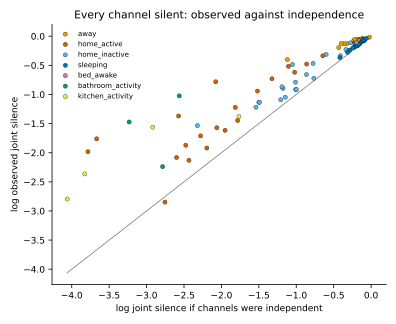
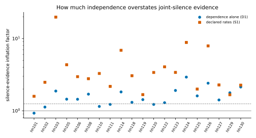
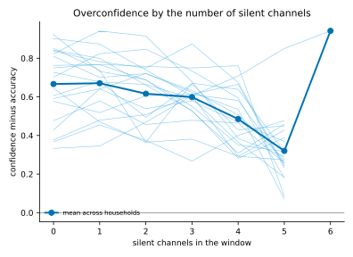
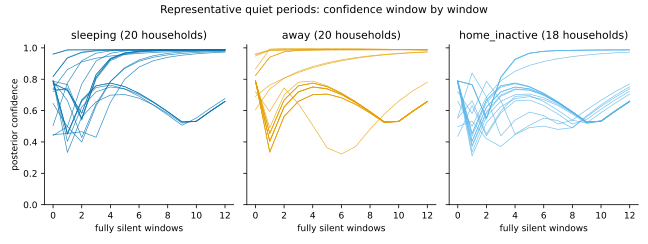

# Phase 3.3: correlated silence, a diagnostic

The generative model multiplies one Poisson likelihood per sensor. A channel
that records nothing in a window adds `−λ_c(s) Δ` to the log-evidence for
state `s`, and a quiet window's evidence is the sum of those terms over every
silent channel. The [uncertainty model](UNCERTAINTY_MODEL.md) showed that
silent working streams, not the transition prior, drive quiet-period
confidence above 0.95.

The roadmap's hypothesis 3.3 is that this is over-concentration: channels fall
silent together, given the state, more often than independence implies, so the
sum overstates the evidence. The proposed remedy, a two-stage model with a
total count and a room allocation, is only worth building if that is
materially true. This diagnostic measures it.

**Status: pre-specified diagnostic, development panel.**

- **Diagnostic only.** No inference, emission model or default changes. The
  diagnostic reads the filter's own emission terms and transition.
- **Frozen first.** Every setting and rule was committed before any household
  was examined.
- **Not held out.** The development homes have been inspected in earlier work.
  The frozen external cohort is not touched.

## Streams

A stream is an evidence channel of the [information sets](INFORMATION_SETS.md):
one room and one modality, pooling that room's event sensors, counted in the
same 5-minute windows as Phases 1, 3.1 and 3.2. There are six:

- bathroom, bedroom, hall, kitchen and living-room motion;
- the hall door.

A household's uninstrumented channels are left out.

Under the model, a silent channel's likelihood is the same whether its sensors
are pooled or multiplied one by one, `exp(−Σ_i λ_i(s) Δ)`. So pooling loses
nothing for the silence terms.

## Protocol

The protocol is `artifacts/phase3/silence_protocol.json`. The script refuses
to run if the code's protocol differs from it by a single value. It freezes:

- **Households.** All 20 single-resident development homes of
  `artifacts/phase1/household_splits.json`, recorded by digest. Nothing is
  fitted, so the folds are not used.
- **Eligibility.** A state enters a household's dependence statistics with at
  least 50 labelled windows there.
- **Estimability.** A joint-silence statistic is computed only where at least
  5 windows would be jointly silent if the channels fell silent independently.
  - Below that, the smoothed estimate sits at its floor, and a ratio to
    independence would measure the floor.
  - The rule uses only the channels' own silence, so it does not select on
    dependence.
  - A log odds ratio needs all four cells of its table to reach 5.
  - This is the classical expected-count rule for contingency tables.
- **Smoothing.** Probabilities are `(k + 0.5) / (n + 1)`.
- **Model.** The filter's generative model: default emissions pooled per
  channel, the default ontology, and full reliability. It is fed every window
  of the recording from the stationary distribution, which is the production
  filter's recursion. A test checks this against `MultimodalBayesFilter`.
- **Bootstrap.** 10,000 household resamples, with 95% percentile intervals for
  the mean and the median. The seed is 0.

### What is measured

Within each household, conditional on the annotated state:

- **Joint silence.** The observed probability that every instrumented channel
  is silent is compared with three independence baselines:
  - the product of the channels' observed silence probabilities, which tests
    dependence alone;
  - independent Poisson streams with each channel's observed mean count, which
    adds each channel's departure from a Poisson count;
  - the filter's declared rates, which are what the filter assumes.
- **Pairwise dependence.** For every pair of channels:
  - the log odds ratio of silence;
  - the log ratio of joint to independent silence;
  - the correlation and covariance of counts.
- **Dispersion.** The variance of the number of silent channels, against its
  variance if channels fell silent independently.
- **Silence-evidence inflation.**
  - A constant excess of joint silence in every state shifts each state's
    evidence equally, and cannot move a posterior. Only its variation across
    states can.
  - The inflation factor is therefore the spread across states of the
    independent joint-silence log-evidence, over the spread of the observed
    one: `SD_s[Σ_c log p_c(s)] / SD_s[log p_joint(s)]`.
  - It is 1 under independence, and above 1 when independence overstates the
    evidence.
  - It is computed with the channels' observed silence probabilities
    (dependence alone, D1) and with the filter's declared terms (S1). Their
    difference, S2, is what the declared rates add.
- **Concentration.**
  - Each labelled window's overconfidence is its confidence minus its
    correctness.
  - C1 is its least-squares slope on the number of silent channels, within
    the predicted state.
  - A calibrated model has zero expected overconfidence given anything
    computed from the data, so every such slope is zero in expectation.
  - Grouping by the annotated state would condition on the truth, and a
    calibrated model would then show a slope. Every labelled window enters
    for the same reason.
  - S8 is the same slope along consecutive fully silent windows, per hour,
    over the first three hours of each quiet run.
- **Representative quiet periods.**
  - For each household and quiet state, the run is chosen by a fixed rule.
    Candidates are the maximal runs of fully silent windows labelled with
    that state, at least 12 windows (one hour) long. The case is the earliest
    run of the lower-median length.
  - Its first 12 windows are decomposed: the prediction from the transition,
    each silent channel's contribution and the confidence after adding it, the
    posterior, the number of silent channels and the final confidence.

The quiet states are `sleeping`, `away` and `home_inactive`, where the
saturation was observed.

### Estimands

Each is one value per household, tested against zero: independence for
dependence measures, or a calibrated model for slopes.

| Key | Role | Quantity | Question |
| --- | --- | --- | --- |
| D1 | primary | log inflation factor, observed marginals | does independence overstate silence evidence, from dependence alone? |
| D2 | primary | log joint-silence ratio, quiet states | do channels fall silent together more often than independence implies? |
| C1 | primary | overconfidence slope per silent channel | does overconfidence grow with the number of silent channels? |
| S1 | secondary | log inflation factor, declared terms | how much do the filter's own silence terms overstate it? |
| S2 | secondary | S1 − D1 | how much of that comes from the declared rates? |
| S3 | secondary | median pairwise log odds ratio of silence, quiet states | pairwise dependence of silence |
| S4 | secondary | mean pairwise count correlation, quiet states | dependence of counts |
| S5 | secondary | log dispersion of the number of silent channels, quiet states | dependence across all channels |
| S6 | secondary | confidence slope per silent channel | the confidence part of C1 |
| S7 | secondary | accuracy slope per silent channel | the accuracy part of C1 |
| S8 | secondary | overconfidence slope per quiet hour | accumulation along quiet runs |

Every per-state statistic is also reported across households for every
state. Per channel pair, both pairwise silence measures are reported, averaged
over each household's quiet states. The Spearman correlation of D1 and C1
across households is reported with a household bootstrap interval.

### Criteria

The criteria compare effect sizes, with their uncertainty, against declared
minimal effects `δ`. They are not significance tests.

| Scale | `δ` | Why |
| --- | ---: | --- |
| log ratio | log 1.25 | At an inflation of 1.25, a posterior of 0.95 reached on silence alone would be 0.91 with the evidence corrected. That leaves the uncertainty study's 0.95–1.00 confidence band. |
| slope | 0.02 per silent channel or per hour | The calibration-error minimal difference of Phases 3.1 and 3.2. |
| correlation | 0.1 | The conventional smallest correlation of note. |

Each estimand gets one verdict:

| Verdict | When |
| --- | --- |
| positive | mean ≥ `δ` and the interval's lower bound > 0 |
| negative | mean ≤ `−δ` and the interval's upper bound < 0 |
| negligible | the whole interval lies within `(−δ, δ)` |
| uncertain | anything else |

The overall rule is fixed in advance:

- **Supported.** D1 and C1 are both positive. Independence materially inflates
  silence evidence, and overconfidence grows with the number of silent
  channels.
- **Weakened.** D1 or C1 is negligible or negative.
- **Inconclusive.** Anything else.

`ROADMAP.md` is updated only if the conclusion is supported or weakened.

D1, not D2, enters the rule. A constant excess of joint silence cannot move a
posterior, so D2 can be large while the posterior is unaffected. C1 alone
cannot attribute over-concentration to dependence, because wrong declared
rates can produce it too. D1 separates the two.

### Checked on synthetic households

The tests build panels of synthetic households whose states follow the
ontology's own chain:

- **Conditionally independent streams**, scored by a correctly specified
  model. D1, D2, the pairwise log odds, the dispersion and C1 are all
  negligible, and the conclusion is weakened.
- **Strongly correlated silence.** Half the windows are silent on every
  channel together, and each channel keeps its mean. D1, D2, the pairwise log
  odds, the dispersion and C1 are all positive, and the conclusion is
  supported.

They also check that:

- the recursion equals `MultimodalBayesFilter` fed the same windows;
- a decomposed quiet window adds up to its posterior.

## Results

The summary below is generated from the published record,
`artifacts/phase3/phase3-correlated-silence.json`, by `render_summary`.
A test checks that it still matches the record.

<!-- generated-summary:start -->

### Correlated silence: summary

Generated from the record `phase3-correlated-silence`: protocol `138e35aa977d`, commit `c9724dc6697a`. Status: pre-specified diagnostic; development panel, which earlier work has inspected.

- 20 households, each counted once. Streams are the instrumented evidence channels in 5-minute windows.
- Every value is computed within a household. Across households, the mean and median carry 95% household bootstrap intervals from 10,000 resamples. Zero is independence, or a calibrated model for slopes.
- Quiet states: sleeping, away, home_inactive.
- Minimal effects: correlation 0.1, log_ratio 0.223, slope 0.02. A log ratio of log 1.25 is a ratio of 1.25.

#### Pre-specified conclusion

| Question | Verdict |
| --- | ---: |
| Does independence materially inflate silence evidence? (D1) | positive |
| Does overconfidence grow with the number of silent channels? (C1) | negative |
| The correlated-silence hypothesis | weakened |

Supported: D1 and C1 are both positive: independence materially inflates silence evidence, and overconfidence grows with the number of silent channels. Weakened: D1 or C1 is negligible or negative.

Verdicts: positive: mean >= delta and lower bound > 0; negative: mean <= -delta and upper bound < 0; negligible: the whole interval within (-delta, delta); uncertain: anything else.

#### Estimands

Log ratios are also shown as ratios, where 1 is independence:

| Key | Role | Quantity | Mean | Median | As a ratio | Households above / below zero | Verdict |
| --- | ---: | ---: | ---: | ---: | ---: | ---: | ---: |
| D1 | primary | log_inflation | +0.435 [+0.319, +0.559] | +0.368 [+0.263, +0.587] | 1.55 [1.38, 1.75] | 19 / 1 of 20 | positive |
| D2 | primary | log_joint_silence_quiet | +0.144 [+0.107, +0.190] | +0.114 [+0.100, +0.143] | 1.15 [1.11, 1.21] | 20 / 0 of 20 | negligible |
| C1 | primary | gap_slope | −0.059 [−0.083, −0.034] | −0.061 [−0.098, −0.049] |  | 4 / 16 of 20 | negative |
| S1 | secondary | log_inflation_declared | +1.219 [+0.958, +1.513] | +1.102 [+0.820, +1.311] | 3.38 [2.61, 4.54] | 20 / 0 of 20 | positive |
| S2 | secondary | log_marginal_factor | +0.784 [+0.557, +1.031] | +0.755 [+0.515, +1.073] | 2.19 [1.75, 2.80] | 19 / 1 of 20 | positive |
| S3 | secondary | log_odds_silence_quiet | +4.429 [+3.795, +5.099] | +4.458 [+3.551, +4.814] | 83.81 [44.46, 163.88] | 19 / 0 of 19 | positive |
| S4 | secondary | count_correlation_quiet | +0.301 [+0.273, +0.332] | +0.292 [+0.261, +0.317] |  | 20 / 0 of 20 | positive |
| S5 | secondary | log_dispersion_quiet | +0.762 [+0.689, +0.837] | +0.777 [+0.731, +0.814] | 2.14 [1.99, 2.31] | 20 / 0 of 20 | positive |
| S6 | secondary | confidence_slope | −0.030 [−0.034, −0.025] | −0.028 [−0.035, −0.024] |  | 0 / 20 of 20 | negative |
| S7 | secondary | accuracy_slope | +0.030 [+0.005, +0.053] | +0.030 [+0.021, +0.069] |  | 15 / 5 of 20 | positive |
| S8 | secondary | accumulation_slope | +0.175 [+0.118, +0.231] | +0.172 [+0.074, +0.280] |  | 18 / 2 of 20 | positive |

#### Joint silence by state

Mean log ratio of the observed probability that every channel is silent to each independence baseline, with the households where it is estimable. The difference is in probability:

| State | Households | Against observed marginals | Against Poisson streams | Against the declared rates | Difference |
| --- | ---: | ---: | ---: | ---: | ---: |
| away | 20 | +0.153 [+0.102, +0.228], uncertain | +1.549 [+1.050, +2.271] | +0.311 [+0.266, +0.343] | +0.116 [+0.088, +0.150] |
| home_active | 20 | +0.649 [+0.450, +0.881], positive | +15.613 [+12.887, +18.349] | +3.520 [+3.069, +3.927] | +0.129 [+0.094, +0.168] |
| home_inactive | 20 | +0.244 [+0.171, +0.328], positive | +5.332 [+4.266, +6.442] | +0.403 [+0.208, +0.586] | +0.095 [+0.071, +0.122] |
| sleeping | 20 | +0.035 [+0.028, +0.043], negligible | +0.852 [+0.638, +1.104] | −0.006 [−0.044, +0.026] | +0.029 [+0.024, +0.037] |
| bed_awake | 1 | +0.092, uncertain | +0.098 | +1.149 | +0.079 |
| bathroom_activity | 3 | +1.282 [+0.546, +1.760], positive | +12.124 [+9.123, +15.047] | +0.723 [−2.164, +2.396] | +0.172 [+0.045, +0.282] |
| kitchen_activity | 4 | +1.118 [+0.629, +1.413], positive | +20.892 [+9.724, +33.566] | +1.374 [+0.816, +1.932] | +0.088 [+0.053, +0.135] |

#### Pairwise dependence by state

Mean across households of each household's median over channel pairs (log odds ratio of silence, log pair silence ratio), mean pairwise count correlation, and log dispersion of the number of silent channels:

| State | Log odds ratio of silence | Log pair silence ratio | Count correlation | Log dispersion |
| --- | ---: | ---: | ---: | ---: |
| away | +6.623 [+5.928, +7.303] (n = 13) | +0.026 [+0.017, +0.040] (n = 20) | +0.407 [+0.371, +0.447] (n = 20) | +1.159 [+1.075, +1.232] (n = 20) |
| home_active | +1.833 [+1.619, +2.052] (n = 20) | +0.108 [+0.063, +0.171] (n = 20) | +0.170 [+0.134, +0.209] (n = 20) | +0.751 [+0.668, +0.838] (n = 20) |
| home_inactive | +3.268 [+2.636, +4.070] (n = 19) | +0.037 [+0.022, +0.061] (n = 20) | +0.214 [+0.185, +0.244] (n = 20) | +0.646 [+0.548, +0.745] (n = 20) |
| sleeping | +4.632 [+3.710, +5.665] (n = 13) | +0.004 [+0.002, +0.008] (n = 20) | +0.283 [+0.238, +0.327] (n = 20) | +0.483 [+0.399, +0.575] (n = 20) |
| bed_awake | n/a (n = 0) | +0.009 (n = 1) | +0.224 (n = 1) | +0.533 (n = 1) |
| bathroom_activity | +2.891 [+2.244, +3.520] (n = 18) | +0.180 [+0.141, +0.223] (n = 19) | +0.051 [+0.019, +0.083] (n = 19) | +0.746 [+0.662, +0.834] (n = 19) |
| kitchen_activity | +2.671 [+1.958, +3.320] (n = 17) | +0.146 [+0.087, +0.220] (n = 18) | +0.047 [+0.010, +0.089] (n = 18) | +0.655 [+0.560, +0.744] (n = 18) |

#### Channel pairs in the quiet states

Mean across households, each household averaged over its quiet states where the statistic is estimable:

| Pair | Log odds ratio of silence | Households above / below zero | Log pair silence ratio | Households above / below zero |
| --- | ---: | ---: | ---: | ---: |
| bathroom_motion and bedroom_motion | +5.205 [+4.458, +6.035] | 14 / 0 of 14 | +0.030 [+0.021, +0.041] | 19 / 0 of 19 |
| bathroom_motion and hall_door | +5.906 [+4.119, +7.571] | 6 / 0 of 6 | +0.014 [+0.009, +0.019] | 19 / 0 of 19 |
| bathroom_motion and hall_motion | n/a | 0 | +0.003 | 1 / 0 of 1 |
| bathroom_motion and kitchen_motion | +3.840 [+2.356, +5.625] | 9 / 0 of 9 | +0.014 [+0.007, +0.025] | 19 / 0 of 19 |
| bathroom_motion and living_motion | +3.869 [+2.946, +4.927] | 15 / 0 of 15 | +0.022 [+0.014, +0.033] | 19 / 0 of 19 |
| bedroom_motion and hall_door | +4.611 [+3.373, +5.855] | 14 / 0 of 14 | +0.023 [+0.015, +0.033] | 20 / 0 of 20 |
| bedroom_motion and hall_motion | +1.491 | 1 / 0 of 1 | +0.012 [+0.002, +0.022] | 2 / 0 of 2 |
| bedroom_motion and kitchen_motion | +2.591 [+1.784, +3.406] | 14 / 1 of 15 | +0.023 [+0.011, +0.037] | 20 / 0 of 20 |
| bedroom_motion and living_motion | +3.217 [+2.219, +4.273] | 18 / 1 of 19 | +0.033 [+0.015, +0.054] | 16 / 4 of 20 |
| hall_door and hall_motion | +1.119 | 1 / 0 of 1 | +0.011 [+0.008, +0.014] | 2 / 0 of 2 |
| hall_door and kitchen_motion | +4.119 [+2.677, +5.724] | 11 / 0 of 11 | +0.016 [+0.011, +0.021] | 20 / 0 of 20 |
| hall_door and living_motion | +5.230 [+4.457, +6.028] | 19 / 0 of 19 | +0.031 [+0.024, +0.038] | 20 / 0 of 20 |
| hall_motion and kitchen_motion | +3.495 | 1 / 0 of 1 | +0.021 [+0.003, +0.039] | 2 / 0 of 2 |
| hall_motion and living_motion | +4.099 | 1 / 0 of 1 | +0.039 [+0.008, +0.069] | 2 / 0 of 2 |
| kitchen_motion and living_motion | +4.715 [+4.040, +5.391] | 17 / 0 of 17 | +0.040 [+0.029, +0.053] | 20 / 0 of 20 |

#### Households

Each household's values. D1 and S1 are shown as inflation factors, D2 as a ratio; C1 and S8 are slopes of overconfidence:

| Household | Channels | D1 inflation | S1 declared inflation | D2 joint silence | C1 per silent channel | S8 per quiet hour |
| --- | ---: | ---: | ---: | ---: | ---: | ---: |
| hh101 | 5 | 0.93 | 1.59 | 1.11 | +0.009 | +0.194 |
| hh102 | 5 | 1.12 | 2.48 | 1.05 | −0.101 | +0.099 |
| hh103 | 5 | 1.87 | 19.79 | 1.11 | −0.067 | +0.292 |
| hh105 | 5 | 1.45 | 4.33 | 1.11 | −0.082 | +0.151 |
| hh106 | 5 | 1.44 | 2.97 | 1.16 | −0.132 | +0.235 |
| hh108 | 5 | 1.70 | 2.78 | 1.19 | −0.055 | +0.274 |
| hh110 | 5 | 1.15 | 3.28 | 1.09 | −0.118 | +0.358 |
| hh111 | 5 | 1.23 | 2.18 | 1.08 | −0.100 | +0.350 |
| hh114 | 5 | 1.82 | 6.87 | 1.12 | −0.053 | +0.038 |
| hh118 | 5 | 1.31 | 3.06 | 1.14 | −0.096 | +0.083 |
| hh119 | 5 | 1.43 | 1.67 | 1.14 | −0.053 | +0.101 |
| hh120 | 5 | 1.22 | 3.39 | 1.07 | −0.116 | +0.263 |
| hh122 | 5 | 1.29 | 4.05 | 1.12 | −0.047 | +0.287 |
| hh123 | 5 | 1.91 | 3.39 | 1.15 | −0.005 | +0.066 |
| hh124 | 6 | 2.92 | 8.82 | 1.04 | +0.040 | +0.031 |
| hh125 | 5 | 1.61 | 1.99 | 1.10 | −0.143 | −0.047 |
| hh126 | 5 | 2.41 | 7.90 | 1.55 | −0.051 | −0.013 |
| hh127 | 5 | 1.41 | 2.28 | 1.23 | +0.052 | +0.046 |
| hh129 | 5 | 1.77 | 1.67 | 1.42 | −0.095 | +0.329 |
| hh130 | 5 | 2.13 | 2.26 | 1.24 | +0.026 | +0.365 |

Across households, the Spearman correlation of D1 and C1 is +0.392 [−0.103, +0.815], n = 20.

#### Representative quiet periods

One pre-specified quiet run per household and quiet state. Medians across households of the confidence predicted by the transition before the first window, and of the posterior confidence after windows 1, 6 and the last recorded:

| State | Households | Predicted, window 1 | After window 1 | After window 6 | After the last | Silent channels |
| --- | ---: | ---: | ---: | ---: | ---: | ---: |
| sleeping | 20 | 0.787 | 0.729 | 0.975 | 0.986 | 5 |
| away | 20 | 0.790 | 0.472 | 0.710 | 0.658 | 5 |
| home_inactive | 18 | 0.780 | 0.477 | 0.700 | 0.684 | 5 |

<!-- generated-summary:end -->

### Figures

`scripts/plot_phase3_silence.py` drew these from the published record. Each
carries the SHA-256 of the data it plots, and a test checks it against the
record.



*Joint silence on every channel, per household and state where it is
estimable. Points above the line are silent together more often than
independence implies.*



*The inflation factor per household, from dependence alone (D1) and with the
filter's declared terms (S1). The solid line is independence; the dashed line
is the minimal effect, 1.25.*



*Mean confidence minus accuracy at each number of silent channels, per
household, not adjusted for the predicted state. Only `hh124` has six
channels, so the point at six is one household.*



*Posterior confidence along each representative quiet run. Window 0 is the
confidence predicted by the transition before the first silent window.*

### What this shows and does not show

Figures are means across the 20 homes, with 95% household intervals, and the
number of homes on each side of zero.

- **By the pre-specified rule, the hypothesis is weakened.** D1 is positive,
  but C1 is negative.
- **Silences are strongly dependent, given the state.** In the quiet states:
  - the median pairwise log odds ratio of silence is +4.43 [+3.80, +5.10],
    above zero in all 19 homes where it is estimable (S3);
  - counts correlate at +0.30 [+0.27, +0.33], in all 20 homes (S4);
  - the number of silent channels varies 2.14 [1.99, 2.31] times as much as
    independence allows, in all 20 homes (S5).
- **That dependence materially inflates silence evidence (D1).** Independence
  overstates the spread of joint-silence log-evidence across states by a
  factor of 1.55 [1.38, 1.75], in 19 of 20 homes.
- **The excess joint silence in the quiet states is small (D2).**
  - Every channel is silent together 1.15 [1.11, 1.21] times as often as
    independence implies: a negligible verdict.
  - The ratio cannot be large there. Each channel is silent in almost every
    quiet window (the median home is fully silent in 88% of its sleeping
    windows and 94% of its away windows), so the product of the channels'
    silence is already close to the joint silence.
  - The excess is larger where joint silence is rarer: 1.91 in
    `home_active`, and above 3 in the bathroom and kitchen states of the few
    homes where it is estimable.
- **The declared rates overstate silence evidence more than dependence does.**
  - The filter's own silence terms overstate the spread by 3.38
    [2.61, 4.54], in all 20 homes (S1).
  - On the log scale that is exactly D1 plus S2. Dependence accounts for
    0.435 of the mean 1.219, and the declared rates for 0.784, a factor of
    2.19 [1.75, 2.80] (S2).
- **Overconfidence does not grow with the number of silent channels (C1).**
  - Within the predicted state it falls by 0.059 [0.034, 0.083] per
    additional silent channel, in 16 of 20 homes.
  - Confidence falls by 0.030 per silent channel, in all 20 homes (S6).
    Accuracy rises by 0.030 (S7).
  - Unadjusted, windows with every channel active have mean confidence 1.00
    and accuracy 0.33. Windows with five silent channels, which is all of
    them in 19 of the 20 homes, have 0.83 and 0.51. The model is most
    overconfident where channels are active, not silent.
- **Overconfidence grows along quiet runs (S8).**
  - It rises by 0.175 [0.118, 0.231] per hour of consecutive fully silent
    windows, in 18 of 20 homes.
  - In the representative sleeping runs, the median confidence is 0.73 after
    the first silent window, 0.975 after six (30 minutes) and 0.986 after
    twelve.
- **Silence drives every quiet state towards `sleeping`.**
  - After twelve fully silent windows, the model reports `sleeping` in all 20
    sleeping runs, 19 of 20 away runs and all 18 `home_inactive` runs.
  - The median confidence at that point is 0.658 in the away runs and 0.684
    in the `home_inactive` runs, still rising.
  - This follows from the construction. In a fully silent window, every home
    with the same channels gets the same update, from the declared terms and
    the transition. The home only sets the belief the run starts from, which
    is why several trajectories in the last figure coincide.
- **One household stands out.** `hh124` is the only one with six channels. In
  its 16,586 fully silent windows the model's mean confidence is 0.97 and its
  accuracy 0.03.
- **Dependence and overconfidence are not clearly linked across homes.** The
  Spearman correlation of D1 and C1 is +0.39 [−0.10, +0.82].

The reading, then:

- The independence assumption is materially wrong for silence.
- But the pre-specified consequence, overconfidence growing with the number of
  jointly silent channels, is not what the data show.
- Quiet-period saturation appears as accumulation over consecutive silent
  windows, with the posterior drifting to `sleeping`.
- The filter's silence terms are overstated more by their declared rates than
  by dependence.

**Not shown:**

- This is the development panel, which earlier work has inspected, so it is
  not a held-out or external claim.
- The diagnostic runs the filter's generative model on the six channels at
  full reliability. The production pipeline's health and attribution layers
  are not included.
- Dependence is conditional on the annotated state. The annotations are
  coarse, and the diagnostic does not separate the causes of dependence, such
  as time of day or which room the resident is in.
- C1 and S8 are associations within the predicted state. No change to the
  evidence, such as tempering silence, is tested, because that would change
  inference.
- Windows are autocorrelated, so there are no within-household intervals.

## Reproducing it

```text
python scripts/run_phase3_silence.py <archive_root> <output_dir>
python scripts/plot_phase3_silence.py <record.json> <figure_dir>
```

`archive_root` is the extracted `labeled_data.zip` of Zenodo record 15708568
(CC-BY-4.0, not redistributed here). The first script writes the record, a
Markdown summary generated from the written record, and the figures. The
second redraws the figures from any written record. Each SVG carries the
SHA-256 of the data it plots, and a test checks the committed figures against
the published record.
