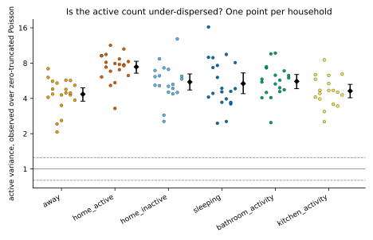
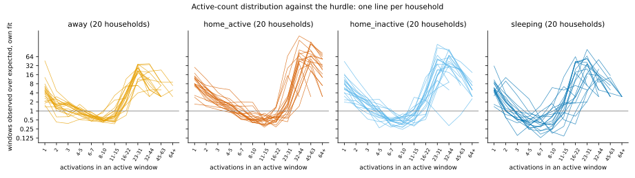
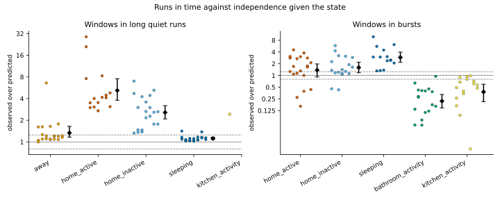
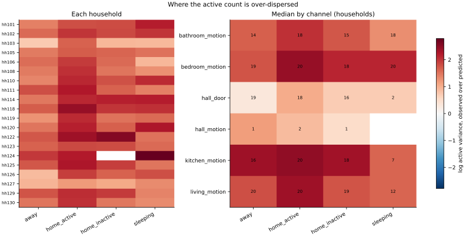

# Phase 3.3 follow-up diagnostic: posterior predictive checks of the hurdle model

The [fitted hurdle channel models](PHASE3_FITTED_RATES.md) improved calibration
substantially. Two problems remained:

- An active window's count is over-dispersed, with variance 5 to 12 times its
  mean in the common states.
- `home_active` recall fell by 0.23.

Before another distribution is introduced, this diagnostic locates where the
fitted observation model is misspecified. It compares observed channel counts
with the model's predictive distribution for each household, state and channel
with enough data.

**Status: pre-specified diagnostic, development panel.** Every setting and the
rule that reads the result were frozen before any household was examined.

- **Diagnostic only.** No model is changed, no inference is run, and no state
  is estimated.
- **Data.** Only the 20 development homes are used, which earlier work has
  inspected. The frozen external cohort is not touched.

## Two references

A **cell** is one household's labelled windows of one state on one
instrumented channel, in time order. Each cell with at least 50 windows is
checked against two hurdle models:

| Reference | Fitted on | What its misses mean |
| --- | --- | --- |
| `own` | the cell alone: `π` its share of silent windows, `μ` solved from its active windows' mean | the hurdle family itself is wrong, whatever the household |
| `population` | the fold's training households, with 12 pseudo-windows, exactly as inference uses it | the family's misses and the differences between households |

The `own` fit reproduces a cell's silence, mean and active mean exactly, so
those three are not judged against it.

## The statistics

Each statistic's observed value is compared with its predictive distribution,
from 200 replicates of the cell's own windows drawn from the reference:

| Statistic | Observed against predicted |
| --- | --- |
| `silence` | share of silent windows, as a log odds ratio |
| `mean`, `variance` | of the count over every window |
| `active_mean` | mean count of an active window |
| `active_dispersion` | variance of an active window's count over the zero-truncated Poisson's; above one means the model is under-dispersed |
| `q90`, `q99` | upper quantiles of an active window's count |
| `tail_excess` | active windows above the model's 99th percentile |
| `quiet_runs` | windows in runs of at least 12 silent windows, one hour |
| `bursts` | windows in runs of at least 3 active windows, 15 minutes |

- **Runs.** Runs are counted within stretches of consecutive labelled windows
  of the state. The model draws each window independently given the state. An
  excess of either run is therefore dependence in time, which no count
  distribution can produce.
- **Count distribution.** The observed windows in each count bin are recorded
  against each reference's expected windows. The bins are 0, 1, 2, 3, 4–5,
  6–7, 8–10, 11–15, 16–22, 23–31, 32–44, 45–63 and 64 or more.
- **Replicates.** `own` replicates are refitted before their statistics are
  computed: a parametric bootstrap. With a correctly specified model, the
  observed value then falls inside the replicates' central band as often as the
  band's coverage.
- **Sufficiency.**
  - Active-window statistics need at least 30 active windows.
  - A run statistic needs its observed or predicted windows in runs to reach
    five runs' worth.

### Verdicts

- **For a cell.** The comparison uses the log ratio of observed over predicted
  and a 95% band of the replicates' log ratios:
  - **consistent:** inside the band;
  - **above** or **below:** outside it by at least a ratio of 1.25 in that
    direction;
  - **small:** outside it by less.
- **Across households.** Households are the unit, and windows are never pooled
  across households.
  - Each household's value for a group, such as a state, a channel, a room or a
    channel type, is the mean of its cells' log ratios.
  - The household mean has a 95% household bootstrap interval from 10,000
    resamples.
  - The verdict is **positive** if the mean is at least log 1.25 and the lower
    bound is above 0, and **negative** in the mirror case.
  - It is **negligible** if the whole interval lies within ±log 1.25, and
    **uncertain** otherwise.
  - It is **insufficient** with fewer than five households.
  - Every household's values stay in the record and in the summary.

### Conclusions and routing

Three questions are answered with the `own` reference, across the four common
states: `away`, `home_active`, `home_inactive` and `sleeping`.

- Is the zero-truncated Poisson active count under-dispersed?
- Are long quiet runs in excess?
- Are bursts in excess?

Each answer is one of:

- **systematic:** positive in at least three of the four common states and
  negative in none;
- **partial:** positive in one or two;
- **absent:** negligible or negative in all four;
- **inconclusive:** anything else.

The routing to a next model family was declared before any household was
examined:

1. **Temporal dependence.** A systematic excess of quiet runs or bursts points
   to within-state temporal dependence: activity sub-states, or a
   Markov-modulated emission within each state. No marginal count family
   produces runs beyond independence, and a latent intensity that varies over
   time also over-disperses the counts.
2. **Dispersion.** Otherwise, systematic active-count under-dispersion points to
   an over-dispersed zero-truncated count model for the active part, such as
   the zero-truncated negative binomial. It would keep the hurdle's silence
   parameter.
3. **Nothing indicated.** Otherwise, no new family is indicated.

The roadmap names a next model family only if the routing indicates one.

### Also reported

- Every statistic by state, channel, room and channel type, against both
  references.
- The median across households for each state and channel.
- Each household's slope of log active variance on log active mean.
- How many cells fall in each verdict.
- Figures drawn from the record alone.

## The synthetic checks

The tests run the checks on processes whose answer is known:

- **Poisson.** A correctly specified Poisson is accepted. Across 40 seeds, no
  cell is flagged for variance, dispersion or the upper quantiles, and
  household values read as negligible.
- **Negative binomial.** A gamma-mixed Poisson with size 0.5 is detected in
  every seed, in active dispersion, the 99th percentile and the tail. Its
  household values read as positive, and the pattern as systematic.
- **Clustering in time.** Quiet and busy spells that persist are detected in
  both quiet runs and bursts. Independent windows are not flagged.
- **Population reference.** A household quieter or busier than the population
  is flagged by the population reference.

## Results

The summary below is generated from the published record,
`artifacts/phase3/phase3-hurdle-predictive-checks.json`, by `render_summary`.
A test checks that it still matches the record. The run was made from the
protocol commit, `7d7f856`, on a clean tree.

<!-- generated-summary:start -->

### Posterior predictive checks of the fitted hurdle model: summary

Generated from the record `phase3-hurdle-predictive-checks`: protocol `7fe466e19e6a`, commit `7d7f85692cf4`. Status: pre-specified diagnostic; development panel, which earlier work has inspected.

- Diagnostic only: no model is changed and no state is estimated.
- 20 households, each examined once. A cell is one household's labelled windows of one state on one channel, with at least 50 windows; the counts are each instrumented channel's activations in each 5-minute window, as the fitted channel models read them.
- Two references: `own`, the hurdle fitted to the cell alone, which tests the family; and `population`, the fold's population hurdle fitted on the training households, which inference uses.
- Each cell is compared with 200 replicates of its own windows drawn from the reference, with a 95% band; `own` replicates are refitted.
- Ratios are observed over predicted. A ratio above one means more than the model predicts. The minimal ratio is 1.25. Long quiet runs are 12 or more silent windows, and bursts 3 or more active windows, counted as windows in such runs.
- Households are the unit: each household's value for a group is the mean of its cells' log ratios, and every interval is a household bootstrap, 95%, from 10,000 resamples.

#### Pre-specified conclusions

| Question | away | home_active | home_inactive | sleeping | Conclusion |
| --- | ---: | ---: | ---: | ---: | ---: |
| Is the active count under-dispersed? | positive | positive | positive | positive | systematic |
| Are long quiet runs in excess? | positive | positive | positive | negligible | systematic |
| Are bursts in excess? | insufficient | uncertain | positive | positive | partial |

Systematic: positive in at least three of the four common states and negative in none, own reference. Partial: positive in one or two common states, own reference. Absent: negligible or negative in every common state, own reference.

Routing: a systematic excess of quiet runs or bursts points to within-state temporal dependence, which would also over-disperse the counts; otherwise systematic active dispersion points to an over-dispersed zero-truncated count model; otherwise no new family is indicated.

**Indicated next family: within-state temporal dependence: activity sub-states or a Markov-modulated emission within each state; no marginal count family produces runs beyond independence given the state, and a latent intensity that varies over time also over-disperses the counts.**

#### The shape of the active count, own reference

The geometric mean over households of observed over predicted, with its interval, households above and below one, and the verdict:

| State | active_dispersion | variance | q90 | q99 | tail_excess |
| --- | ---: | ---: | ---: | ---: | ---: |
| away | 4.342 [3.788, 4.921], 20 / 0, positive | 1.520 [1.439, 1.621], 20 / 0, positive | 1.327 [1.275, 1.372], 19 / 1, positive | 1.905 [1.747, 2.088], 20 / 0, positive | 6.589 [5.708, 7.509], 20 / 0, positive |
| home_active | 7.418 [6.556, 8.287], 20 / 0, positive | 1.900 [1.771, 2.032], 20 / 0, positive | 1.494 [1.450, 1.537], 20 / 0, positive | 2.152 [2.015, 2.291], 20 / 0, positive | 12.987 [11.577, 14.420], 20 / 0, positive |
| home_inactive | 5.517 [4.717, 6.465], 19 / 0, positive | 1.629 [1.525, 1.731], 20 / 0, positive | 1.432 [1.368, 1.491], 19 / 0, positive | 2.043 [1.918, 2.194], 19 / 0, positive | 9.807 [8.624, 11.127], 19 / 0, positive |
| sleeping | 5.345 [4.389, 6.593], 20 / 0, positive | 1.479 [1.400, 1.563], 20 / 0, positive | 1.384 [1.273, 1.500], 18 / 1, positive | 2.016 [1.869, 2.183], 20 / 0, positive | 8.003 [6.621, 9.612], 20 / 0, positive |
| bed_awake | n/a | n/a (1 homes) | n/a | n/a | n/a |
| bathroom_activity | 5.588 [4.842, 6.390], 19 / 0, positive | 2.142 [1.947, 2.367], 19 / 0, positive | 1.411 [1.365, 1.457], 19 / 0, positive | 1.982 [1.852, 2.122], 19 / 0, positive | 9.793 [8.424, 11.202], 19 / 0, positive |
| kitchen_activity | 4.623 [4.048, 5.266], 18 / 0, positive | 1.915 [1.745, 2.109], 18 / 0, positive | 1.326 [1.282, 1.370], 18 / 0, positive | 1.855 [1.727, 1.997], 18 / 0, positive | 7.475 [6.330, 8.664], 18 / 0, positive |

#### Runs in time, own reference

Windows in long quiet runs and in bursts, observed over predicted:

| State | quiet_runs | bursts |
| --- | ---: | ---: |
| away | 1.336 [1.166, 1.645], 19 / 1, positive | n/a |
| home_active | 5.187 [3.795, 7.544], 15 / 0, positive | 1.368 [0.912, 1.978], 15 / 5, uncertain |
| home_inactive | 2.568 [2.088, 3.193], 20 / 0, positive | 1.596 [1.170, 2.181], 16 / 2, positive |
| sleeping | 1.116 [1.079, 1.162], 20 / 0, negligible | 2.896 [2.171, 3.976], 14 / 0, positive |
| bathroom_activity | n/a | 0.219 [0.147, 0.324], 0 / 17, negative |
| kitchen_activity | n/a (1 homes) | 0.378 [0.212, 0.595], 0 / 16, negative |

#### Against the population model

The same against the fold's population hurdle, which also carries the differences between households:

| State | silence | mean | active_dispersion | quiet_runs |
| --- | ---: | ---: | ---: | ---: |
| away | 0.775 [0.533, 1.153], 6 / 14, uncertain | 1.147 [0.725, 1.682], 14 / 6, uncertain | 3.987 [3.351, 4.728], 18 / 0, positive | 1.109 [1.086, 1.133], 20 / 0, negligible |
| home_active | 0.956 [0.744, 1.232], 9 / 11, uncertain | 0.932 [0.727, 1.191], 10 / 10, uncertain | 6.994 [5.558, 8.718], 20 / 0, positive | 6.173 [4.530, 8.292], 15 / 0, positive |
| home_inactive | 1.079 [0.819, 1.438], 8 / 12, uncertain | 0.837 [0.641, 1.069], 10 / 10, uncertain | 5.712 [4.596, 7.233], 19 / 0, positive | 2.584 [2.235, 2.961], 20 / 0, positive |
| sleeping | 1.207 [1.018, 1.433], 13 / 7, uncertain | 0.729 [0.585, 0.897], 7 / 13, negative | 5.107 [3.620, 7.227], 19 / 1, positive | 1.084 [1.045, 1.120], 18 / 2, negligible |
| bed_awake | n/a (1 homes) | n/a (1 homes) | n/a | n/a |
| bathroom_activity | 0.673 [0.496, 0.892], 6 / 13, negative | 0.968 [0.825, 1.129], 9 / 10, negligible | 5.491 [4.439, 6.737], 19 / 0, positive | n/a |
| kitchen_activity | 0.700 [0.467, 1.072], 6 / 12, uncertain | 0.955 [0.769, 1.176], 8 / 10, uncertain | 4.405 [3.471, 5.527], 18 / 0, positive | n/a (1 homes) |

#### By channel, room and channel type

Own reference, active dispersion and runs; population reference, silence:

| Channel | active_dispersion | quiet_runs | bursts | silence (population) |
| --- | ---: | ---: | ---: | ---: |
| bathroom_motion | 5.188 [4.146, 6.245], 18 / 0, positive | 1.410 [1.264, 1.626], 19 / 0, positive | 0.824 [0.523, 1.290], 6 / 9, uncertain | 0.750 [0.566, 0.965], 7 / 12, negative |
| bedroom_motion | 7.493 [6.127, 9.015], 20 / 0, positive | 2.296 [1.908, 2.832], 20 / 0, positive | 0.984 [0.651, 1.489], 10 / 10, uncertain | 0.928 [0.693, 1.216], 10 / 10, uncertain |
| hall_door | 2.114 [1.803, 2.483], 19 / 1, positive | 1.459 [1.307, 1.676], 20 / 0, positive | 2.672 [1.103, 5.460], 7 / 1, positive | 0.992 [0.720, 1.331], 12 / 8, uncertain |
| hall_motion | n/a (2 homes) | n/a (2 homes) | n/a (1 homes) | n/a (2 homes) |
| kitchen_motion | 9.484 [8.112, 10.994], 20 / 0, positive | 1.658 [1.458, 1.912], 20 / 0, positive | 1.120 [0.783, 1.562], 9 / 10, uncertain | 0.902 [0.603, 1.305], 11 / 9, uncertain |
| living_motion | 5.727 [4.855, 6.750], 20 / 0, positive | 2.561 [1.848, 3.652], 19 / 1, positive | 0.700 [0.501, 0.968], 8 / 12, negative | 0.996 [0.797, 1.259], 10 / 10, uncertain |

| Room | active_dispersion | quiet_runs | bursts | silence (population) |
| --- | ---: | ---: | ---: | ---: |
| bathroom | 5.188 [4.146, 6.245], 18 / 0, positive | 1.410 [1.264, 1.626], 19 / 0, positive | 0.824 [0.523, 1.290], 6 / 9, uncertain | 0.750 [0.566, 0.965], 7 / 12, negative |
| bedroom | 7.493 [6.127, 9.015], 20 / 0, positive | 2.296 [1.908, 2.832], 20 / 0, positive | 0.984 [0.651, 1.489], 10 / 10, uncertain | 0.928 [0.693, 1.216], 10 / 10, uncertain |
| hall | 2.114 [1.802, 2.484], 19 / 1, positive | 1.466 [1.314, 1.682], 20 / 0, positive | 2.726 [1.120, 5.499], 7 / 1, positive | 0.966 [0.691, 1.329], 11 / 9, uncertain |
| kitchen | 9.484 [8.112, 10.994], 20 / 0, positive | 1.658 [1.458, 1.912], 20 / 0, positive | 1.120 [0.783, 1.562], 9 / 10, uncertain | 0.902 [0.603, 1.305], 11 / 9, uncertain |
| living | 5.727 [4.855, 6.750], 20 / 0, positive | 2.561 [1.848, 3.652], 19 / 1, positive | 0.700 [0.501, 0.968], 8 / 12, negative | 0.996 [0.797, 1.259], 10 / 10, uncertain |

| Modality | active_dispersion | quiet_runs | bursts | silence (population) |
| --- | ---: | ---: | ---: | ---: |
| door | 2.114 [1.803, 2.483], 19 / 1, positive | 1.459 [1.307, 1.676], 20 / 0, positive | 2.672 [1.103, 5.460], 7 / 1, positive | 0.992 [0.720, 1.331], 12 / 8, uncertain |
| motion | 6.621 [5.803, 7.442], 20 / 0, positive | 1.944 [1.732, 2.209], 20 / 0, positive | 0.870 [0.665, 1.145], 6 / 14, uncertain | 0.881 [0.694, 1.102], 8 / 12, uncertain |

#### Variance and mean

Each household's slope of log active variance on log active mean across its cells: about 1 for Poisson-like counts, nearer 2 when the excess variance grows with the square of the mean. Household means with their intervals:

| Slope | Households | Mean | Median |
| --- | ---: | ---: | ---: |
| observed | 20 | 1.940 [1.854, 2.030] | 1.887 [1.813, 2.077] |
| predicted | 20 | 1.146 [1.109, 1.188] | 1.134 [1.083, 1.161] |
| difference | 20 | 0.794 [0.699, 0.894] | 0.757 [0.671, 0.893] |

#### Cells by verdict

How many cells fall in each verdict, over every household and state:

| Reference | Statistic | consistent | small | above | below |
| --- | ---: | ---: | ---: | ---: | ---: |
| own | variance | 59 | 57 | 463 | 0 |
| own | active_dispersion | 18 | 0 | 472 | 3 |
| own | q90 | 102 | 25 | 365 | 2 |
| own | q99 | 39 | 1 | 454 | 0 |
| own | tail_excess | 33 | 0 | 461 | 0 |
| own | quiet_runs | 58 | 129 | 167 | 0 |
| own | bursts | 50 | 11 | 60 | 53 |
| population | silence | 138 | 18 | 202 | 236 |
| population | mean | 112 | 45 | 212 | 219 |
| population | variance | 83 | 9 | 346 | 150 |
| population | active_mean | 59 | 142 | 136 | 142 |
| population | active_dispersion | 23 | 1 | 432 | 23 |
| population | q90 | 79 | 43 | 297 | 60 |
| population | q99 | 49 | 12 | 399 | 19 |
| population | tail_excess | 65 | 0 | 400 | 14 |
| population | quiet_runs | 65 | 139 | 148 | 5 |
| population | bursts | 39 | 7 | 83 | 59 |

#### Households

Each household's cells, its own-reference active dispersion in each common state as a ratio, and its cells flagged above for active dispersion, quiet runs and bursts:

| Household | Fold | Cells | away | home_active | home_inactive | sleeping | Flagged |
| --- | ---: | ---: | ---: | ---: | ---: | ---: | ---: |
| hh101 | phase1-fold-a | 30 | 4.085 | 6.095 | 6.127 | 8.955 | 24 / 6 / 3 |
| hh102 | phase1-fold-b | 30 | 4.801 | 7.396 | 6.234 | 7.325 | 25 / 4 / 2 |
| hh103 | phase1-fold-a | 30 | 2.066 | 5.153 | 2.544 | 2.452 | 21 / 11 / 2 |
| hh105 | phase1-fold-b | 30 | 4.281 | 5.444 | 5.069 | 4.547 | 24 / 6 / 0 |
| hh106 | phase1-fold-a | 35 | 4.771 | 7.025 | 4.869 | 2.541 | 23 / 8 / 1 |
| hh108 | phase1-fold-b | 30 | 4.286 | 7.736 | 4.492 | 3.589 | 27 / 8 / 3 |
| hh110 | phase1-fold-a | 30 | 3.862 | 8.244 | 5.855 | 8.072 | 21 / 11 / 5 |
| hh111 | phase1-fold-b | 30 | 6.037 | 9.246 | 5.177 | 4.101 | 29 / 10 / 7 |
| hh114 | phase1-fold-a | 30 | 4.353 | 8.122 | 8.693 | 8.889 | 23 / 13 / 4 |
| hh118 | phase1-fold-b | 30 | 5.404 | 11.340 | 7.277 | 7.640 | 25 / 6 / 4 |
| hh119 | phase1-fold-a | 30 | 3.483 | 7.933 | 4.520 | 4.877 | 26 / 11 / 2 |
| hh120 | phase1-fold-b | 30 | 4.452 | 8.680 | 5.266 | 9.484 | 27 / 11 / 4 |
| hh122 | phase1-fold-a | 30 | 5.682 | 10.544 | 12.866 | 4.588 | 25 / 7 / 7 |
| hh123 | phase1-fold-b | 30 | 5.174 | 6.262 | 6.184 | 4.843 | 28 / 6 / 0 |
| hh124 | phase1-fold-a | 24 | 7.164 | 9.223 | n/a | 16.250 | 11 / 2 / 5 |
| hh125 | phase1-fold-b | 30 | 5.601 | 9.487 | 6.916 | 4.412 | 27 / 9 / 6 |
| hh126 | phase1-fold-a | 30 | 2.420 | 6.817 | 5.134 | 6.038 | 25 / 15 / 1 |
| hh127 | phase1-fold-b | 30 | 2.589 | 3.285 | 2.876 | 3.704 | 16 / 8 / 0 |
| hh129 | phase1-fold-a | 30 | 5.722 | 7.796 | 7.073 | 3.960 | 24 / 3 / 1 |
| hh130 | phase1-fold-b | 25 | 4.447 | 7.596 | 4.369 | 3.699 | 21 / 12 / 3 |

<!-- generated-summary:end -->

### Figures

Each figure is drawn from the published record by `draw_figures`, and its
metadata carries the digest of the data it plots.



Every point is one household. The black diamond is the household mean, with its
95% household interval. Dashed lines mark the minimal ratio, 1.25 and 0.8.



Windows observed over expected in each count bin, under each cell's own fit,
summed over a household's channels. Every household has the same shape:

- too many windows with a single activation;
- too few in the middle of the range;
- far too many large counts.





### What this shows and does not show

Ratios are geometric means over households of observed over predicted, with
95% household intervals. Every household's values are in the record and in the
tables above.

- **The zero-truncated Poisson active count is systematically under-dispersed.**
  The pre-specified conclusion is *systematic*: positive in all four common
  states.
  - Against each cell's own fit, the observed active variance is 4.34 times the
    predicted in `away`, 7.42 times in `home_active`, 5.52 times in
    `home_inactive` and 5.35 times in `sleeping`. Each is above one in every
    household with a value.
  - 472 of the 493 cells with enough active windows are flagged above; 3 are
    flagged below.
  - The 99th percentile is about twice the predicted one. Active windows above
    the predicted 99th percentile are 6.6 to 13.0 times as frequent as
    predicted.
  - The distribution has too many single activations, too few mid-range
    counts, and far too many large ones. That is the signature of a mixture of
    low and high intensities, not of a wider unimodal count.
- **The excess variance grows with the square of the mean.** Within each
  household, the slope of log active variance on log active mean is 1.94
  [1.85, 2.03]. The zero-truncated Poisson predicts 1.15 on the same cells.
  This is the variance–mean relationship of a gamma-mixed Poisson, the negative
  binomial, not of a Poisson with a constant inflation.
- **Silence comes in long runs: a systematic excess.** Windows in runs of at
  least an hour of silence are more common than independence given the state
  allows:
  - 1.34 times in `away`;
  - 5.19 times in `home_active`, in 15 households with enough runs;
  - 2.57 times in `home_inactive`.

  In `sleeping`, 1.12, the excess is negligible. Every channel with enough
  households shows it.
- **Bursts: partial.**
  - **In excess.** Activity runs of 15 minutes or more are in excess in
    `sleeping`, 2.90, and `home_inactive`, 1.60.
  - **Uncertain.** In `home_active` the excess is uncertain, 1.37.
  - **Fewer than independence predicts.** In the short, busy states,
    `bathroom_activity` at 0.22 and `kitchen_activity` at 0.38, bursts are
    rarer than independence predicts. Their activity is concentrated rather
    than spread over consecutive windows.
- **Where the mismatch is largest.**
  - **By state.** `home_active` has the largest dispersion ratio, 7.42, and the
    largest excess of long quiet runs, 5.19. Under the fitted model, an hour of
    silence in `home_active` is far less probable than it is in the data. That
    is consistent with the `home_active` recall loss, and does not test it.
  - **By channel type.** The door is much less over-dispersed than motion:
    2.11 against 6.62.
  - **By channel.** Kitchen motion is the most over-dispersed, 9.48, then
    bedroom motion, 7.49.
  - **By household.** Every household shows the pattern, from 2.1 to 16.3 in
    the common states. `hh127` and `hh103` are the least over-dispersed.
- **Households differ in silence in both directions.**
  - Against the population model, the household mean silence ratio is
    uncertain in five of the six states with a verdict, and 0.67 in
    `bathroom_activity`.
  - The spread is wide: the household SD of the silence log odds ratio is 0.41
    to 0.93, depending on the state.
  - Of the population's silence checks, 202 cells are above and 236 below.
    That is the between-household variation Phase 3.4 pools, not a direction
    the family gets wrong.
- **The routing.** By the declared rule, the systematic excess of long quiet
  runs points to **within-state temporal dependence**, such as activity
  sub-states or a Markov-modulated emission within each state. A new marginal
  count distribution alone cannot produce runs.
  - **Consistent with this.** A latent intensity that changes over time within
    a state would produce all three patterns: the bimodal count distribution,
    the variance growing with the square of the mean, and the long quiet runs.
  - **Not tested.** Whether it does is for the model that follows. A
    zero-truncated negative binomial would address the dispersion but not the
    runs.

**Not shown:**

- This is the development panel, which earlier work has inspected, so it is
  not a held-out or external claim.
- **No model is fitted or compared here.** Nothing shows how much a sub-state
  model or a negative binomial would improve prediction or calibration.
- **Labels.** They are the dataset's annotations, which are coarse. Some of the
  within-state dependence may reflect annotation intervals that span
  behaviours the ontology does not separate. For inference, the consequence is
  the same.
- **Parameter uncertainty.** The own fit's parametric bootstrap covers it. The
  population fit's replicates are not refitted, so they carry no parameter
  uncertainty. With thousands of training windows per cell, it is small.
- **Channels.** Dependence between channels is not examined. It was Phase
  3.3's subject.

## Reproducing it

```text
python scripts/run_phase3_predictive_checks.py <archive_root> <output_dir>
```

`archive_root` is the extracted `labeled_data.zip` of Zenodo record 15708568
(CC-BY-4.0, not redistributed here). The script writes the record, a Markdown
summary generated from it, and the figures.
