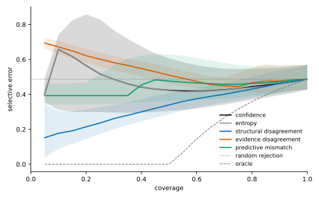
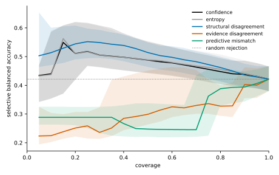
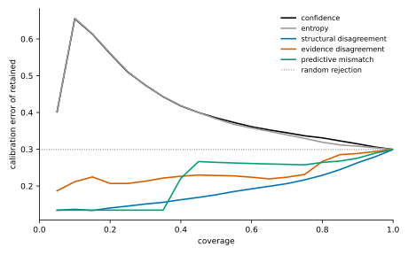
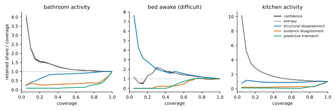

# Phase 4: richer uncertainty diagnostics against confidence

Paper 1 found that confidence, entropy, margin, evidence strength and information gain fail as standalone uncertainty signals. Phase 4 built three structural diagnostics: model-structure disagreement, evidence-channel disagreement and predictive mismatch. This pre-specified experiment compares them with posterior confidence and entropy as signals for rejecting the same predictions, on the development households.

This page is generated entirely from the experiment record, `artifacts/phase4/phase4-uncertainty-diagnostics.json`, by `sensor_modeling.datasets.uncertainty_summary.render_page`, and the figures by `sensor_modeling.datasets.uncertainty_figures.draw_figures`. A test checks that the committed page is exactly that rendering.

**Status: pre-specified, development panel.**

- **Protocol.** Every signal, estimand, minimal difference and decision rule was frozen before any household was scored.
- **Not a held-out claim.** The development homes have been inspected in earlier work. The frozen external cohort is not touched.
- **Thresholds.** None selected: no coverage level or signal value is chosen for deployment.

## The answer

> Does any structural diagnostic produce a materially better selective-risk curve than confidence, without disproportionately rejecting difficult minority states?

**Yes.** Materially better: `structural_disagreement`.

| Signal | AURC: confidence − signal | 95% interval | Verdict | Minority-state guard | Decision |
| --- | --- | --- | --- | --- | --- |
| `entropy` | +0.002 | [+0.001, +0.003] | negligible | holds | **negligible difference** |
| `structural_disagreement` (structural) | +0.059 | [+0.031, +0.087] | favours signal | holds | **materially better** |
| `evidence_disagreement` (structural) | -0.149 | [-0.183, -0.110] | favours confidence | fails (3) | **worse** |
| `predictive_mismatch` (structural) | -0.040 | [-0.060, -0.020] | favours confidence | fails (3) | **worse** |

The AURC difference is paired by household, and each household counts once. A positive difference favours the signal. The minimal difference is 0.01.

### Read with

- **The guard's reach.** It covers `bed_awake`: 68 windows in 5 households.
- **`structural_disagreement` at the inspection levels.** Error at 0.5: uncertain; balanced accuracy at 0.5: uncertain; error at 0.7: uncertain; balanced accuracy at 0.7: uncertain; error at 0.9: negligible; balanced accuracy at 0.9: uncertain.
- **`structural_disagreement` and the other minority states.** It retains less than confidence of `bathroom_activity` at 0.5, 0.7; `kitchen_activity` at 0.5, 0.7: minority states the guard does not cover.

## Protocol

The protocol is `artifacts/phase4/uncertainty_protocol.json`, SHA-256 `78a378f47c8adb9b1d2233383cd211b433881e167dab19b94750054182985c91`.

- **Households.** 20 development homes in the frozen folds of `artifacts/phase1/household_splits.json`. Each home is held out once and scored by models fitted on its fold's training homes.
- **Predictions.** `hurdle/population/all`: the Phase 3.3 follow-up's recursion: fitted hurdle-Poisson channels with the fold's population parameters, fed every window of the recording from the stationary distribution; the predicted state is the posterior's most probable, and every signal ranks these same predictions.
- **Coverage grid.** 0.05 to 1.00 in 20 levels; inspection levels 0.5, 0.7, 0.9.
- **Uncertainty.** Households, never timestamps, are resampled: 2,000 resamples for the pooled curves, 10,000 for the paired comparisons, 95% percentile intervals, seed 0.

### Signals

| Signal | Direction | Missing values | Definition |
| --- | --- | --- | --- |
| `confidence` | `higher_is_safer` | `refuse` | the reference recursion's posterior probability of its predicted state |
| `entropy` | `higher_is_riskier` | `refuse` | the reference posterior's Shannon entropy divided by log of the number of states, in [0, 1] |
| `structural_disagreement` | `higher_is_riskier` | `refuse` | the normalised discordance of the ensemble's posteriors: their generalised Jensen-Shannon divergence in bits over log2 of the number of specifications, in [0, 1] |
| `evidence_disagreement` | `higher_is_riskier` | `reject_first` | the normalised discordance of the identifiable evidence groups of the reference recursion's window: motion (the motion channels), contact (the door channel) and context (the prediction before the window), each group's posterior its channels' fitted likelihoods normalised with no prior; undefined, and rejected first, when fewer than two groups are identifiable |
| `predictive_mismatch` | `higher_is_riskier` | `refuse` | the least standardised surprise over the states: min over s of (-log p(x \| s) minus its mean under s) over its standard deviation under s, with the reference's normalised hurdle count laws |

The structural ensemble is `hurdle/population/all`, `hurdle_nb/population/all`, `hurdle/population/half_a`, `hurdle/population/half_b`: the default ensemble without its pooled specification, which adapts to the household's own labelled windows; a deployed signal has no labels, and a cut-off would change the scored windows of every signal.

### Estimands and decision

- **AURC, the primary estimand.** Primary: each household's error AURC over the grid, confidence minus signal; positive favours the signal.
- **Balanced accuracy over the grid.** Each household's selective balanced accuracy averaged over the grid by the trapezoid rule, signal minus confidence.
- **At each inspection level.** At each inspection coverage, each household's selective balanced accuracy (signal minus confidence), error and calibration error (confidence minus signal).
- **Retained share of each state.** At each inspection coverage, each household's retained share of each state it has, signal minus confidence: negative when the signal rejects the state more.
- **Pairing.** Households with a value under both signals; every household counts once.

| Quantity | Minimal difference |
| --- | --- |
| `aurc` | 0.01 |
| `balanced_accuracy` | 0.02 |
| `balanced_accuracy_area` | 0.02 |
| `calibration_error` | 0.02 |
| `error` | 0.02 |
| `state_coverage` | 0.05 |

- **Verdicts.** Favours signal: mean at least the minimal difference and interval above 0; favours confidence: mean at most minus it and interval below 0; negligible: interval within plus or minus it; uncertain otherwise.
- **Difficult minority states.** A state is a difficult minority state when its share of the scored windows is below 0.1 and the reference's recall on it at full coverage is below the reference's balanced accuracy, both pooled over the scored windows; fixed from the reference's predictions, before any signal is compared.
- **Guard.** A signal disproportionately rejects difficult minority states when, for any such state at any inspection coverage, the paired comparison of its retained share favours confidence: it retains less of the state than confidence does, by at least the minimal difference, with the interval below 0.
- **Absolute bias.** The retained share over the coverage, pooled, is reported for every signal and state: 1 is proportional rejection.
- **Materially better.** The AURC verdict favours the signal and the guard holds.
- **Better but rejects difficult minority states.** The AURC verdict favours the signal and the guard fails.
- **Negligible difference.** The AURC verdict is negligible.
- **Worse.** The AURC verdict favours confidence.
- **Uncertain.** Otherwise.
- **The key question.** Yes when any structural signal is materially better; no otherwise.

## Selective-risk curves

The panel pools 232,975 scored windows. At full coverage the reference's error is 0.487, its balanced accuracy 0.421 and its calibration error 0.299. Random rejection keeps these at every coverage. The oracle's AURC is 0.152.

### Curve summaries, pooled over the panel

| Signal | AURC | 95% interval | Excess over oracle | Gain | 95% interval |
| --- | --- | --- | --- | --- | --- |
| `confidence` | 0.473 | [0.336, 0.638] | 0.321 | 0.041 | [-0.216, 0.305] |
| `entropy` | 0.472 | [0.335, 0.638] | 0.320 | 0.044 | [-0.215, 0.310] |
| `structural_disagreement` | 0.336 | [0.281, 0.417] | 0.184 | 0.450 | [0.369, 0.529] |
| `evidence_disagreement` | 0.531 | [0.499, 0.565] | 0.379 | -0.131 | [-0.289, 0.072] |
| `predictive_mismatch` | 0.442 | [0.373, 0.540] | 0.290 | 0.133 | [0.012, 0.211] |

Random rejection's AURC is 0.487. The gain is 1 for the oracle and 0 for random rejection.

### Selective error, pooled, at the inspection levels

| Signal | coverage 0.5 | coverage 0.7 | coverage 0.9 |
| --- | --- | --- | --- |
| `confidence` | 0.424 [0.306, 0.606] | 0.426 [0.342, 0.547] | 0.462 [0.397, 0.554] |
| `entropy` | 0.422 [0.301, 0.607] | 0.425 [0.342, 0.548] | 0.459 [0.394, 0.550] |
| `structural_disagreement` | 0.340 [0.286, 0.409] | 0.401 [0.354, 0.466] | 0.463 [0.410, 0.537] |
| `evidence_disagreement` | 0.510 [0.463, 0.556] | 0.449 [0.419, 0.497] | 0.477 [0.412, 0.566] |
| `predictive_mismatch` | 0.476 [0.363, 0.628] | 0.458 [0.373, 0.580] | 0.472 [0.407, 0.563] |

### Selective balanced accuracy, pooled, at the inspection levels

| Signal | coverage 0.5 | coverage 0.7 | coverage 0.9 |
| --- | --- | --- | --- |
| `confidence` | 0.488 [0.443, 0.552] | 0.463 [0.419, 0.513] | 0.438 [0.396, 0.485] |
| `entropy` | 0.489 [0.443, 0.554] | 0.467 [0.423, 0.521] | 0.441 [0.398, 0.487] |
| `structural_disagreement` | 0.514 [0.464, 0.549] | 0.482 [0.434, 0.519] | 0.436 [0.392, 0.475] |
| `evidence_disagreement` | 0.299 [0.263, 0.451] | 0.330 [0.301, 0.454] | 0.402 [0.355, 0.463] |
| `predictive_mismatch` | 0.247 [0.221, 0.338] | 0.245 [0.221, 0.435] | 0.394 [0.344, 0.449] |

### Calibration error of retained predictions, pooled, at the inspection levels

| Signal | coverage 0.5 | coverage 0.7 | coverage 0.9 |
| --- | --- | --- | --- |
| `confidence` | 0.385 | 0.345 | 0.315 |
| `entropy` | 0.383 | 0.339 | 0.308 |
| `structural_disagreement` | 0.176 | 0.207 | 0.263 |
| `evidence_disagreement` | 0.229 | 0.224 | 0.288 |
| `predictive_mismatch` | 0.264 | 0.259 | 0.276 |

### Household coverage under the pooled selection

One threshold over the panel retains different shares of each household. Smallest, median and largest household coverage:

| Signal | coverage 0.5 | coverage 0.7 | coverage 0.9 |
| --- | --- | --- | --- |
| `confidence` | 0.30 / 0.47 / 0.93 | 0.53 / 0.69 / 0.97 | 0.82 / 0.90 / 0.99 |
| `entropy` | 0.29 / 0.46 / 0.94 | 0.49 / 0.70 / 0.98 | 0.82 / 0.90 / 1.00 |
| `structural_disagreement` | 0.23 / 0.52 / 0.66 | 0.32 / 0.73 / 0.86 | 0.56 / 0.96 / 0.99 |
| `evidence_disagreement` | 0.07 / 0.55 / 0.70 | 0.13 / 0.78 / 0.86 | 0.84 / 0.90 / 0.98 |
| `predictive_mismatch` | 0.00 / 0.39 / 0.97 | 0.00 / 0.70 / 0.97 | 0.83 / 0.89 / 0.99 |

Households wholly rejected by the pooled selection: `predictive_mismatch` rejects every window of hh127 at 0.5, 0.7.

## Household-level paired differences

Each household's own curve retains the given fraction of its own windows. Differences are oriented so that a positive value favours the signal over confidence.

| Signal | Quantity | Mean difference | 95% interval | Households | Verdict |
| --- | --- | --- | --- | --- | --- |
| `entropy` | AURC | +0.002 | [+0.001, +0.003] | 20 | negligible |
| `entropy` | balanced accuracy over the grid | +0.001 | [-0.000, +0.003] | 20 | negligible |
| `entropy` | balanced accuracy at 0.5 | -0.000 | [-0.005, +0.004] | 20 | negligible |
| `entropy` | calibration error at 0.5 | +0.004 | [+0.002, +0.007] | 20 | negligible |
| `entropy` | error at 0.5 | +0.004 | [+0.001, +0.006] | 20 | negligible |
| `entropy` | balanced accuracy at 0.7 | +0.005 | [+0.001, +0.011] | 20 | negligible |
| `entropy` | calibration error at 0.7 | +0.010 | [+0.006, +0.015] | 20 | negligible |
| `entropy` | error at 0.7 | +0.006 | [+0.003, +0.009] | 20 | negligible |
| `entropy` | balanced accuracy at 0.9 | +0.002 | [+0.000, +0.004] | 20 | negligible |
| `entropy` | calibration error at 0.9 | +0.005 | [+0.004, +0.007] | 20 | negligible |
| `entropy` | error at 0.9 | +0.003 | [+0.002, +0.004] | 20 | negligible |
| `structural_disagreement` | AURC | +0.059 | [+0.031, +0.087] | 20 | favours signal |
| `structural_disagreement` | balanced accuracy over the grid | +0.032 | [+0.013, +0.051] | 20 | favours signal |
| `structural_disagreement` | balanced accuracy at 0.5 | +0.011 | [-0.015, +0.036] | 20 | uncertain |
| `structural_disagreement` | calibration error at 0.5 | +0.131 | [+0.103, +0.164] | 20 | favours signal |
| `structural_disagreement` | error at 0.5 | +0.027 | [-0.007, +0.062] | 20 | uncertain |
| `structural_disagreement` | balanced accuracy at 0.7 | +0.006 | [-0.012, +0.023] | 20 | uncertain |
| `structural_disagreement` | calibration error at 0.7 | +0.093 | [+0.070, +0.116] | 20 | favours signal |
| `structural_disagreement` | error at 0.7 | +0.000 | [-0.026, +0.024] | 20 | uncertain |
| `structural_disagreement` | balanced accuracy at 0.9 | -0.006 | [-0.021, +0.008] | 20 | uncertain |
| `structural_disagreement` | calibration error at 0.9 | +0.038 | [+0.028, +0.048] | 20 | favours signal |
| `structural_disagreement` | error at 0.9 | -0.004 | [-0.016, +0.008] | 20 | negligible |
| `evidence_disagreement` | AURC | -0.149 | [-0.183, -0.110] | 20 | favours confidence |
| `evidence_disagreement` | balanced accuracy over the grid | -0.141 | [-0.167, -0.115] | 20 | favours confidence |
| `evidence_disagreement` | balanced accuracy at 0.5 | -0.175 | [-0.215, -0.136] | 20 | favours confidence |
| `evidence_disagreement` | calibration error at 0.5 | +0.050 | [+0.019, +0.081] | 20 | favours signal |
| `evidence_disagreement` | error at 0.5 | -0.172 | [-0.212, -0.127] | 20 | favours confidence |
| `evidence_disagreement` | balanced accuracy at 0.7 | -0.128 | [-0.154, -0.102] | 20 | favours confidence |
| `evidence_disagreement` | calibration error at 0.7 | +0.044 | [+0.032, +0.056] | 20 | favours signal |
| `evidence_disagreement` | error at 0.7 | -0.085 | [-0.104, -0.064] | 20 | favours confidence |
| `evidence_disagreement` | balanced accuracy at 0.9 | -0.042 | [-0.060, -0.027] | 20 | favours confidence |
| `evidence_disagreement` | calibration error at 0.9 | +0.026 | [+0.023, +0.030] | 20 | favours signal |
| `evidence_disagreement` | error at 0.9 | -0.014 | [-0.018, -0.007] | 20 | negligible |
| `predictive_mismatch` | AURC | -0.040 | [-0.060, -0.020] | 20 | favours confidence |
| `predictive_mismatch` | balanced accuracy over the grid | -0.107 | [-0.142, -0.071] | 20 | favours confidence |
| `predictive_mismatch` | balanced accuracy at 0.5 | -0.173 | [-0.222, -0.120] | 20 | favours confidence |
| `predictive_mismatch` | calibration error at 0.5 | +0.095 | [+0.074, +0.116] | 20 | favours signal |
| `predictive_mismatch` | error at 0.5 | -0.059 | [-0.081, -0.036] | 20 | favours confidence |
| `predictive_mismatch` | balanced accuracy at 0.7 | -0.092 | [-0.132, -0.054] | 20 | favours confidence |
| `predictive_mismatch` | calibration error at 0.7 | +0.084 | [+0.073, +0.096] | 20 | favours signal |
| `predictive_mismatch` | error at 0.7 | -0.028 | [-0.041, -0.014] | 20 | favours confidence |
| `predictive_mismatch` | balanced accuracy at 0.9 | -0.023 | [-0.039, -0.007] | 20 | favours confidence |
| `predictive_mismatch` | calibration error at 0.9 | +0.038 | [+0.034, +0.042] | 20 | favours signal |
| `predictive_mismatch` | error at 0.9 | -0.009 | [-0.015, -0.003] | 20 | negligible |

## Rejection bias by behavioural state

### The states

| State | Windows | Households | Share of scored windows | Reference recall | Difficult minority |
| --- | --- | --- | --- | --- | --- |
| `away` | 75,667 | 20 | 32.48% | 0.403 | no |
| `bathroom_activity` | 7,956 | 20 | 3.41% | 0.431 | no |
| `bed_awake` | 68 | 5 | 0.03% | 0.132 | yes |
| `home_active` | 24,837 | 20 | 10.66% | 0.273 | no |
| `home_inactive` | 40,735 | 20 | 17.48% | 0.396 | no |
| `kitchen_activity` | 5,959 | 20 | 2.56% | 0.550 | no |
| `sleeping` | 77,753 | 20 | 33.37% | 0.763 | no |

Difficult minority states: `bed_awake`.

### The other minority states, outside the decision rule

Descriptive only: these states are below the minority share, but the reference's recall on them is not below its balanced accuracy, so the guard does not cover them. Listed are the inspection levels where a signal's paired comparison of the retained share favours confidence.

| Signal | State | Rejected more than under confidence at |
| --- | --- | --- |
| `entropy` | `bathroom_activity` | none |
| `entropy` | `kitchen_activity` | none |
| `structural_disagreement` | `bathroom_activity` | 0.5, 0.7 |
| `structural_disagreement` | `kitchen_activity` | 0.5, 0.7 |
| `evidence_disagreement` | `bathroom_activity` | 0.5, 0.7, 0.9 |
| `evidence_disagreement` | `kitchen_activity` | 0.5, 0.7, 0.9 |
| `predictive_mismatch` | `bathroom_activity` | 0.5, 0.7, 0.9 |
| `predictive_mismatch` | `kitchen_activity` | 0.5, 0.7, 0.9 |

### Retained share over coverage, pooled, at 0.5

1 is proportional rejection; below 1, the state is rejected more than the panel.

| Signal | `away` | `bathroom_activity` | `bed_awake` | `home_active` | `home_inactive` | `kitchen_activity` | `sleeping` |
| --- | --- | --- | --- | --- | --- | --- | --- |
| `confidence` | 1.04 | 1.16 | 1.62 | 1.07 | 0.82 | 1.46 | 0.98 |
| `entropy` | 1.04 | 1.17 | 1.59 | 1.06 | 0.80 | 1.47 | 1.00 |
| `structural_disagreement` | 0.73 | 0.87 | 1.79 | 0.88 | 0.83 | 0.85 | 1.41 |
| `evidence_disagreement` | 1.04 | 0.32 | 0.26 | 0.81 | 1.20 | 0.26 | 1.04 |
| `predictive_mismatch` | 1.45 | 0.11 | 0.36 | 0.34 | 0.66 | 0.08 | 1.11 |

### Retained share over coverage, pooled, at 0.7

1 is proportional rejection; below 1, the state is rejected more than the panel.

| Signal | `away` | `bathroom_activity` | `bed_awake` | `home_active` | `home_inactive` | `kitchen_activity` | `sleeping` |
| --- | --- | --- | --- | --- | --- | --- | --- |
| `confidence` | 0.98 | 1.06 | 1.30 | 1.02 | 0.90 | 1.19 | 1.05 |
| `entropy` | 0.98 | 1.08 | 1.28 | 1.02 | 0.88 | 1.21 | 1.05 |
| `structural_disagreement` | 0.79 | 0.92 | 1.37 | 0.99 | 0.95 | 0.91 | 1.25 |
| `evidence_disagreement` | 0.98 | 0.37 | 0.88 | 0.84 | 1.09 | 0.30 | 1.14 |
| `predictive_mismatch` | 1.33 | 0.13 | 0.99 | 0.40 | 0.70 | 0.06 | 1.18 |

### Retained share over coverage, pooled, at 0.9

1 is proportional rejection; below 1, the state is rejected more than the panel.

| Signal | `away` | `bathroom_activity` | `bed_awake` | `home_active` | `home_inactive` | `kitchen_activity` | `sleeping` |
| --- | --- | --- | --- | --- | --- | --- | --- |
| `confidence` | 0.99 | 1.02 | 1.09 | 1.01 | 0.97 | 1.05 | 1.02 |
| `entropy` | 0.99 | 1.00 | 1.11 | 1.00 | 0.95 | 1.06 | 1.03 |
| `structural_disagreement` | 0.84 | 1.01 | 1.08 | 1.06 | 1.05 | 1.02 | 1.11 |
| `evidence_disagreement` | 1.08 | 0.53 | 0.95 | 0.87 | 0.99 | 0.57 | 1.06 |
| `predictive_mismatch` | 1.07 | 0.42 | 0.96 | 0.78 | 1.01 | 0.50 | 1.09 |

### Retained share against confidence, paired by household

Signal minus confidence: negative when the signal rejects the state more. The minimal difference is 0.05.

| Signal | Coverage | State | Mean difference | 95% interval | Households | Verdict |
| --- | --- | --- | --- | --- | --- | --- |
| `entropy` | 0.5 | `away` | -0.003 | [-0.007, +0.002] | 20 | negligible |
| `entropy` | 0.5 | `bathroom_activity` | +0.010 | [+0.003, +0.017] | 20 | negligible |
| `entropy` | 0.5 | `bed_awake` (difficult minority) | +0.067 | [+0.000, +0.200] | 5 | uncertain |
| `entropy` | 0.5 | `home_active` | -0.000 | [-0.005, +0.004] | 20 | negligible |
| `entropy` | 0.5 | `home_inactive` | -0.010 | [-0.015, -0.005] | 20 | negligible |
| `entropy` | 0.5 | `kitchen_activity` | +0.008 | [+0.002, +0.015] | 20 | negligible |
| `entropy` | 0.5 | `sleeping` | +0.006 | [+0.002, +0.010] | 20 | negligible |
| `entropy` | 0.7 | `away` | +0.002 | [-0.007, +0.012] | 20 | negligible |
| `entropy` | 0.7 | `bathroom_activity` | +0.007 | [-0.008, +0.022] | 20 | negligible |
| `entropy` | 0.7 | `bed_awake` (difficult minority) | +0.067 | [+0.000, +0.200] | 5 | uncertain |
| `entropy` | 0.7 | `home_active` | -0.015 | [-0.033, +0.000] | 20 | negligible |
| `entropy` | 0.7 | `home_inactive` | -0.031 | [-0.044, -0.019] | 20 | negligible |
| `entropy` | 0.7 | `kitchen_activity` | +0.008 | [-0.002, +0.018] | 20 | negligible |
| `entropy` | 0.7 | `sleeping` | +0.016 | [+0.006, +0.029] | 20 | negligible |
| `entropy` | 0.9 | `away` | +0.007 | [-0.005, +0.019] | 20 | negligible |
| `entropy` | 0.9 | `bathroom_activity` | -0.010 | [-0.022, +0.002] | 20 | negligible |
| `entropy` | 0.9 | `bed_awake` (difficult minority) | -0.050 | [-0.150, +0.000] | 5 | uncertain |
| `entropy` | 0.9 | `home_active` | -0.010 | [-0.018, -0.002] | 20 | negligible |
| `entropy` | 0.9 | `home_inactive` | -0.016 | [-0.024, -0.007] | 20 | negligible |
| `entropy` | 0.9 | `kitchen_activity` | +0.013 | [+0.005, +0.022] | 20 | negligible |
| `entropy` | 0.9 | `sleeping` | +0.002 | [-0.004, +0.008] | 20 | negligible |
| `structural_disagreement` | 0.5 | `away` | +0.032 | [-0.030, +0.099] | 20 | uncertain |
| `structural_disagreement` | 0.5 | `bathroom_activity` | -0.156 | [-0.234, -0.069] | 20 | favours confidence |
| `structural_disagreement` | 0.5 | `bed_awake` (difficult minority) | +0.185 | [-0.067, +0.450] | 5 | uncertain |
| `structural_disagreement` | 0.5 | `home_active` | -0.074 | [-0.147, +0.016] | 20 | uncertain |
| `structural_disagreement` | 0.5 | `home_inactive` | +0.037 | [-0.046, +0.150] | 20 | uncertain |
| `structural_disagreement` | 0.5 | `kitchen_activity` | -0.342 | [-0.444, -0.217] | 20 | favours confidence |
| `structural_disagreement` | 0.5 | `sleeping` | +0.172 | [+0.104, +0.268] | 20 | favours signal |
| `structural_disagreement` | 0.7 | `away` | +0.059 | [-0.019, +0.138] | 20 | uncertain |
| `structural_disagreement` | 0.7 | `bathroom_activity` | -0.129 | [-0.226, -0.014] | 20 | favours confidence |
| `structural_disagreement` | 0.7 | `bed_awake` (difficult minority) | -0.028 | [-0.233, +0.178] | 5 | uncertain |
| `structural_disagreement` | 0.7 | `home_active` | -0.010 | [-0.087, +0.086] | 20 | uncertain |
| `structural_disagreement` | 0.7 | `home_inactive` | +0.068 | [-0.020, +0.185] | 20 | uncertain |
| `structural_disagreement` | 0.7 | `kitchen_activity` | -0.236 | [-0.352, -0.096] | 20 | favours confidence |
| `structural_disagreement` | 0.7 | `sleeping` | +0.123 | [+0.053, +0.225] | 20 | favours signal |
| `structural_disagreement` | 0.9 | `away` | +0.015 | [-0.037, +0.071] | 20 | uncertain |
| `structural_disagreement` | 0.9 | `bathroom_activity` | -0.065 | [-0.126, +0.001] | 20 | uncertain |
| `structural_disagreement` | 0.9 | `bed_awake` (difficult minority) | -0.156 | [-0.367, +0.022] | 5 | uncertain |
| `structural_disagreement` | 0.9 | `home_active` | +0.012 | [-0.041, +0.081] | 20 | uncertain |
| `structural_disagreement` | 0.9 | `home_inactive` | +0.064 | [+0.006, +0.150] | 20 | favours signal |
| `structural_disagreement` | 0.9 | `kitchen_activity` | -0.094 | [-0.207, +0.046] | 20 | uncertain |
| `structural_disagreement` | 0.9 | `sleeping` | +0.060 | [+0.026, +0.113] | 20 | favours signal |
| `evidence_disagreement` | 0.5 | `away` | +0.261 | [+0.184, +0.345] | 20 | favours signal |
| `evidence_disagreement` | 0.5 | `bathroom_activity` | -0.444 | [-0.525, -0.355] | 20 | favours confidence |
| `evidence_disagreement` | 0.5 | `bed_awake` (difficult minority) | -0.393 | [-0.667, -0.119] | 5 | favours confidence |
| `evidence_disagreement` | 0.5 | `home_active` | -0.139 | [-0.234, -0.034] | 20 | favours confidence |
| `evidence_disagreement` | 0.5 | `home_inactive` | +0.166 | [+0.082, +0.258] | 20 | favours signal |
| `evidence_disagreement` | 0.5 | `kitchen_activity` | -0.616 | [-0.729, -0.481] | 20 | favours confidence |
| `evidence_disagreement` | 0.5 | `sleeping` | -0.013 | [-0.113, +0.104] | 20 | uncertain |
| `evidence_disagreement` | 0.7 | `away` | +0.226 | [+0.169, +0.288] | 20 | favours signal |
| `evidence_disagreement` | 0.7 | `bathroom_activity` | -0.530 | [-0.613, -0.436] | 20 | favours confidence |
| `evidence_disagreement` | 0.7 | `bed_awake` (difficult minority) | -0.556 | [-0.833, -0.233] | 5 | favours confidence |
| `evidence_disagreement` | 0.7 | `home_active` | -0.180 | [-0.261, -0.086] | 20 | favours confidence |
| `evidence_disagreement` | 0.7 | `home_inactive` | +0.100 | [+0.033, +0.187] | 20 | favours signal |
| `evidence_disagreement` | 0.7 | `kitchen_activity` | -0.648 | [-0.757, -0.516] | 20 | favours confidence |
| `evidence_disagreement` | 0.7 | `sleeping` | +0.038 | [-0.044, +0.141] | 20 | uncertain |
| `evidence_disagreement` | 0.9 | `away` | +0.108 | [+0.084, +0.134] | 20 | favours signal |
| `evidence_disagreement` | 0.9 | `bathroom_activity` | -0.462 | [-0.526, -0.388] | 20 | favours confidence |
| `evidence_disagreement` | 0.9 | `bed_awake` (difficult minority) | -0.443 | [-0.667, -0.178] | 5 | favours confidence |
| `evidence_disagreement` | 0.9 | `home_active` | -0.107 | [-0.156, -0.052] | 20 | favours confidence |
| `evidence_disagreement` | 0.9 | `home_inactive` | +0.047 | [+0.008, +0.107] | 20 | uncertain |
| `evidence_disagreement` | 0.9 | `kitchen_activity` | -0.415 | [-0.486, -0.330] | 20 | favours confidence |
| `evidence_disagreement` | 0.9 | `sleeping` | +0.041 | [+0.015, +0.078] | 20 | uncertain |
| `predictive_mismatch` | 0.5 | `away` | +0.254 | [+0.198, +0.314] | 20 | favours signal |
| `predictive_mismatch` | 0.5 | `bathroom_activity` | -0.533 | [-0.601, -0.457] | 20 | favours confidence |
| `predictive_mismatch` | 0.5 | `bed_awake` (difficult minority) | -0.453 | [-0.733, -0.170] | 5 | favours confidence |
| `predictive_mismatch` | 0.5 | `home_active` | -0.308 | [-0.396, -0.210] | 20 | favours confidence |
| `predictive_mismatch` | 0.5 | `home_inactive` | -0.055 | [-0.128, +0.023] | 20 | uncertain |
| `predictive_mismatch` | 0.5 | `kitchen_activity` | -0.694 | [-0.790, -0.579] | 20 | favours confidence |
| `predictive_mismatch` | 0.5 | `sleeping` | +0.091 | [+0.036, +0.144] | 20 | favours signal |
| `predictive_mismatch` | 0.7 | `away` | +0.270 | [+0.219, +0.317] | 20 | favours signal |
| `predictive_mismatch` | 0.7 | `bathroom_activity` | -0.634 | [-0.709, -0.546] | 20 | favours confidence |
| `predictive_mismatch` | 0.7 | `bed_awake` (difficult minority) | -0.636 | [-0.933, -0.309] | 5 | favours confidence |
| `predictive_mismatch` | 0.7 | `home_active` | -0.373 | [-0.464, -0.273] | 20 | favours confidence |
| `predictive_mismatch` | 0.7 | `home_inactive` | -0.085 | [-0.168, +0.007] | 20 | uncertain |
| `predictive_mismatch` | 0.7 | `kitchen_activity` | -0.765 | [-0.862, -0.646] | 20 | favours confidence |
| `predictive_mismatch` | 0.7 | `sleeping` | +0.116 | [+0.067, +0.172] | 20 | favours signal |
| `predictive_mismatch` | 0.9 | `away` | +0.099 | [+0.077, +0.122] | 20 | favours signal |
| `predictive_mismatch` | 0.9 | `bathroom_activity` | -0.507 | [-0.576, -0.432] | 20 | favours confidence |
| `predictive_mismatch` | 0.9 | `bed_awake` (difficult minority) | -0.284 | [-0.417, -0.136] | 5 | favours confidence |
| `predictive_mismatch` | 0.9 | `home_active` | -0.194 | [-0.249, -0.139] | 20 | favours confidence |
| `predictive_mismatch` | 0.9 | `home_inactive` | +0.037 | [+0.002, +0.085] | 20 | uncertain |
| `predictive_mismatch` | 0.9 | `kitchen_activity` | -0.493 | [-0.575, -0.403] | 20 | favours confidence |
| `predictive_mismatch` | 0.9 | `sleeping` | +0.064 | [+0.051, +0.081] | 20 | favours signal |

## Checks

- **Reproduction.** At full coverage, every household's accuracy, balanced accuracy and calibration error differ from the `hurdle@R` cell of `phase3-hurdle-negative-binomial` (commit `af458fa`) by at most 2.89e-15, over 20 households.
- **Comparator.** Every signal is compared with `confidence` on the same predictions and the same household resamples.

## What this does not show

- **No threshold.** No coverage level or signal value is chosen for deployment.
- **Development panel only.** A held-out claim needs the frozen external cohort.
- **One reference model.** Every signal ranks the predictions of the `hurdle/population/all` recursion.
- **Signals as declared.** No signal was added, tuned or combined after the results were seen.
