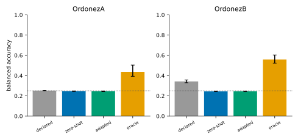
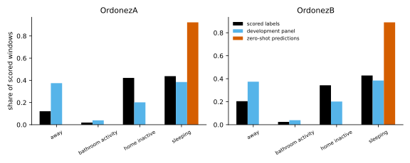
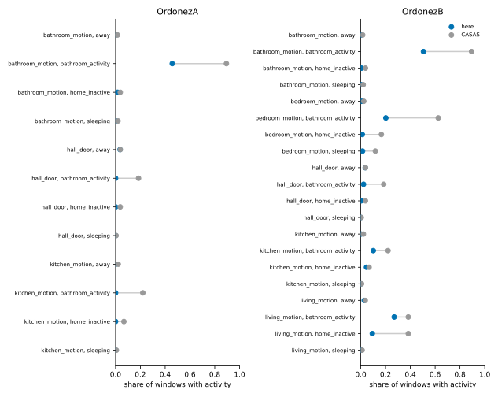

# Phase 5: external generalisation results

The frozen [external-generalisation protocol](PHASE5_EXTERNAL_PROTOCOL.md) run exactly as declared, on the UCI ADL Binary dataset of Ordóñez et al.: two single-resident homes in Spain, collected independently of CASAS, with a different sensing layout. This page is generated entirely from the record, `artifacts/phase5/phase5-external-ordonez-results.json`, by `sensor_modeling.datasets.external_summary.render_page`, and a test checks that the committed page is exactly that rendering.

**Status: pre-specified, external, two homes.**

- **Protocol.** Frozen in `a863bff` before any external scoring, SHA-256 `620f3fdc55e0fe9da6ebcc0737ccf3c2be584f9573c490ce30388e02a218b334`. The run checked the frozen file, and reproduced every CASAS population digest, before it scored.
- **Two homes.** Every conclusion is about these two homes, not a population of homes. Intervals resample local days within a home.
- **Descriptive sections.** The failure causes and the separation of losses are descriptive. They were declared in the scoring code before the run, and change no conclusion.

## The declared conclusions

|  | Estimand | Verdict per home | Conclusion |
| --- | --- | --- | --- |
| T | Transfer: zero-shot against the declared rates | OrdonezA: negligible; OrdonezB: favours declared | **does not transfer** |
| A | Adaptation: adapted against zero-shot | OrdonezA: negligible; OrdonezB: negligible | **does not help** |
| C | Above chance: zero-shot balanced accuracy against chance | OrdonezA: negligible; OrdonezB: negligible | **not above chance** |
| S | Phase 4 direction: structural disagreement against confidence | OrdonezA: uncertain; OrdonezB: favours structural | **inconclusive** |

Homes improved and worsened, by the point difference:

| Estimand | Metric | Improved | Worsened |
| --- | --- | --- | --- |
| T | balanced accuracy | 0 | 2 |
| T | brier | 1 | 1 |
| T | calibration error | 1 | 1 |
| T | log loss | 1 | 1 |
| A | balanced accuracy | 1 | 1 |
| A | brier | 2 | 0 |
| A | calibration error | 1 | 1 |
| A | log loss | 2 | 0 |

Log loss, the Brier score and the calibration error count as improved when they fall.

## Every home

### OrdonezA

1,826 scored windows over 8 days, after the adaptation period ending 2011-12-05T00:00:00+01:00. Chance is 0.250.

The protocol expected 7 scored days, from the labelled days the dataset's description gives; its definition of the scored period, from the end of the adaptation period to the end of the recording, covers 8 local dates here, and the definition is what was run.

| Metric | declared | zero-shot | adapted | oracle (descriptive) |
| --- | --- | --- | --- | --- |
| balanced accuracy | 0.252 [0.250, 0.254] | 0.246 [0.244, 0.249] | 0.245 [0.242, 0.248] | 0.437 |
| log loss | 3.537 [3.400, 3.704] | 2.307 [2.199, 2.414] | 1.911 [1.774, 2.073] | 1.194 |
| brier | 0.996 [0.955, 1.039] | 0.936 [0.891, 0.982] | 0.886 [0.832, 0.942] | 0.626 |
| calibration error | 0.434 [0.411, 0.459] | 0.410 [0.384, 0.438] | 0.392 [0.363, 0.422] | 0.149 |
| macro f1 | 0.156 [0.152, 0.161] | 0.158 [0.152, 0.165] | 0.159 [0.153, 0.166] | 0.455 |
| accuracy | 0.440 [0.415, 0.464] | 0.431 [0.406, 0.455] | 0.429 [0.405, 0.452] | 0.540 |

Per-state recall:

| State | declared | zero-shot | adapted | oracle (descriptive) |
| --- | --- | --- | --- | --- |
| `away` | 0.000 | 0.000 | 0.000 | 0.126 |
| `bathroom_activity` | 0.000 | 0.000 | 0.000 | 0.429 |
| `home_inactive` | 0.006 | 0.000 | 0.000 | 0.401 |
| `sleeping` | 1.000 | 0.985 | 0.980 | 0.793 |

### OrdonezB

3,666 scored windows over 17 days, after the adaptation period ending 2012-11-18T00:00:00+01:00. Chance is 0.250.

The protocol expected 14 scored days, from the labelled days the dataset's description gives; its definition of the scored period, from the end of the adaptation period to the end of the recording, covers 17 local dates here, and the definition is what was run.

| Metric | declared | zero-shot | adapted | oracle (descriptive) |
| --- | --- | --- | --- | --- |
| balanced accuracy | 0.343 [0.330, 0.357] | 0.244 [0.242, 0.246] | 0.244 [0.243, 0.246] | 0.559 |
| log loss | 2.692 [2.493, 2.878] | 3.262 [3.029, 3.469] | 2.840 [2.653, 3.004] | 0.982 |
| brier | 0.795 [0.738, 0.848] | 1.036 [0.981, 1.083] | 1.024 [0.964, 1.077] | 0.501 |
| calibration error | 0.351 [0.320, 0.383] | 0.453 [0.413, 0.488] | 0.489 [0.459, 0.516] | 0.160 |
| macro f1 | 0.321 [0.300, 0.343] | 0.159 [0.152, 0.167] | 0.161 [0.154, 0.168] | 0.519 |
| accuracy | 0.528 [0.498, 0.560] | 0.418 [0.390, 0.451] | 0.418 [0.390, 0.451] | 0.652 |

Per-state recall:

| State | declared | zero-shot | adapted | oracle (descriptive) |
| --- | --- | --- | --- | --- |
| `away` | 0.170 | 0.000 | 0.000 | 0.040 |
| `bathroom_activity` | 0.000 | 0.000 | 0.000 | 0.573 |
| `home_inactive` | 0.242 | 0.001 | 0.006 | 0.769 |
| `sleeping` | 0.959 | 0.976 | 0.972 | 0.855 |

## Paired differences

Oriented so that a positive difference favours the first model named in the estimand. Intervals resample the scored period's days.

| Home | Estimand | Metric | Difference | 95% interval | Minimal | Verdict |
| --- | --- | --- | --- | --- | --- | --- |
| OrdonezA | T | balanced accuracy | -0.005 | [-0.007, -0.003] | 0.02 | negligible |
| OrdonezA | T | brier | +0.060 | [+0.041, +0.083] | 0.01 | favours zero-shot |
| OrdonezA | T | calibration error | +0.024 | [+0.011, +0.038] | 0.02 | favours zero-shot |
| OrdonezA | T | log loss | +1.230 | [+1.128, +1.338] | 0.05 | favours zero-shot |
| OrdonezA | A | balanced accuracy | -0.001 | [-0.002, -0.000] | 0.02 | negligible |
| OrdonezA | A | brier | +0.050 | [+0.040, +0.060] | 0.01 | favours adapted |
| OrdonezA | A | calibration error | +0.018 | [+0.014, +0.022] | 0.02 | uncertain |
| OrdonezA | A | log loss | +0.396 | [+0.316, +0.465] | 0.05 | favours adapted |
| OrdonezA | C | balanced accuracy | -0.004 | [-0.006, -0.001] | 0.05 | negligible |
| OrdonezA | S | aurc | -0.025 | [-0.054, +0.002] | 0.01 | uncertain |
| OrdonezB | T | balanced accuracy | -0.098 | [-0.113, -0.086] | 0.02 | favours declared |
| OrdonezB | T | brier | -0.242 | [-0.275, -0.212] | 0.01 | favours declared |
| OrdonezB | T | calibration error | -0.102 | [-0.118, -0.084] | 0.02 | favours declared |
| OrdonezB | T | log loss | -0.570 | [-0.729, -0.402] | 0.05 | favours declared |
| OrdonezB | A | balanced accuracy | +0.000 | [-0.002, +0.003] | 0.02 | negligible |
| OrdonezB | A | brier | +0.013 | [-0.006, +0.031] | 0.01 | uncertain |
| OrdonezB | A | calibration error | -0.036 | [-0.048, -0.025] | 0.02 | favours zero-shot |
| OrdonezB | A | log loss | +0.422 | [+0.257, +0.583] | 0.05 | favours adapted |
| OrdonezB | C | balanced accuracy | -0.006 | [-0.008, -0.004] | 0.05 | negligible |
| OrdonezB | S | aurc | +0.249 | [+0.163, +0.340] | 0.01 | favours structural |

Error AURC, rejecting by each signal within the home:

| Home | confidence | structural disagreement |
| --- | --- | --- |
| OrdonezA | 0.298 | 0.324 |
| OrdonezB | 0.645 | 0.396 |

## Failure causes (descriptive)

### OrdonezA

- **Missing sensor semantics.** 65.7% of the scored period's 204 sensor activations come from sensors that feed no model channel: 46 (a state sensor; the channels count events), 17 (its type is unmappable: appliance power use has no modality in the observation model), 26 (no bathroom_contact channel in the CASAS-trained model), 45 (no kitchen_contact channel in the CASAS-trained model).
- **Ontology mismatch.** 97.6% of the scored period's annotated time is scorable. By disposition, in hours: ambiguous 3.8, approximate 85.6, exact 66.6. Whole recording: 3 impossible intervals, 0 point annotations.
- **Room structure.** Instrumented model channels: `bathroom_motion`, `hall_door`, `kitchen_motion`; without a sensor: `bedroom_motion`, `hall_motion`, `living_motion`. Scored states' rooms: `away` no room; `bathroom_activity` bathroom (bathroom_motion); `home_inactive` no room; `sleeping` bedroom (no channel). Fixture-level sensor types: Flush/Toilet, PIR/Basin, PIR/Cooktop, PIR/Shower.
- **Calibration shift.** Zero-shot mean confidence 0.841 against accuracy 0.431: a gap of +0.410, against +0.299 for the same model on the development panel.
- **State-prior shift.** Scored states here: away 12.2%, bathroom_activity 1.9%, home_inactive 42.2%, sleeping 43.8%; on the development panel: away 37.4%, bathroom_activity 3.9%, home_inactive 20.2%, sleeping 38.5% (Jensen-Shannon 0.081 bits). Zero-shot predictions of unsupported states: 7.7%.

**Different event rates.** Scored windows here against the CASAS population:

| Channel | State | Windows | Silent here | Silent in CASAS | Active mean here | Active mean in CASAS |
| --- | --- | --- | --- | --- | --- | --- |
| `bathroom_motion` | `away` | 222 | 1.000 | 0.984 | — | 7.55 |
| `bathroom_motion` | `bathroom_activity` | 35 | 0.543 | 0.106 | 1.31 | 14.00 |
| `bathroom_motion` | `home_inactive` | 770 | 0.984 | 0.962 | 1.08 | 7.65 |
| `bathroom_motion` | `sleeping` | 799 | 0.999 | 0.980 | 1.00 | 8.87 |
| `hall_door` | `away` | 222 | 0.964 | 0.962 | 1.00 | 4.71 |
| `hall_door` | `bathroom_activity` | 35 | 1.000 | 0.815 | — | 2.86 |
| `hall_door` | `home_inactive` | 770 | 1.000 | 0.962 | — | 3.32 |
| `hall_door` | `sleeping` | 799 | 1.000 | 0.996 | — | 2.13 |
| `kitchen_motion` | `away` | 222 | 1.000 | 0.979 | — | 8.07 |
| `kitchen_motion` | `bathroom_activity` | 35 | 1.000 | 0.780 | — | 9.97 |
| `kitchen_motion` | `home_inactive` | 770 | 1.000 | 0.933 | — | 11.33 |
| `kitchen_motion` | `sleeping` | 799 | 1.000 | 0.994 | — | 4.07 |

### OrdonezB

- **Missing sensor semantics.** 15.7% of the scored period's 1,649 sensor activations come from sensors that feed no model channel: 96 (a state sensor; the channels count events), 6 (its type is unmappable: appliance power use has no modality in the observation model), 67 (no bathroom_contact channel in the CASAS-trained model), 90 (no kitchen_contact channel in the CASAS-trained model).
- **Ontology mismatch.** 96.0% of the scored period's annotated time is scorable. By disposition, in hours: ambiguous 12.5, approximate 174.5, conflict 0.1, exact 130.8. Whole recording: 0 impossible intervals, 0 point annotations.
- **Room structure.** Instrumented model channels: `bathroom_motion`, `bedroom_motion`, `hall_door`, `kitchen_motion`, `living_motion`; without a sensor: `hall_motion`. Scored states' rooms: `away` no room; `bathroom_activity` bathroom (bathroom_motion); `home_inactive` no room; `sleeping` bedroom (bedroom_motion). Fixture-level sensor types: Flush/Toilet, PIR/Basin, PIR/Door, PIR/Shower.
- **Calibration shift.** Zero-shot mean confidence 0.871 against accuracy 0.418: a gap of +0.453, against +0.299 for the same model on the development panel.
- **State-prior shift.** Scored states here: away 20.4%, bathroom_activity 2.4%, home_inactive 34.3%, sleeping 42.8%; on the development panel: away 37.4%, bathroom_activity 3.9%, home_inactive 20.2%, sleeping 38.5% (Jensen-Shannon 0.034 bits). Zero-shot predictions of unsupported states: 10.9%.

**Different event rates.** Scored windows here against the CASAS population:

| Channel | State | Windows | Silent here | Silent in CASAS | Active mean here | Active mean in CASAS |
| --- | --- | --- | --- | --- | --- | --- |
| `bathroom_motion` | `away` | 749 | 0.997 | 0.984 | 1.00 | 7.55 |
| `bathroom_motion` | `bathroom_activity` | 89 | 0.494 | 0.106 | 1.04 | 14.00 |
| `bathroom_motion` | `home_inactive` | 1258 | 0.994 | 0.962 | 1.14 | 7.65 |
| `bathroom_motion` | `sleeping` | 1570 | 0.997 | 0.980 | 1.00 | 8.87 |
| `bedroom_motion` | `away` | 749 | 0.992 | 0.976 | 2.00 | 6.90 |
| `bedroom_motion` | `bathroom_activity` | 89 | 0.798 | 0.375 | 1.61 | 9.81 |
| `bedroom_motion` | `home_inactive` | 1258 | 0.987 | 0.834 | 1.56 | 7.93 |
| `bedroom_motion` | `sleeping` | 1570 | 0.985 | 0.882 | 1.04 | 5.35 |
| `hall_door` | `away` | 749 | 0.964 | 0.962 | 1.00 | 4.71 |
| `hall_door` | `bathroom_activity` | 89 | 0.978 | 0.815 | 1.00 | 2.86 |
| `hall_door` | `home_inactive` | 1258 | 0.997 | 0.962 | 1.00 | 3.32 |
| `hall_door` | `sleeping` | 1570 | 0.999 | 0.996 | 1.00 | 2.13 |
| `kitchen_motion` | `away` | 749 | 0.999 | 0.979 | 2.00 | 8.07 |
| `kitchen_motion` | `bathroom_activity` | 89 | 0.899 | 0.780 | 1.56 | 9.97 |
| `kitchen_motion` | `home_inactive` | 1258 | 0.954 | 0.933 | 1.55 | 11.33 |
| `kitchen_motion` | `sleeping` | 1570 | 0.999 | 0.994 | 1.00 | 4.07 |
| `living_motion` | `away` | 749 | 0.972 | 0.964 | 1.52 | 8.40 |
| `living_motion` | `bathroom_activity` | 89 | 0.730 | 0.617 | 2.08 | 8.77 |
| `living_motion` | `home_inactive` | 1258 | 0.907 | 0.617 | 1.40 | 6.76 |
| `living_motion` | `sleeping` | 1570 | 0.997 | 0.989 | 1.80 | 3.64 |

## Separating the losses (descriptive)

The oracle runs the same recursion with each home's own channel parameters, fitted on all its labelled windows, including the scored ones. It is a ceiling for these channels and this model family, not a condition.

- **Dataset incompatibility.** What cannot be compared: unscorable annotated time and unsupported observations.
- **Sensing-information limitation.** What even the oracle cannot recover: its shortfall from perfect balanced accuracy.
- **Model failure.** What the transferred parameters lose: the oracle's balanced accuracy minus the zero-shot's.

| Home | Unscorable annotated time | Unsupported observations | Oracle balanced accuracy | Oracle shortfall | Zero-shot below oracle | Zero-shot calibration gap |
| --- | --- | --- | --- | --- | --- | --- |
| OrdonezA | 2.4% | 65.7% | 0.437 | 0.563 | +0.191 | +0.410 |
| OrdonezB | 4.0% | 15.7% | 0.559 | 0.441 | +0.315 | +0.453 |

## Checks

- **Populations.** `all` reproduced; `half_a` reproduced; `half_b` reproduced.
- **OrdonezA validation.** impossible_interval (error, 3), overlapping_labels (warning, 2), sensor_semantics (warning, 7), timestamp_order (warning, 58). Eligible: yes.
- **OrdonezB validation.** outside_recording (warning, 2), overlapping_labels (warning, 24), sensor_semantics (warning, 8), timestamp_order (warning, 57). Eligible: yes.

## What this does not show

- **A population claim.** Two homes are two case studies.
- **`bed_awake` cannot be scored:** no label names it.
- **`home_active` cannot be scored:** a candidate of the ambiguous labels Breakfast, Dinner, Lunch, Snack, which are not scored.
- **`kitchen_activity` cannot be scored:** a candidate of the ambiguous labels Breakfast, Dinner, Lunch, Snack, which are not scored.
- **Causal proof of the failure causes.** The diagnostics describe the data; they were not part of the declared evaluation.
