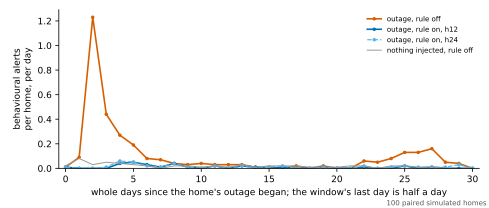
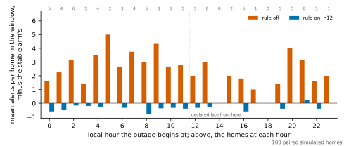
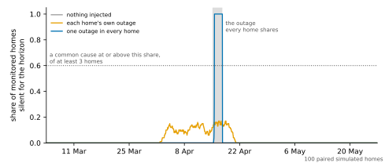
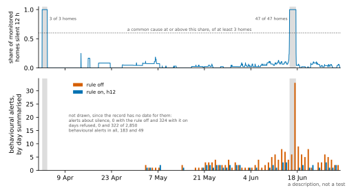

# The silent-home rule: results

The frozen [silent-home protocol](SILENT_HOME_PROTOCOL.md) run as declared. This page is generated from the record, `artifacts/silent_home/silent-home.json`, and its part on TIHM from a second record, `artifacts/silent_home/silent-home-tihm.json`, by `sensor_modeling.datasets.silent_home_summary.render_page`, and a test checks that the committed page is exactly that rendering. The record holds every alert with its moment; the windows a moment falls in are the frozen protocol's.

**The evidence is simulated.** 100 paired simulated homes of 84 days, each run in the 12 pairs of an arm and a condition the protocol declares. Every result is a statement about this repository's simulator.

- **Protocol.** SHA-256 `52d6e6804657f6aaf0c3f921309f33f2d48b88598f38c83251944bb03a660fa6`, checked against the frozen file before the run.
- **Run.** Commit `18b1e42`, with no uncommitted change; recorded 2026-10-07T17:49:19.207709+00:00.
- **The rule.** `HealthConfig.home_silence_horizon`, off by default. Conditions: `off`, the rule off: the pipeline's default; `h12`, the rule on at 12 hours; `h24`, the rule on at 24 hours.
- **Homes.** Seeds from root `20261007`; sensors `front_door`, `bedroom_motion`, `bathroom_motion`, `kitchen_motion`, `living_motion`, `fridge_contact`.
- Pre-specified: the protocol was frozen and pushed before any simulated home was run with the rule on.
- **No pilot.** No pilot informed the protocol: no simulated home had been run with the rule on when it was frozen. The count of homes is the floor `docs/SIMULATION_PROTOCOLS.md` sets, and the Monte Carlo standard error achieved is given beside every paired difference.

## The criteria

Each was fixed, with its margin, before any simulated home had been run with the rule on. They are decided at the primary horizon, `h12`: C1, C2, C4 and C5 on intervals that resample homes, the others on counts.

| Criterion | Claim | Verdict | What decided it |
| --- | --- | --- | --- |
| C1 | The outage raises alerts | **reproduced** | E1 is 2.76 [2.36, 3.15] alerts per home. |
| C2 | The rule removes them | **success** | E3 is 3.04 [2.68, 3.39] and E2 is -0.28 [-0.44, -0.13], against a margin of 0.25. |
| C3 | No harm when nothing is wrong | **success** | The rule changes an alert in 0 homes and raises 0 silence alerts. |
| C4 | Detection is kept | **non-inferior** | 75 of 100 (75%) [66%, 82%] detected with the rule off; on minus off is +0.00 [+0.00, +0.00], against a margin of -0.1. |
| C5 | Detection after an outage | **inconclusive** | 91 of 100 (91%) [84%, 95%] detected with the rule off; on minus off is -0.15 [-0.23, -0.07], against a margin of -0.1. |
| C6 | The silence is reported | **success** | 100 of 100 (100%) [96%, 100%] reported, against 95%. |
| C7 | A shared silence is told from scattered ones | **success** | Stretches found: 0 in `stable`, 0 in `outage`, 1 in `outage_common`; 1 overlapping the outage. |
| C8 | A short silence is not seen | **not confirmed** | The rule changes an alert in 0 homes and raises a silence alert in 1. |

- **C1 and C8 are not successes or failures of the rule.** C1 says whether the simulator shows the problem at all, and C8 states a limit of the rule, whichever way it comes out.
- **E2 lies below zero.** With the rule on the outage arm raises fewer alerts in its window than the same homes with nothing injected. C2 asks only that E2 lie below its margin, so it counts this as success. Whether it is a loss of sensitivity after an outage is not settled; what the record holds on it is the two detection arms set side by side, and the description after the run.
- **C5 is inconclusive, which is not no difference.** The interval of the difference, [-0.23, -0.07], lies on both sides of the margin of -0.1 and excludes zero. With the rule on, fewer homes meet the detection definition; whether the loss is within the margin is not decided.

## What an outage raises, and what the rule leaves (E1, E2, E3)

A home's behavioural alerts in its outage window, minus the same home's alerts in the same window when nothing was injected.

| Condition | Excess alerts per home | Alerts in the window | In the stable arm | Homes with more alerts than their stable arm | Homes with fewer | Removed by the rule, per home |
| --- | --- | --- | --- | --- | --- | --- |
| `off` | 2.76 [2.36, 3.15] | 334 | 58 | 89 | 3 | – |
| `h12` | -0.28 [-0.44, -0.13] | 30 | 58 | 9 | 30 | 3.04 [2.68, 3.39] |
| `h24` | -0.18 [-0.34, -0.02] | 40 | 58 | 15 | 29 | 2.94 [2.60, 3.27] |

E1 is the first row, E2 the row of `h12` and E3 its last column; the other row is the other horizon (S1). The homes with more and with fewer alerts than their stable arm are counted from each home's own values. Monte Carlo standard errors: E1 0.204, E2 0.078, E3 0.183, S1 E2 h24 0.082, S1 E3 h24 0.171.

The outage arm's alerts in the window, against the same homes' with nothing injected: 334 against 58 under `off`; 30 against 58 under `h12`; 40 against 58 under `h24`.

With the rule off, 231 of the 334 alerts in the window are raised in the first seven days after the outage began and 70 from the twenty-second day on. The same homes with nothing injected raise 27 and 10 in those days.

### By when the outage begins (E2 by group)

The rule sees a silence once it has lasted the horizon. If the day on which an outage begins is closed before that, the day is closed as it would be without the rule, with the silent hours read as observed. The hour is drawn so that both cases are in the homes. No criterion is stated on the groups.

| Group | Homes | Condition | Excess per home | Its Monte Carlo standard error | Removed per home | Its Monte Carlo standard error |
| --- | --- | --- | --- | --- | --- | --- |
| `seen_before_the_day_closes` | 57 | `off` | 2.98 [2.51, 3.46] | 0.238 | – | – |
| `seen_before_the_day_closes` | 57 | `h12` | -0.35 [-0.53, -0.18] | 0.088 | 3.33 [2.86, 3.81] | 0.235 |
| `seen_before_the_day_closes` | 57 | `h24` | -0.18 [-0.37, 0.02] | 0.101 | 3.16 [2.75, 3.58] | 0.206 |
| `seen_after_the_day_closes` | 43 | `off` | 2.47 [1.79, 3.16] | 0.353 | – | – |
| `seen_after_the_day_closes` | 43 | `h12` | -0.19 [-0.47, 0.07] | 0.138 | 2.65 [2.14, 3.21] | 0.282 |
| `seen_after_the_day_closes` | 43 | `h24` | -0.19 [-0.47, 0.07] | 0.138 | 2.65 [2.12, 3.21] | 0.286 |

The groups are declared by the hour an outage begins at, and not by what the pipeline did. Under `h12` the day on which the outage began was refused by the baseline in 57 of the 57 homes of `seen_before_the_day_closes` and in 4 of the 43 homes of `seen_after_the_day_closes`. A silence is dated from the home's last observation, which precedes the outage by minutes to hours, and a day is closed by the first step after midnight, so an outage declared late can still be seen before its day closes.

Under `h24` the day on which the outage began was refused in 8 of the 100 homes. The protocol's S1 says that at a horizon of a whole day no outage is seen before the day it begins on has closed; the record does not bear that out, for the same reason.

## A home in which nothing is wrong (E4)

8,400 person-days.

| Condition | Behavioural alerts | Per person-day | Homes in which the rule changes an alert | Silence alerts | Days refused |
| --- | --- | --- | --- | --- | --- |
| `off` | 99 | 0.0118 [0.0090, 0.0148] | – | – | – |
| `h12` | 99 | 0.0118 [0.0090, 0.0148] | 0 | 0 | 0 |
| `h24` | 99 | 0.0118 [0.0090, 0.0148] | 0 | 0 | 0 |

## Detecting a real change (E5, E6)

A home with a behavioural alert about `sleeping_hours` raised once the change day has closed and less than 21 days after that: from local midnight at the end of day 56. The pipeline raises behavioural alerts when a day closes, so these are the alerts that 21 days of changed behaviour can raise, and the alert raised at the close of the day before the change is not among them.

### `change` (E5)

| Condition | Homes detected | Median delay in days | Detections | False detections, in `stable` |
| --- | --- | --- | --- | --- |
| `off` | 75 of 100 (75%) [66%, 82%] | 10.0 [9.0, 11.0] | 75 | 12 of 100 (12%) [7%, 20%] |
| `h12` | 75 of 100 (75%) [66%, 82%] | 10.0 [9.0, 11.0] | 75 | 12 of 100 (12%) [7%, 20%] |

On minus off, paired by home: +0.00 [+0.00, +0.00], Monte Carlo standard error 0.000. 0 homes were detected only with the rule on and 0 only with it off.

In this arm the rule never acted: no home was silent for the horizon, so the two conditions gave the same runs and the difference could not have been anything but zero. It says the rule does nothing where no simulated home is silent, which the stable arm says too.

### `change_after_outage` (E6)

| Condition | Homes detected | Median delay in days | Detections | False detections, in `outage` |
| --- | --- | --- | --- | --- |
| `off` | 91 of 100 (91%) [84%, 95%] | 6.0 [5.0, 8.0] | 91 | 38 of 100 (38%) [29%, 48%] |
| `h12` | 76 of 100 (76%) [67%, 83%] | 11.0 [9.0, 12.0] | 76 | 8 of 100 (8%) [4%, 15%] |

On minus off, paired by home: -0.15 [-0.23, -0.07], Monte Carlo standard error 0.041. 2 homes were detected only with the rule on and 17 only with it off.

### The two arms side by side

**Put together after the run.** Each number below is part of E5 or E6; setting them side by side is not an estimand, and no criterion compares the two arms. That the detections after an outage with the rule off may be alerts the outage itself raises was suggested before the run by a home outside the protocol: see [Between the freeze and the run](#between-the-freeze-and-the-run).

The record's note on the pairing: The outage arms are the stable home's record with every sensor silent over a window, and the change after an outage is the changed home's record with the same window silent, so those pairs differ in the outage alone. The stable and the changed home share a seed and not their sensor events before the change, because the simulator draws the events after planning every day. No paired estimand compares the two. So the last column, which is counted in the stable home's record with the outage, is from another realisation of the home than the first two.

| Condition | Detected with no outage | Detected after an outage | An outage and no change meets the definition |
| --- | --- | --- | --- |
| `off` | 75 of 100 (75%) [66%, 82%] | 91 of 100 (91%) [84%, 95%] | 38 of 100 (38%) [29%, 48%] |
| `h12` | 75 of 100 (75%) [66%, 82%] | 76 of 100 (76%) [67%, 83%] | 8 of 100 (8%) [4%, 15%] |

## Is the silence reported (E7)

| Condition | Homes reported | Hours to the first silence alert, median (range) | Silence alerts per home inside the outage, median (range) | Silence alerts outside it, all homes | Days refused per home, median (range) |
| --- | --- | --- | --- | --- | --- |
| `h12` | 100 of 100 (100%) [96%, 100%] | 12.0 (8.5 to 12.2) | 3 (3 to 3) | 0 | 3 (3 to 4) |
| `h24` | 100 of 100 (100%) [96%, 100%] | 24.0 (20.5 to 24.2) | 2 (2 to 2) | 0 | 3 (2 to 3) |

A silence is dated from the home's last observation, which precedes the outage by minutes to hours. That is why the first alert can come sooner than a horizon after the outage began.

Homes by the number of their days the baseline refused: `h12`: 95 with 3, 5 with 4; `h24`: 48 with 2, 52 with 3.

## A silence that homes share (E8)

The fleet check calls a common cause when at least 60% of the monitored homes, and at least 3, have been silent for 12 hours.

| Arm | Stretches of common silence | Largest share of homes silent at one assessment | Assessments |
| --- | --- | --- | --- |
| `stable` | 0 | 0% | 2,015 |
| `outage` | 0 | 17% | 2,015 |
| `outage_common` | 1 | 100% | 2,015 |

- In `outage_common`: silent since 2024-04-15 02:59, called common at 2024-04-15 15:00, last called so at 2024-04-17 15:00; 100 of 100 homes at most. The outage ran from 2024-04-15 03:00 to 2024-04-17 15:00, in UTC.
- The first assessment to call it common came 12.0 hours after the outage began.
- In `outage` the homes' outages are spread over 18 days, so few homes are silent at once and the fraction is far away. C7 says the check is not tripped by outages that merely overlap, and nothing about where the fraction should be set.

## An outage shorter than the horizon (E9)

| Condition | Excess alerts per home |
| --- | --- |
| `off` | -0.05 [-0.16, 0.06] |
| `h12` | -0.05 [-0.16, 0.06] |

With the rule on it changes a behavioural alert in 0 homes, raises a silence alert in 1 home and has 1 day refused. Monte Carlo standard errors of the excess: 0.059 with the rule off and 0.059 with it on.

In home `718017` the alert came 8.5 hours after the outage began, 0.5 hours after it ended: the home's last observation before the outage and its first after it were further apart than the horizon.

## What the alerts were (described after the run)

**Not an estimand of the protocol.** The run kept, beside each behavioural alert, the verdict of the baseline that raised it. No criterion reads it. It is shown because a count of alerts does not say what was alerted about: an alert about sleep in the detection window counts as a detection whatever raised it. Each row counts every home's alerts of every feature in the window named.

| Arm | Condition | Window | Alerts | By feature and verdict |
| --- | --- | --- | --- | --- |
| `outage` | `off` | its outage window | 334 | 27 away_hours, gradual drift; 3 away_hours, persistent change; 13 kitchen_activity_hours, gradual drift; 55 kitchen_activity_hours, persistent change; 105 sleeping_hours, abrupt change; 131 sleeping_hours, gradual drift |
| `outage` | `h12` | its outage window | 30 | 4 away_hours, gradual drift; 3 away_hours, persistent change; 2 sleeping_hours, abrupt change; 21 sleeping_hours, gradual drift |
| `stable` | `off` | its outage window | 58 | 12 away_hours, gradual drift; 2 away_hours, persistent change; 1 sleeping_hours, abrupt change; 42 sleeping_hours, gradual drift; 1 sleeping_hours, persistent change |
| `stable` | `h12` | its outage window | 58 | 12 away_hours, gradual drift; 2 away_hours, persistent change; 1 sleeping_hours, abrupt change; 42 sleeping_hours, gradual drift; 1 sleeping_hours, persistent change |
| `change` | `off` | the detection window | 176 | 5 away_hours, gradual drift; 1 away_hours, persistent change; 9 sleeping_hours, abrupt change; 161 sleeping_hours, gradual drift |
| `change` | `h12` | the detection window | 176 | 5 away_hours, gradual drift; 1 away_hours, persistent change; 9 sleeping_hours, abrupt change; 161 sleeping_hours, gradual drift |
| `stable` | `off` | the detection window | 16 | 4 away_hours, gradual drift; 12 sleeping_hours, gradual drift |
| `stable` | `h12` | the detection window | 16 | 4 away_hours, gradual drift; 12 sleeping_hours, gradual drift |
| `change_after_outage` | `off` | the detection window | 355 | 16 away_hours, gradual drift; 1 away_hours, persistent change; 4 kitchen_activity_hours, gradual drift; 6 sleeping_hours, abrupt change; 328 sleeping_hours, gradual drift |
| `change_after_outage` | `h12` | the detection window | 159 | 5 away_hours, gradual drift; 13 sleeping_hours, abrupt change; 141 sleeping_hours, gradual drift |
| `outage` | `off` | the detection window | 71 | 5 away_hours, gradual drift; 5 kitchen_activity_hours, gradual drift; 61 sleeping_hours, gradual drift |
| `outage` | `h12` | the detection window | 11 | 3 away_hours, gradual drift; 8 sleeping_hours, gradual drift |

The detection definition, home by home, in the change arm and in the same home's change after an outage:

| Condition | Detected in both | Only with no outage | Only after an outage | In neither |
| --- | --- | --- | --- | --- |
| `off` | 73 | 2 | 18 | 7 |
| `h12` | 67 | 8 | 9 | 16 |

Of the 74 homes detected after an outage under both conditions, the first alert with the rule on comes later than with it off in 41, earlier in 8 and at the same moment in 25.

The outage window in two parts. With the rule on a refused day raises nothing, and the days an outage touches are refused except, in 39 of 100 homes, the day it began on. So the first part runs from the outage's beginning to a day after its end, and the second is the rest of the window.

| Condition | Arm | Alerts to a day after the outage's end | Alerts in the rest of the window |
| --- | --- | --- | --- |
| `off` | `outage` | 158 | 176 |
| `off` | `stable` | 16 | 42 |
| `h12` | `outage` | 1 | 29 |
| `h12` | `stable` | 16 | 42 |

Under `h12` the outage arm raises 29 alerts in the rest of the window and the same homes with nothing injected 42. Whether a difference there is a loss of sensitivity after an outage is not settled. The nearest evidence is the two detection arms set side by side above, whose change begins in that part of the window. Why the alerts are missing, no arm can say.

## Between the freeze and the run

The protocol was frozen and pushed before any simulated home had been run with the rule on. What was run and read after that, and before the run, on homes that are not the protocol's:

- After the protocol was frozen, simulated homes that are not the protocol's were run with the rule on, to test the scoring code and to review it: seeds 563265, 679832 and 785210, drawn from root 7, and seeds 126987, 157858 and 244682, drawn from root 2, in records of 26 to 44 days; and seed 807611, drawn from root 424242, in a record of the declared shape.
- The three homes of root 7, whose outage lasted 36 hours, raised no behavioural alert in an outage arm, so the alerts of the three homes of root 2 were read, to write tests that do not pass on a cohort without alerts. Their records are 34 days long with a step of 30 minutes. In two of the three the outage raised behavioural alerts with the rule off and none with it on, and in none did the rule change an alert of the stable home.
- The alerts of seed 807611 were read during the review of the code. In that one home the change alone was not detected, with the rule off or on. With the rule off the change after the outage was detected, by gradual-drift alerts, and the same home's outage without the change raised one such alert in the detection window too. With the rule on the change after the outage was not detected. So it was known before the run that the detections C5 compares may be alerts the outage itself raises.
- Nothing in the protocol, its estimands, its criteria or their scoring was changed after that. What was added to the scoring code before the run is descriptive: the baseline's verdict, its direction and the severity kept beside each behavioural alert; each home's own values; the count of all of a home's silence alerts beside the count of those inside its outage; and the alerts that are neither behavioural nor about silence, by subject.
- One more simulated home is not in the record's list, and should have been. A unit test committed before the run, `test_online_pipeline.py::TestSilentHome::test_where_there_are_canaries_they_speak_first`, runs the test suite's home of seed 2024, twelve days long with every sensor and an outage of 40 hours, with the rule on. It was read for when the silence alert comes and which days are refused. Twelve days are fewer than the baseline needs before it raises a behavioural alert, so it showed nothing about one.

## What this does not show

- A simulated home is not expected to be silent for a horizon unless a fault makes it so, so the simulator says nothing about how often a real home is silent for a harmless reason, or about which horizon a real home needs.
- A resident who is away for days, or who needs help, is not simulated. The rule reports such a silence in the same words as an outage, and the simulator cannot say what that costs.
- The simulated sensors fire at rates this project wrote down.

## TIHM: what the rule does where the problem was found

**A description, not a test: the rule was designed from these homes.** This part is generated from a second record, `artifacts/silent_home/silent-home-tihm.json`.

- **Run.** Commit `18b1e42`, with no uncommitted change; recorded 2026-10-07T17:58:04.276673+00:00.
- **Check.** With the rule off the run gives 2,850 monitored days and 183 behavioural alerts, the published record's, and the same two counts in each of 56 homes.
- **Not reported.** Any relation to the dataset's labels. Whether the alerts that remain relate to what a clinical team verified is the alert-burden protocol's question and is not reopened here.
- **Dataset.** Palermo, F.; Chen, Y.; Capstick, A.; Fletcher-Lloyd, N.; Walsh, C.; Kouchaki, S.; True, J.; Balazikova, O.; Soreq, E.; Scott, G.; Rostill, H.; Nilforooshan, R.; Barnaghi, P. TIHM: An open dataset for remote healthcare monitoring in dementia. Scientific Data 10, 606 (2023). https://doi.org/10.1038/s41597-023-02519-y Licence: CC BY 4.0; the dataset's repository asks that Surrey and Borders Partnership NHS Foundation Trust and Howz be acknowledged in any publication or use. The dataset is not redistributed here.

| Condition | Monitored days | Usable days | Evaluable days | Days refused because of the rule (homes) | Behavioural alerts (homes) | Silence alerts (homes) | Alerts of both kinds |
| --- | --- | --- | --- | --- | --- | --- | --- |
| `off` | 2,850 | 2,793 | 2,075 | 0 (0) | 183 (39) | 0 (0) | 183 |
| `h12` | 2,850 | 2,472 | 1,754 | 322 (48) | 49 (13) | 324 (48) | 373 |
| `h24` | 2,850 | 2,588 | 1,870 | 205 (47) | 66 (18) | 205 (47) | 271 |

- Under `h12` the rule refuses 11.3% of the monitored days, and usable days fall by 321. The pipeline raises 0.017 behavioural alerts and 0.114 silence alerts per monitored day, where with the rule off it raises 0.064 behavioural alerts.
- Under `h24` the rule refuses 7.2% of the monitored days, and usable days fall by 205. The pipeline raises 0.023 behavioural alerts and 0.072 silence alerts per monitored day, where with the rule off it raises 0.064 behavioural alerts.
- A silence alert is repeated once per cooldown while a silence lasts, so there are fewer silences than silence alerts. The record does not count silences.

An alert is the same alert under two conditions when it is in the same home, about the same feature, raised by the same day.

| Condition | Alerts also raised with the rule off | Raised only with the rule off | Raised only under this condition | By feature |
| --- | --- | --- | --- | --- |
| `off` | 183 | 0 | 0 | 20 `away_hours`, 7 `kitchen_activity_hours`, 156 `sleeping_hours` |
| `h12` | 36 | 147 | 13 | 6 `away_hours`, 5 `kitchen_activity_hours`, 38 `sleeping_hours` |
| `h24` | 52 | 131 | 14 | 12 `away_hours`, 5 `kitchen_activity_hours`, 49 `sleeping_hours` |

### Silence shared across the homes

The fleet check, with the settings of the test, over each home's activity records: 2 stretches of common silence in 2,184 assessments. The largest share of monitored homes silent at one assessment was 100%, at 2019-04-02 02:05. Times are local to the homes.

| Silent since | Called common at | Last called so at | Homes | Monitored |
| --- | --- | --- | --- | --- |
| 2019-04-01 14:01 | 2019-04-02 02:05 | 2019-04-03 15:05 | 3 | 3 |
| 2019-06-15 04:04 | 2019-06-15 16:05 | 2019-06-17 14:05 | 47 | 47 |

Silence alerts dated inside a stretch of common silence: `h12`: 145 of 324; `h24`: 106 of 205.

### Alerts by day

The days whose summary raised the most alerts with the rule off, which are the alert-burden results' alert days, and what the same days raised with the rule on.

| Day summarised | `off` | `h12` | `h24` |
| --- | --- | --- | --- |
| 2019-06-11 | 6 | 1 | 2 |
| 2019-06-13 | 8 | 3 | 3 |
| 2019-06-14 | 7 | 3 | 3 |
| 2019-06-16 | 6 | 0 | 0 |
| 2019-06-17 | 33 | 0 | 0 |
| 2019-06-18 | 9 | 1 | 0 |
| 2019-06-19 | 6 | 2 | 4 |
| 2019-06-21 | 8 | 1 | 4 |
| 2019-06-26 | 6 | 3 | 3 |

These are the 9 days with at least 6 alerts with the rule off.

### Every TIHM home

Each home's days refused because of the rule and its silence alerts, by the dataset's identifier.

| Home | Days refused, `h12` | Days refused, `h24` | Silence alerts, `h12` | Silence alerts, `h24` |
| --- | --- | --- | --- | --- |
| `0697d` | 0 | 0 | 0 | 0 |
| `099bc` | 8 | 6 | 9 | 6 |
| `0cda9` | 3 | 2 | 3 | 2 |
| `0d5ef` | 6 | 2 | 6 | 2 |
| `0efe8` | 7 | 2 | 6 | 2 |
| `0f352` | 0 | 0 | 0 | 0 |
| `16f4b` | 5 | 4 | 5 | 4 |
| `1fbe4` | 13 | 8 | 11 | 8 |
| `201d8` | 3 | 2 | 3 | 2 |
| `28710` | 3 | 2 | 3 | 2 |
| `2b131` | 0 | 0 | 0 | 0 |
| `2f54b` | 3 | 3 | 3 | 2 |
| `30a32` | 3 | 2 | 3 | 2 |
| `385de` | 3 | 3 | 3 | 2 |
| `393cb` | 8 | 2 | 8 | 2 |
| `3fb61` | 22 | 16 | 23 | 15 |
| `46286` | 10 | 8 | 10 | 9 |
| `55cd4` | 10 | 8 | 10 | 9 |
| `561af` | 3 | 2 | 3 | 2 |
| `56b6b` | 15 | 7 | 15 | 6 |
| `65db4` | 6 | 2 | 6 | 2 |
| `6b29b` | 14 | 10 | 15 | 10 |
| `714d7` | 8 | 0 | 8 | 0 |
| `73f7c` | 3 | 2 | 3 | 2 |
| `76230` | 0 | 0 | 0 | 0 |
| `7db78` | 3 | 2 | 3 | 2 |
| `8a835` | 3 | 2 | 3 | 2 |
| `8d0d4` | 3 | 2 | 3 | 2 |
| `93c14` | 8 | 5 | 8 | 5 |
| `95899` | 3 | 2 | 3 | 2 |
| `96adf` | 3 | 2 | 3 | 2 |
| `a2849` | 5 | 4 | 4 | 3 |
| `a380e` | 0 | 0 | 0 | 0 |
| `a539e` | 11 | 2 | 11 | 2 |
| `ab47a` | 3 | 2 | 3 | 2 |
| `b0455` | 0 | 0 | 0 | 0 |
| `b45c2` | 15 | 12 | 16 | 12 |
| `b9d58` | 6 | 4 | 6 | 4 |
| `c5031` | 7 | 6 | 8 | 6 |
| `c55f8` | 17 | 13 | 17 | 13 |
| `c5785` | 3 | 2 | 3 | 2 |
| `c8574` | 3 | 3 | 3 | 3 |
| `ca44d` | 3 | 2 | 3 | 2 |
| `d263a` | 3 | 2 | 3 | 2 |
| `d44d2` | 3 | 3 | 3 | 3 |
| `d7a46` | 4 | 2 | 4 | 2 |
| `d8d97` | 0 | 0 | 0 | 0 |
| `d93d8` | 3 | 2 | 3 | 2 |
| `e2472` | 7 | 5 | 7 | 5 |
| `e4959` | 6 | 2 | 6 | 2 |
| `e87bd` | 8 | 2 | 8 | 2 |
| `e8a78` | 17 | 15 | 18 | 17 |
| `ec812` | 12 | 10 | 12 | 11 |
| `eca1f` | 3 | 2 | 3 | 2 |
| `f220c` | 4 | 2 | 4 | 2 |
| `fd100` | 0 | 0 | 0 | 0 |

## Every simulated home

Excess alerts are the home's alerts in its outage window minus its stable arm's. The three columns after them are under `h12`. Each cell of the last two holds two answers: whether the change was detected with no outage, and whether it was detected after the outage.

| Seed | Outage begins | Excess, `off` | Excess, `h12` | Excess, `h24` | Silence alerts | Days refused | First outage day refused | Detected, `off` | Detected, `h12` |
| --- | --- | --- | --- | --- | --- | --- | --- | --- | --- |
| `13526` | day 42, 20:00 | 1 | -1 | -1 | 3 | 3 | no | no / yes | no / yes |
| `20039` | day 40, 16:00 | 3 | 0 | 0 | 3 | 3 | no | yes / yes | yes / yes |
| `28983` | day 40, 03:00 | 2 | 0 | 0 | 3 | 3 | yes | no / yes | no / no |
| `30333` | day 45, 04:00 | 0 | -1 | -2 | 3 | 3 | yes | yes / yes | yes / yes |
| `40041` | day 36, 01:00 | 2 | -1 | -1 | 3 | 3 | yes | yes / yes | yes / yes |
| `40360` | day 30, 06:00 | 4 | 0 | 0 | 3 | 3 | yes | yes / yes | yes / no |
| `44530` | day 30, 07:00 | 3 | 0 | 1 | 3 | 3 | yes | no / no | no / no |
| `46280` | day 35, 11:00 | 1 | 0 | 0 | 3 | 3 | yes | yes / yes | yes / no |
| `78794` | day 45, 07:00 | 3 | 0 | 0 | 3 | 3 | yes | yes / yes | yes / yes |
| `83654` | day 39, 01:00 | 0 | 0 | 0 | 3 | 3 | yes | yes / yes | yes / yes |
| `91149` | day 37, 00:00 | 3 | 0 | 0 | 3 | 3 | yes | no / yes | no / no |
| `94759` | day 29, 12:00 | 0 | -2 | -2 | 3 | 3 | yes | yes / yes | yes / yes |
| `121658` | day 41, 13:00 | 2 | 0 | 0 | 3 | 3 | no | no / yes | no / yes |
| `128148` | day 42, 03:00 | 2 | 0 | 0 | 3 | 3 | yes | yes / yes | yes / yes |
| `133269` | day 42, 09:00 | 5 | 0 | 0 | 3 | 3 | yes | yes / yes | yes / yes |
| `143550` | day 43, 04:00 | 7 | 0 | 0 | 3 | 3 | yes | yes / yes | yes / yes |
| `152418` | day 29, 21:00 | 6 | 2 | 2 | 3 | 3 | no | yes / yes | yes / yes |
| `155015` | day 37, 07:00 | 5 | 0 | 1 | 3 | 3 | yes | yes / yes | yes / yes |
| `171009` | day 42, 00:00 | 1 | -1 | -1 | 3 | 3 | yes | yes / yes | yes / yes |
| `173407` | day 30, 20:00 | 2 | -1 | -1 | 3 | 3 | no | yes / yes | yes / no |
| `188647` | day 43, 21:00 | 1 | -1 | -1 | 3 | 3 | no | no / no | no / no |
| `214903` | day 31, 16:00 | 3 | 0 | 0 | 3 | 3 | no | yes / no | yes / yes |
| `217565` | day 43, 02:00 | 4 | 0 | 0 | 3 | 3 | yes | yes / yes | yes / yes |
| `220206` | day 40, 21:00 | 0 | 0 | 0 | 3 | 3 | no | yes / yes | yes / yes |
| `246969` | day 29, 15:00 | 2 | 0 | 0 | 3 | 3 | no | yes / yes | yes / yes |
| `259594` | day 44, 20:00 | 7 | 1 | 1 | 3 | 3 | no | yes / yes | yes / yes |
| `263821` | day 41, 21:00 | 1 | 0 | 0 | 3 | 3 | no | no / yes | no / no |
| `273073` | day 42, 03:00 | 1 | -1 | -1 | 3 | 3 | yes | yes / yes | yes / yes |
| `276573` | day 37, 08:00 | 4 | -1 | -1 | 3 | 3 | yes | yes / yes | yes / yes |
| `278446` | day 42, 10:00 | 5 | 0 | 0 | 3 | 3 | yes | yes / yes | yes / yes |
| `310941` | day 37, 22:00 | 2 | 0 | 0 | 3 | 3 | no | yes / yes | yes / yes |
| `316264` | day 41, 13:00 | 1 | -1 | -1 | 3 | 3 | no | yes / yes | yes / yes |
| `320700` | day 43, 09:00 | 4 | 0 | 0 | 3 | 3 | yes | yes / yes | yes / yes |
| `333164` | day 33, 01:00 | 2 | -1 | -1 | 3 | 3 | yes | yes / yes | yes / yes |
| `346595` | day 45, 13:00 | 5 | 0 | 0 | 3 | 4 | yes | yes / yes | yes / yes |
| `347479` | day 28, 09:00 | 5 | 0 | 0 | 3 | 3 | yes | yes / yes | yes / yes |
| `376909` | day 36, 02:00 | 1 | -1 | -1 | 3 | 3 | yes | yes / yes | yes / yes |
| `389460` | day 43, 19:00 | 3 | 1 | 1 | 3 | 3 | no | no / yes | no / yes |
| `400728` | day 43, 05:00 | 4 | 0 | 0 | 3 | 3 | yes | yes / yes | yes / yes |
| `419532` | day 38, 11:00 | 2 | 0 | 0 | 3 | 4 | yes | no / yes | no / no |
| `420985` | day 31, 09:00 | 6 | -1 | 1 | 3 | 3 | yes | yes / yes | yes / yes |
| `424842` | day 40, 21:00 | 4 | 0 | 0 | 3 | 3 | no | yes / yes | yes / yes |
| `426479` | day 36, 09:00 | 4 | -2 | -1 | 3 | 3 | yes | no / yes | no / yes |
| `442394` | day 37, 17:00 | 1 | 0 | 0 | 3 | 3 | no | yes / yes | yes / yes |
| `442747` | day 40, 06:00 | 2 | -1 | -1 | 3 | 3 | yes | yes / yes | yes / yes |
| `447916` | day 33, 02:00 | 7 | 1 | 1 | 3 | 3 | yes | yes / yes | yes / yes |
| `457526` | day 34, 07:00 | 4 | 0 | 1 | 3 | 3 | yes | yes / yes | yes / yes |
| `463575` | day 35, 13:00 | 1 | 0 | 0 | 3 | 3 | no | yes / yes | yes / yes |
| `475808` | day 41, 01:00 | 5 | 0 | 0 | 3 | 3 | yes | yes / yes | yes / no |
| `486028` | day 44, 09:00 | 4 | 0 | 0 | 3 | 3 | yes | yes / yes | yes / yes |
| `492826` | day 44, 22:00 | 3 | -1 | -1 | 3 | 3 | no | no / yes | no / yes |
| `496673` | day 41, 10:00 | 2 | 0 | 0 | 3 | 3 | yes | no / yes | no / yes |
| `507993` | day 45, 10:00 | 2 | 0 | 0 | 3 | 3 | yes | yes / yes | yes / yes |
| `508959` | day 44, 15:00 | 2 | 0 | 0 | 3 | 3 | no | yes / yes | yes / no |
| `511611` | day 43, 19:00 | 1 | 0 | 0 | 3 | 3 | no | no / no | no / no |
| `540332` | day 39, 23:00 | 2 | 0 | 0 | 3 | 3 | no | yes / yes | yes / yes |
| `541550` | day 30, 11:00 | 3 | -1 | 1 | 3 | 3 | yes | no / no | no / no |
| `543583` | day 38, 13:00 | 2 | -1 | -1 | 3 | 3 | no | yes / yes | yes / yes |
| `546733` | day 38, 16:00 | 5 | -1 | -1 | 3 | 3 | no | no / yes | no / no |
| `566782` | day 32, 03:00 | 1 | 0 | -1 | 3 | 3 | yes | no / yes | no / no |
| `580416` | day 35, 06:00 | 2 | 0 | 0 | 3 | 3 | yes | no / yes | no / no |
| `582268` | day 35, 02:00 | 1 | 0 | 0 | 3 | 3 | yes | yes / yes | yes / yes |
| `622795` | day 36, 08:00 | 5 | 0 | 0 | 3 | 3 | yes | yes / yes | yes / yes |
| `636584` | day 32, 19:00 | 1 | 0 | 0 | 3 | 3 | no | yes / yes | yes / yes |
| `638168` | day 30, 13:00 | 4 | 0 | 0 | 3 | 3 | no | no / yes | no / yes |
| `643046` | day 30, 16:00 | -1 | -2 | -2 | 3 | 3 | no | yes / yes | yes / yes |
| `652792` | day 37, 20:00 | 5 | 0 | 0 | 3 | 3 | no | yes / yes | yes / yes |
| `660800` | day 44, 19:00 | 4 | 0 | 0 | 3 | 3 | no | yes / yes | yes / yes |
| `669761` | day 37, 12:00 | 4 | 1 | 0 | 3 | 4 | yes | no / yes | no / no |
| `671038` | day 40, 22:00 | 0 | -1 | -1 | 3 | 3 | no | yes / yes | yes / no |
| `688693` | day 37, 13:00 | 2 | -1 | -1 | 3 | 3 | no | yes / yes | yes / yes |
| `690795` | day 32, 08:00 | 0 | 1 | -1 | 3 | 3 | yes | no / yes | no / no |
| `718017` | day 36, 02:00 | 4 | 0 | 0 | 3 | 3 | yes | yes / yes | yes / yes |
| `735148` | day 44, 10:00 | 2 | 0 | 0 | 3 | 3 | yes | yes / yes | yes / yes |
| `761663` | day 33, 04:00 | 2 | 0 | 0 | 3 | 3 | yes | yes / yes | yes / yes |
| `777270` | day 34, 12:00 | 2 | 0 | 1 | 3 | 4 | yes | yes / yes | yes / yes |
| `784723` | day 44, 22:00 | 2 | 0 | 0 | 3 | 3 | no | yes / yes | yes / yes |
| `795734` | day 35, 22:00 | 1 | 0 | 0 | 3 | 3 | no | yes / yes | yes / yes |
| `800441` | day 44, 04:00 | 5 | 0 | 2 | 3 | 3 | yes | yes / yes | yes / yes |
| `812236` | day 43, 02:00 | 2 | -1 | -1 | 3 | 3 | yes | yes / yes | yes / yes |
| `824245` | day 35, 09:00 | 4 | 0 | 0 | 3 | 3 | yes | yes / yes | yes / yes |
| `829927` | day 41, 21:00 | 9 | 1 | 1 | 3 | 3 | no | yes / yes | yes / yes |
| `832781` | day 28, 20:00 | 5 | 1 | 1 | 3 | 3 | no | yes / yes | yes / yes |
| `833416` | day 35, 08:00 | 1 | -2 | -1 | 3 | 3 | yes | yes / yes | yes / yes |
| `838462` | day 32, 08:00 | 5 | -2 | -1 | 3 | 3 | yes | no / no | no / no |
| `869948` | day 29, 19:00 | -2 | -3 | -3 | 3 | 3 | no | yes / no | yes / no |
| `875901` | day 33, 11:00 | 4 | -1 | 0 | 3 | 3 | yes | yes / yes | yes / yes |
| `879234` | day 32, 09:00 | 3 | 0 | 0 | 3 | 3 | yes | yes / yes | yes / yes |
| `879321` | day 34, 16:00 | -1 | 0 | 0 | 3 | 3 | no | yes / yes | yes / yes |
| `881942` | day 29, 11:00 | 4 | 0 | 0 | 3 | 4 | yes | no / no | no / yes |
| `900784` | day 39, 00:00 | 2 | -1 | -1 | 3 | 3 | yes | yes / yes | yes / no |
| `902483` | day 43, 03:00 | 1 | 0 | 1 | 3 | 3 | yes | yes / yes | yes / yes |
| `902607` | day 28, 21:00 | 4 | 0 | 0 | 3 | 3 | no | yes / yes | yes / yes |
| `933983` | day 37, 10:00 | 1 | -2 | -2 | 3 | 3 | yes | yes / yes | yes / yes |
| `938034` | day 29, 00:00 | 2 | 0 | 0 | 3 | 3 | yes | no / yes | no / no |
| `940923` | day 34, 00:00 | 0 | -1 | -1 | 3 | 3 | yes | yes / yes | yes / yes |
| `976067` | day 41, 05:00 | 6 | 0 | 0 | 3 | 3 | yes | no / no | no / no |
| `976826` | day 37, 13:00 | 7 | 1 | 1 | 3 | 3 | no | yes / yes | yes / yes |
| `982391` | day 29, 21:00 | 0 | 0 | 0 | 3 | 3 | no | no / yes | no / yes |
| `988242` | day 38, 10:00 | 4 | 0 | 0 | 3 | 3 | yes | yes / yes | yes / yes |
