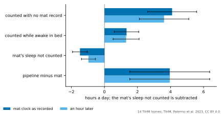
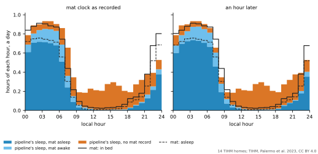
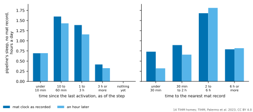

# Where the pipeline's sleep parts from the sleep mat: results

The frozen [plan](SLEEP_GAP_PLAN.md), run as declared. This page is generated entirely from `artifacts/sleep_gap/sleep-gap.json` by `sensor_modeling.datasets.sleep_gap_summary.render_page`, and a test checks that the committed page is exactly that rendering.

**Status: exploratory description of 14 homes of people living with dementia, planned after the sleep-mat comparison had been read and frozen before anything of it was computed. No criterion, no margin. Nothing in the pipeline was changed or fitted. The mat's stages are the device's own and are not validated, and a minute with no mat record may be an empty bed, a person asleep elsewhere or a mat that stopped.**

- **Plan digest.** `dc2fae37de19128313e0c5def2c5efa367977aae697286b5dfcecb253e19e726`.
- **Run.** Commit `1e46865`, recorded 2026-10-10T08:19:18.102536+00:00.
- **Homes.** 14, on 705 matched days.
- **Code changed since the freeze.** None.

## The check

With the rule off the run gave the published alert-burden counts for all 17 mat homes, and with the rule at 12 hours the silent-home record's. Every home's number of matched days and per-home statistics equal the sleep-mat record's. The repeat's daily summaries equal the run's; on every matched day the minutes sum, for every state and for the time watched, to the day's hours, to within 1.4e-13 hours, and the mat's minutes to its hours under each clock. No matched day has a clock change, and D1's difference from the mat's sleep is the sleep-mat record's 3.95 hours.

## The hours of sleep, by what the mat says (D1)

Hours a day: the mean over homes of each home's mean over its matched days, with a Student t interval over homes, and the median over homes.

|  | Mat clock as recorded: mean | median | An hour later: mean | median |
| --- | --- | --- | --- | --- |
| The pipeline's hours of sleep | 11.35 [9.73, 12.96] | 10.91 | 11.35 [9.73, 12.96] | 10.91 |
| of which while the mat says asleep | 5.91 [4.75, 7.07] | 6.59 | 6.42 [5.17, 7.68] | 7.18 |
| of which while the mat says awake in bed | 1.34 [0.60, 2.08] | 0.84 | 1.31 [0.52, 2.10] | 0.62 |
| of which with no mat record | 4.10 [2.61, 5.58] | 3.44 | 3.61 [2.11, 5.10] | 2.88 |
| The mat's hours asleep | 7.39 [6.01, 8.78] | 8.12 | 7.39 [6.00, 8.78] | 8.14 |
| of which the pipeline did not count as sleep | 1.48 [1.03, 1.93] | 1.47 | 0.97 [0.54, 1.39] | 0.89 |
| of which no step of the pipeline covered | 0.12 [0.09, 0.15] | 0.15 | 0.10 [0.07, 0.13] | 0.12 |
| The mat's hours in bed | 9.38 [8.48, 10.28] | 9.36 | 9.38 [8.48, 10.28] | 9.36 |
| of which the pipeline did not count as sleep | 2.13 [1.36, 2.90] | 1.75 | 1.64 [0.81, 2.48] | 1.22 |
| Pipeline minus the mat's sleep | 3.95 [1.54, 6.37] | 2.38 | 3.95 [1.54, 6.37] | 2.39 |
| Pipeline minus the mat's time in bed | 1.97 [-0.01, 3.94] | 1.53 | 1.96 [-0.01, 3.94] | 1.53 |

With the mat's clock as recorded, the pipeline's 3.95 hours a day more sleep than the mat's are 4.10 hours counted with no mat record, plus 1.34 counted while the mat says awake in bed, less 1.48 hours of the mat's sleep the pipeline did not count as sleep. Against the mat's time in bed, 1.97 hours: 4.10 counted with no record, less 2.13 hours in bed not counted as sleep.

With the mat's clock as recorded, home by home, in hours a day:

| Home | Days | Pipeline's sleep | of which no mat record | Mat asleep | Mat in bed | Pipeline minus mat | Correlation with the mat's sleep |
| --- | --- | --- | --- | --- | --- | --- | --- |
| `16f4b` | 55 | 7.02 | 2.04 | 4.89 | 11.15 | 2.13 | 0.14 |
| `1fbe4` | 48 | 9.45 | 2.98 | 7.23 | 8.20 | 2.22 | 0.19 |
| `30a32` | 61 | 11.59 | 2.58 | 9.78 | 11.54 | 1.81 | -0.04 |
| `55cd4` | 66 | 12.69 | 4.26 | 9.11 | 9.85 | 3.58 | 0.19 |
| `93c14` | 38 | 11.17 | 3.48 | 8.16 | 9.46 | 3.00 | 0.13 |
| `96adf` | 50 | 11.62 | 3.11 | 10.89 | 12.06 | 0.73 | 0.22 |
| `a2849` | 55 | 10.52 | 3.20 | 8.46 | 9.28 | 2.06 | 0.07 |
| `c55f8` | 71 | 11.09 | 3.64 | 7.63 | 9.49 | 3.46 | -0.15 |
| `c5785` | 63 | 10.38 | 2.56 | 8.41 | 9.43 | 1.96 | 0.20 |
| `c8574` | 49 | 10.69 | 3.50 | 8.15 | 8.89 | 2.54 | -0.01 |
| `d7a46` | 14 | 10.73 | 5.95 | 2.72 | 5.73 | 8.01 | 0.37 |
| `e2472` | 24 | 10.25 | 3.40 | 8.09 | 8.80 | 2.16 | -0.09 |
| `ec812` | 65 | 11.74 | 4.25 | 7.28 | 9.16 | 4.46 | 0.11 |
| `f220c` | 46 | 19.89 | 12.40 | 2.70 | 8.28 | 17.20 | 0.23 |

## Hour by hour (D2)

The mean over homes of each home's mean hours a day in each local hour, with the mat's clock as recorded; the figure shows both clocks. The pipeline's hours at 00 and 23 are lower by construction: the interval across midnight is counted by neither day.

| Hour | Mat in bed | Mat asleep | Pipeline's sleep, mat record | Pipeline's sleep, no mat record |
| --- | --- | --- | --- | --- |
| 00:00 | 0.84 | 0.72 | 0.69 | 0.10 |
| 01:00 | 0.88 | 0.75 | 0.80 | 0.08 |
| 02:00 | 0.91 | 0.76 | 0.84 | 0.06 |
| 03:00 | 0.91 | 0.74 | 0.85 | 0.08 |
| 04:00 | 0.88 | 0.73 | 0.85 | 0.08 |
| 05:00 | 0.87 | 0.71 | 0.83 | 0.07 |
| 06:00 | 0.75 | 0.56 | 0.69 | 0.17 |
| 07:00 | 0.44 | 0.30 | 0.36 | 0.29 |
| 08:00 | 0.22 | 0.14 | 0.15 | 0.20 |
| 09:00 | 0.09 | 0.05 | 0.06 | 0.13 |
| 10:00 | 0.05 | 0.02 | 0.03 | 0.15 |
| 11:00 | 0.03 | 0.01 | 0.02 | 0.21 |
| 12:00 | 0.03 | 0.01 | 0.01 | 0.20 |
| 13:00 | 0.02 | 0.01 | 0.01 | 0.20 |
| 14:00 | 0.03 | 0.01 | 0.01 | 0.27 |
| 15:00 | 0.03 | 0.01 | 0.01 | 0.29 |
| 16:00 | 0.04 | 0.02 | 0.01 | 0.25 |
| 17:00 | 0.06 | 0.04 | 0.01 | 0.19 |
| 18:00 | 0.12 | 0.09 | 0.03 | 0.16 |
| 19:00 | 0.14 | 0.11 | 0.06 | 0.21 |
| 20:00 | 0.18 | 0.14 | 0.09 | 0.23 |
| 21:00 | 0.38 | 0.25 | 0.17 | 0.21 |
| 22:00 | 0.68 | 0.52 | 0.25 | 0.14 |
| 23:00 | 0.80 | 0.69 | 0.43 | 0.10 |

## What the pipeline believed, by what the mat says (D3)

The mean over homes of each home's mean belief in each state over its watched minutes of each class.

**Mat clock as recorded.**

| When | Homes | `away` | `home_active` | `home_inactive` | `sleeping` | `bed_awake` | `bathroom_activity` | `kitchen_activity` |
| --- | --- | --- | --- | --- | --- | --- | --- | --- |
| the mat says asleep | 14 | 0.03 | 0.03 | 0.11 | 0.81 | 0.02 | 0.00 | 0.00 |
| the mat says awake in bed | 14 | 0.05 | 0.05 | 0.22 | 0.66 | 0.02 | 0.00 | 0.00 |
| no mat record | 14 | 0.10 | 0.17 | 0.42 | 0.28 | 0.02 | 0.00 | 0.01 |

**An hour later.**

| When | Homes | `away` | `home_active` | `home_inactive` | `sleeping` | `bed_awake` | `bathroom_activity` | `kitchen_activity` |
| --- | --- | --- | --- | --- | --- | --- | --- | --- |
| the mat says asleep | 14 | 0.02 | 0.02 | 0.06 | 0.88 | 0.01 | 0.00 | 0.00 |
| the mat says awake in bed | 14 | 0.04 | 0.05 | 0.24 | 0.63 | 0.05 | 0.00 | 0.00 |
| no mat record | 14 | 0.11 | 0.17 | 0.45 | 0.24 | 0.02 | 0.00 | 0.01 |

## With no mat record: what the sensors had last said (D4)

Over the minutes with no mat record: the pipeline's hours of sleep and the hours of such minutes, each a mean over homes of a home's mean a day, and the mean over homes of the pipeline's belief in sleeping over them. The sensor and the time since it are as of the step whose belief covers the minute.

**Mat clock as recorded, by the sensor that last reported.**

|  | Pipeline's sleep, hours a day | No mat record, hours a day | Belief in sleeping |
| --- | --- | --- | --- |
| Bedroom | 1.40 | 2.19 | 0.56 [0.47, 0.64] |
| Front Door | 0.83 | 1.83 | 0.40 [0.32, 0.49] |
| Lounge | 0.62 | 3.70 | 0.16 [0.12, 0.20] |
| Hallway | 0.44 | 1.99 | 0.21 [0.10, 0.33] |
| Kitchen | 0.26 | 2.64 | 0.10 [0.06, 0.13] |
| Back Door | 0.24 | 0.81 | 0.17 [0.09, 0.26] |
| Fridge Door | 0.15 | 0.76 | 0.13 [0.01, 0.25] |
| Bathroom | 0.15 | 0.71 | 0.23 [0.12, 0.35] |

**Mat clock as recorded, by the time since it.**

|  | Pipeline's sleep, hours a day | No mat record, hours a day | Belief in sleeping |
| --- | --- | --- | --- |
| under 10 minutes | 0.69 | 8.77 | 0.10 [0.02, 0.17] |
| 10 to 60 minutes | 1.60 | 3.90 | 0.39 [0.30, 0.47] |
| 1 to 3 hours | 1.39 | 1.53 | 0.90 [0.87, 0.94] |
| 3 hours or more | 0.42 | 0.42 | 0.99 [0.99, 1.00] |

**Mat clock as recorded, by whether the sensor was an exit.**

|  | Pipeline's sleep, hours a day | No mat record, hours a day | Belief in sleeping |
| --- | --- | --- | --- |
| an exit door, front or back | 1.07 | 2.63 | 0.38 [0.30, 0.45] |
| another sensor | 3.03 | 11.99 | 0.24 [0.14, 0.34] |

**Mat clock as recorded, by period of the day.**

|  | Pipeline's sleep, hours a day | No mat record, hours a day | Belief in sleeping |
| --- | --- | --- | --- |
| day, 07:00 to 22:00 | 3.20 | 13.14 | 0.25 [0.16, 0.34] |
| night, 22:00 to 07:00 | 0.89 | 1.48 | 0.66 [0.54, 0.78] |

**An hour later, by the sensor that last reported.**

|  | Pipeline's sleep, hours a day | No mat record, hours a day | Belief in sleeping |
| --- | --- | --- | --- |
| Bedroom | 0.92 | 1.86 | 0.32 [0.21, 0.43] |
| Front Door | 0.81 | 1.83 | 0.40 [0.31, 0.49] |
| Lounge | 0.70 | 3.94 | 0.17 [0.13, 0.21] |
| Hallway | 0.42 | 2.04 | 0.19 [0.08, 0.30] |
| Kitchen | 0.25 | 2.66 | 0.10 [0.06, 0.13] |
| Back Door | 0.24 | 0.81 | 0.17 [0.09, 0.26] |
| Fridge Door | 0.16 | 0.77 | 0.13 [0.01, 0.25] |
| Bathroom | 0.11 | 0.72 | 0.17 [0.08, 0.27] |

**An hour later, by the time since it.**

|  | Pipeline's sleep, hours a day | No mat record, hours a day | Belief in sleeping |
| --- | --- | --- | --- |
| under 10 minutes | 0.70 | 9.18 | 0.09 [0.02, 0.16] |
| 10 to 60 minutes | 1.43 | 3.81 | 0.35 [0.26, 0.44] |
| 1 to 3 hours | 1.16 | 1.30 | 0.88 [0.83, 0.92] |
| 3 hours or more | 0.33 | 0.33 | 0.99 [0.98, 1.00] |

**An hour later, by whether the sensor was an exit.**

|  | Pipeline's sleep, hours a day | No mat record, hours a day | Belief in sleeping |
| --- | --- | --- | --- |
| an exit door, front or back | 1.06 | 2.64 | 0.38 [0.30, 0.45] |
| another sensor | 2.55 | 11.98 | 0.20 [0.09, 0.31] |

**An hour later, by period of the day.**

|  | Pipeline's sleep, hours a day | No mat record, hours a day | Belief in sleeping |
| --- | --- | --- | --- |
| day, 07:00 to 22:00 | 2.79 | 12.77 | 0.23 [0.14, 0.31] |
| night, 22:00 to 07:00 | 0.81 | 1.84 | 0.40 [0.29, 0.51] |

**Mat clock as recorded, by the sensor, the time since it and the period together.** Rows with under 0.05 hours a day of the pipeline's sleep are in the record.

|  | Pipeline's sleep, hours a day | No mat record, hours a day | Belief in sleeping |
| --- | --- | --- | --- |
| Front Door, 1 to 3 hours before, by day | 0.44 | 0.51 | 0.82 [0.75, 0.88] |
| Lounge, 10 to 60 minutes before, by day | 0.35 | 1.10 | 0.31 [0.27, 0.35] |
| Bedroom, 10 to 60 minutes before, by day | 0.34 | 0.44 | 0.66 [0.56, 0.77] |
| Bedroom, 1 to 3 hours before, by day | 0.29 | 0.29 | 0.98 [0.97, 1.00] |
| Bedroom, 10 to 60 minutes before, by night | 0.20 | 0.24 | 0.87 [0.80, 0.94] |
| Bedroom, 1 to 3 hours before, by night | 0.20 | 0.21 | 0.98 [0.96, 1.00] |
| Front Door, 10 to 60 minutes before, by day | 0.17 | 0.62 | 0.28 [0.24, 0.31] |
| Hallway, 10 to 60 minutes before, by day | 0.17 | 0.47 | 0.39 [0.27, 0.52] |
| Front Door, 3 hours or more before, by day | 0.16 | 0.16 | 0.99 [0.99, 1.00] |
| Bedroom, under 10 minutes before, by day | 0.16 | 0.75 | 0.18 [0.10, 0.27] |
| Back Door, 1 to 3 hours before, by day | 0.11 | 0.15 | 0.84 [0.76, 0.92] |
| Lounge, under 10 minutes before, by day | 0.11 | 2.25 | 0.05 [0.04, 0.06] |
| Kitchen, 10 to 60 minutes before, by day | 0.10 | 0.34 | 0.28 [0.23, 0.34] |
| Bedroom, 3 hours or more before, by day | 0.09 | 0.09 | 1.00 [0.99, 1.00] |
| Hallway, 1 to 3 hours before, by day | 0.08 | 0.09 | 0.93 [0.89, 0.97] |
| Hallway, under 10 minutes before, by day | 0.08 | 1.24 | 0.09 [0.01, 0.17] |
| Kitchen, under 10 minutes before, by day | 0.08 | 2.11 | 0.04 [0.02, 0.05] |
| Bedroom, under 10 minutes before, by night | 0.07 | 0.12 | 0.54 [0.41, 0.68] |
| Lounge, 1 to 3 hours before, by day | 0.06 | 0.06 | 0.92 [0.89, 0.96] |
| Back Door, 3 hours or more before, by day | 0.06 | 0.06 | 1.00 [0.99, 1.00] |
| Bathroom, under 10 minutes before, by day | 0.06 | 0.51 | 0.13 [0.04, 0.22] |
| Bedroom, 3 hours or more before, by night | 0.06 | 0.06 | 0.99 [0.99, 1.00] |
| Back Door, 10 to 60 minutes before, by day | 0.05 | 0.24 | 0.25 [0.17, 0.32] |
| Lounge, 10 to 60 minutes before, by night | 0.05 | 0.11 | 0.32 [0.18, 0.46] |

## Day to day (D5)

The mean over homes of the within-home Spearman correlation over matched days. The swapped-mask reference sets every day's beliefs beside every other day's mat, the mean over all cyclic shifts of the days: what the mat's own hours give a part of the pipeline's sleep with no day-specific tracking. A home whose values on either side are constant counts as 0; the last column gives how many did, under each clock.

| Correlation | Mat clock as recorded | Swapped-mask reference | An hour later | Swapped-mask reference | Constant |
| --- | --- | --- | --- | --- | --- |
| The mat's hours asleep, with the pipeline's hours of sleep | 0.11 [0.03, 0.19] |  | 0.15 [0.06, 0.25] |  | 0, 0 |
| The mat's hours asleep, with its hours of sleep while the mat has a record | 0.58 [0.48, 0.67] | 0.47 [0.40, 0.55] | 0.61 [0.50, 0.71] | 0.43 [0.34, 0.52] | 0, 0 |
| The mat's hours asleep, with its hours of sleep with no mat record | -0.31 [-0.40, -0.23] | -0.32 [-0.40, -0.23] | -0.27 [-0.37, -0.17] | -0.28 [-0.39, -0.18] | 0, 0 |
| The mat's hours in bed, with the pipeline's hours of sleep | 0.14 [0.01, 0.27] |  | 0.17 [0.03, 0.30] |  | 0, 0 |
| The mat's hours in bed, with its hours of sleep while the mat has a record | 0.70 [0.58, 0.81] | 0.59 [0.49, 0.69] | 0.71 [0.58, 0.83] | 0.52 [0.40, 0.64] | 0, 0 |
| The mat's hours in bed, with its hours of sleep with no mat record | -0.39 [-0.52, -0.27] | -0.40 [-0.53, -0.27] | -0.36 [-0.49, -0.24] | -0.35 [-0.49, -0.20] | 0, 0 |
| The pipeline's hours of sleep, with the day's quiet hours | 0.54 [0.44, 0.64] |  | 0.54 [0.44, 0.64] |  | 0, 0 |
| The pipeline's hours of sleep, with the day's activations | -0.71 [-0.77, -0.64] |  | -0.71 [-0.77, -0.64] |  | 0, 0 |

Each home's correlation minus its swapped-mask reference, as a mean over homes, with the homes above zero:

|  | Mat clock as recorded | An hour later |
| --- | --- | --- |
| The mat's hours asleep, with its hours of sleep while the mat has a record | +0.10 [+0.05, +0.15]; 14 of 14 homes above zero | +0.18 [+0.09, +0.26]; 12 of 14 homes above zero |
| The mat's hours asleep, with its hours of sleep with no mat record | +0.00 [-0.05, +0.05]; 9 of 14 homes above zero | +0.01 [-0.05, +0.07]; 7 of 14 homes above zero |
| The mat's hours in bed, with its hours of sleep while the mat has a record | +0.11 [+0.04, +0.18]; 12 of 14 homes above zero | +0.19 [+0.10, +0.28]; 13 of 14 homes above zero |
| The mat's hours in bed, with its hours of sleep with no mat record | +0.00 [-0.06, +0.07]; 8 of 14 homes above zero | -0.02 [-0.08, +0.04]; 7 of 14 homes above zero |

The share of the variance of the pipeline's daily hours of sleep that moves with each part, its covariance with the part over its variance, as a mean over homes; the two shares of a home sum to one:

|  | Mat clock as recorded | An hour later |
| --- | --- | --- |
| Its hours of sleep with no mat record | 0.68 [0.54, 0.83] | 0.70 [0.54, 0.86] |
| Its hours of sleep while the mat has a record | 0.32 [0.17, 0.46] | 0.30 [0.14, 0.46] |

The mean over homes of the within-home standard deviation, in hours:

|  | Mat clock as recorded | An hour later |
| --- | --- | --- |
| The pipeline's hours of sleep | 1.74 [1.45, 2.03] | 1.74 [1.45, 2.03] |
| Its hours of sleep with no mat record | 1.78 [1.45, 2.11] | 1.83 [1.50, 2.17] |
| Its hours of sleep while the mat has a record | 1.19 [0.78, 1.60] | 1.21 [0.78, 1.65] |

## Without the homes the mat stages mostly awake (D6)

Left out: `16f4b`, `d7a46`, `f220c`. D2 to D4 and D7 without them are in the record.

|  | Mat clock as recorded | An hour later |
| --- | --- | --- |
| The pipeline's hours of sleep | 11.02 [10.42, 11.61] | 11.02 [10.42, 11.61] |
| of which while the mat says asleep | 6.88 [6.42, 7.34] | 7.47 [6.97, 7.97] |
| of which while the mat says awake in bed | 0.78 [0.53, 1.03] | 0.72 [0.44, 0.99] |
| of which with no mat record | 3.36 [2.98, 3.74] | 2.83 [2.46, 3.20] |
| The mat's hours asleep | 8.47 [7.74, 9.21] | 8.47 [7.74, 9.21] |
| of which the pipeline did not count as sleep | 1.59 [1.20, 1.99] | 1.01 [0.61, 1.41] |
| of which no step of the pipeline covered | 0.15 [0.14, 0.16] | 0.13 [0.10, 0.15] |
| The mat's hours in bed | 9.65 [8.88, 10.43] | 9.65 [8.88, 10.43] |
| of which the pipeline did not count as sleep | 1.99 [1.60, 2.39] | 1.47 [1.03, 1.91] |
| Pipeline minus the mat's sleep | 2.55 [1.86, 3.23] | 2.54 [1.86, 3.23] |
| Pipeline minus the mat's time in bed | 1.37 [0.72, 2.01] | 1.37 [0.72, 2.01] |
| The mat's hours asleep, with the pipeline's hours of sleep | 0.07 [-0.01, 0.16] | 0.12 [0.02, 0.22] |
| The mat's hours asleep, with its hours of sleep while the mat has a record | 0.58 [0.45, 0.70] | 0.60 [0.48, 0.73] |
| The mat's hours asleep, with its hours of sleep with no mat record | -0.27 [-0.36, -0.18] | -0.21 [-0.30, -0.12] |
| The mat's hours in bed, with the pipeline's hours of sleep | 0.08 [-0.05, 0.20] | 0.10 [-0.02, 0.22] |
| The mat's hours in bed, with its hours of sleep while the mat has a record | 0.66 [0.53, 0.78] | 0.66 [0.52, 0.80] |
| The mat's hours in bed, with its hours of sleep with no mat record | -0.31 [-0.41, -0.21] | -0.27 [-0.36, -0.18] |
| The pipeline's hours of sleep, with the day's quiet hours | 0.55 [0.42, 0.67] | 0.55 [0.42, 0.67] |
| The pipeline's hours of sleep, with the day's activations | -0.72 [-0.78, -0.66] | -0.72 [-0.78, -0.66] |
| Variance share: its hours of sleep with no mat record | 0.79 [0.69, 0.89] | 0.82 [0.72, 0.91] |
| Variance share: its hours of sleep while the mat has a record | 0.21 [0.11, 0.31] | 0.18 [0.09, 0.28] |

## With no mat record: how far from the mat's records (D7)

As D4, by the time from the minute to the nearest mat record, earlier or later, in the home's whole file.

**Mat clock as recorded.**

|  | Pipeline's sleep, hours a day | No mat record, hours a day | Belief in sleeping |
| --- | --- | --- | --- |
| under 30 minutes | 0.73 | 1.26 | 0.59 [0.50, 0.68] |
| 30 minutes to 2 hours | 0.89 | 3.09 | 0.29 [0.20, 0.38] |
| 2 to 6 hours | 1.68 | 7.64 | 0.22 [0.12, 0.32] |
| 6 hours or more | 0.79 | 2.62 | 0.28 [0.18, 0.38] |

**An hour later.**

|  | Pipeline's sleep, hours a day | No mat record, hours a day | Belief in sleeping |
| --- | --- | --- | --- |
| under 30 minutes | 0.32 | 1.26 | 0.26 [0.20, 0.32] |
| 30 minutes to 2 hours | 0.66 | 3.09 | 0.21 [0.12, 0.31] |
| 2 to 6 hours | 1.81 | 7.64 | 0.24 [0.14, 0.34] |
| 6 hours or more | 0.82 | 2.62 | 0.29 [0.19, 0.38] |

**Mat clock as recorded, by the time to the nearest record and the period together.**

|  | Pipeline's sleep, hours a day | No mat record, hours a day | Belief in sleeping |
| --- | --- | --- | --- |
| under 30 minutes, by day | 0.36 | 0.75 | 0.49 [0.37, 0.62] |
| under 30 minutes, by night | 0.37 | 0.51 | 0.75 [0.64, 0.86] |
| 30 minutes to 2 hours, by day | 0.64 | 2.60 | 0.26 [0.18, 0.34] |
| 30 minutes to 2 hours, by night | 0.25 | 0.49 | 0.57 [0.41, 0.73] |
| 2 to 6 hours, by day | 1.46 | 7.23 | 0.21 [0.12, 0.30] |
| 2 to 6 hours, by night | 0.22 | 0.42 | 0.47 [0.25, 0.69] |
| 6 hours or more, by day | 0.74 | 2.56 | 0.27 [0.17, 0.37] |
| 6 hours or more, by night | 0.05 | 0.07 | 0.73 [0.32, 1.13] |

With the mat's clock as recorded, 11 matched days in 4 homes have fewer than 4 hours of mat records; on them falls a mean over homes of 0.05 [-0.01, 0.12] of a home's sleep counted with no record.

## Notes

- An exploratory description, planned after the sleep-mat comparison had been read and frozen before anything of it was computed. No criterion and no margin. Nothing in the pipeline was changed or fitted.
- The mat's stages are the device's own and are not validated here. A minute with no mat record may be an empty bed, a person asleep elsewhere or a mat that stopped recording.
- Per-home summaries only: no day's or minute's values are recorded, and nothing of the dataset is redistributed.
- TIHM is by Palermo et al., Scientific Data 10, 606 (2023), under CC BY 4.0. Surrey and Borders Partnership NHS Foundation Trust and Howz are acknowledged, as the dataset asks.
