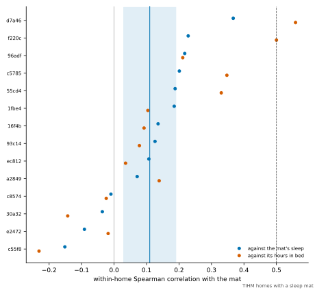
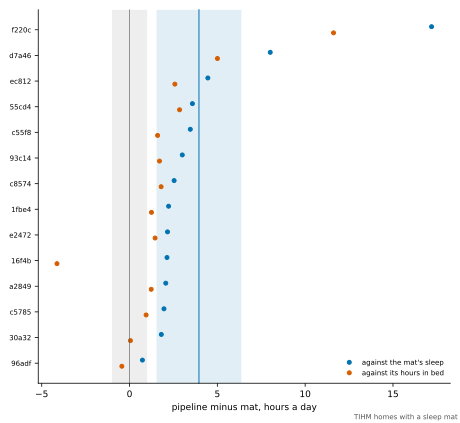
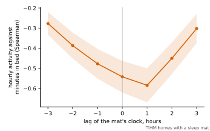

# The pipeline's hours of sleep beside a sleep mat: results

Generated by `sensor_modeling.datasets.sleep_mat_summary.render_page` from `artifacts/sleep_mat/sleep-mat.json` and `artifacts/sleep_mat/sleep-mat-simulated.json`, under [the protocol](SLEEP_MAT_PROTOCOL.md), `aceb56b37cc7dfa90650a1ac21b7795e08dfbf00f6be091f8a99f88d9ae72aae`.

**A measurement on a real cohort.** The pipeline ran on the TIHM homes that have a sleep mat with the alert-burden protocol's frozen settings; nothing in it was changed or fitted. The records hold per-home summaries and no day's values.

- **Commit.** `c42d69a`, from a clean tree.
- **The code.** The sources, libraries and defaults recorded at the freeze are those the run used.

## The runs

With the silent-home rule off, the 17 mat homes give every count of their rows in the published alert-burden record: 903 monitored days and 45 behavioural alerts. With it on at 12 hours they give the silent-home description's counts: 97 days refused because of the rule and 94 silence alerts.

## The criteria

Both were fixed, with their margins, before any value of the pipeline was set beside any record of the mat. They are read in the primary analysis: the rule off, silenced days left out, which are the days with no activity record and those the run with the rule on flags as touched by a silence of the whole home. C1 is the only primary criterion, and the two are not adjusted for each other.

| Criterion | Claim | Reading | What decided it |
| --- | --- | --- | --- |
| C1 | The pipeline follows the mat | **does not follow** | E1, the mean within-home Spearman correlation over 14 homes, is 0.11 [0.03, 0.19]; the margin is 0.5. |
| C2 | The pipeline agrees in level | **does not agree** | E2, the mean difference over 14 homes, is +3.95 [+1.54, +6.37] hours; the margin is ±1 hour. |

- **C1.** On the days the sensors reported, the pipeline's hours of sleep do not rise and fall with the mat's, within a home, by as much as the declared margin: a day the pipeline calls unusual is not reliably a day of unusual sleep.
- **C2.** The two do not agree in level: the mean difference lies wholly beyond an hour.
- **The mat is not a gold standard.** Its stages are the device's own. A disagreement may be the mat's as well as the pipeline's.

## Agreement (E1 to E5, E9)

Means over included homes, with Student t intervals over homes. The difference is the pipeline's value minus the mat's, in hours; the limits of agreement add the spread of homes' mean differences to the spread of days within a home.

| Analysis | Against | Homes | Spearman | Pearson | Difference (h) | Limits of agreement (h) |
| --- | --- | --- | --- | --- | --- | --- |
| rule off, silenced days left out (primary) | the mat's sleep | 14 | 0.11 [0.03, 0.19] | 0.10 [0.00, 0.21] | +3.95 [+1.54, +6.37] | -5.3 to +13.2 |
| rule off, silenced days left out (primary) | the mat's hours in bed | 14 | 0.14 [0.01, 0.27] | 0.11 [-0.03, 0.25] | +1.97 [-0.01, +3.94] | -6.5 to +10.4 |
| rule off, every usable day | the mat's sleep | 14 | 0.09 [0.00, 0.18] | 0.04 [-0.07, 0.15] | +4.67 [+2.26, +7.07] | -6.0 to +15.3 |
| rule off, every usable day | the mat's hours in bed | 14 | 0.10 [-0.02, 0.22] | 0.01 [-0.11, 0.13] | +2.69 [+0.65, +4.74] | -7.5 to +12.8 |
| rule on at 12 hours, silenced days left out | the mat's sleep | 14 | 0.11 [0.03, 0.19] | 0.10 [0.00, 0.21] | +3.95 [+1.54, +6.37] | -5.3 to +13.2 |
| rule on at 12 hours, silenced days left out | the mat's hours in bed | 14 | 0.14 [0.01, 0.27] | 0.11 [-0.03, 0.25] | +1.97 [-0.01, +3.94] | -6.5 to +10.4 |

No included home had constant values on either source.

With the rule on, every home has the same matched days and the same values on them as in the primary analysis, so its rows repeat the primary's: the rule refuses the silenced days, which the primary leaves out already.

## The homes

Every mat home's days. A silent day has no activity record; a partly silent day has records and lost time to a silence of the whole home, as the run with the rule on flags it. Both are counted among the days that would otherwise be matched, and both are left out of the primary analysis. A home enters the estimands with at least 14 matched days.

| Home | Mat records | Mat days | Mat-observed | Monitored | Usable | Silent | Silent, matched | Partly silent, matched | Matched | Included | Staged asleep |
| --- | --- | --- | --- | --- | --- | --- | --- | --- | --- | --- | --- |
| `0f352` | 1,766 | 6 | 4 | 6 | 5 | 0 | 0 | 0 | 4 | no | 0.74 |
| `16f4b` | 37,810 | 59 | 55 | 91 | 91 | 2 | 0 | 0 | 55 | yes | 0.44 |
| `1fbe4` | 27,399 | 60 | 52 | 68 | 67 | 5 | 0 | 4 | 48 | yes | 0.88 |
| `30a32` | 45,355 | 66 | 64 | 66 | 65 | 1 | 1 | 2 | 61 | yes | 0.85 |
| `55cd4` | 43,955 | 77 | 75 | 77 | 76 | 6 | 6 | 3 | 66 | yes | 0.93 |
| `76230` | 2,228 | 5 | 3 | 5 | 3 | 0 | 0 | 0 | 3 | no | 0.84 |
| `93c14` | 25,105 | 47 | 41 | 49 | 48 | 2 | 1 | 2 | 38 | yes | 0.86 |
| `96adf` | 39,868 | 55 | 53 | 55 | 54 | 1 | 1 | 2 | 50 | yes | 0.90 |
| `a2849` | 33,012 | 61 | 59 | 61 | 60 | 2 | 2 | 2 | 55 | yes | 0.91 |
| `b0455` | 3,538 | 10 | 8 | 10 | 9 | 0 | 0 | 0 | 8 | no | 0.85 |
| `c55f8` | 46,001 | 85 | 79 | 91 | 91 | 8 | 2 | 6 | 71 | yes | 0.80 |
| `c5785` | 38,121 | 68 | 66 | 68 | 67 | 1 | 1 | 2 | 63 | yes | 0.89 |
| `c8574` | 28,416 | 54 | 52 | 54 | 53 | 2 | 2 | 1 | 49 | yes | 0.92 |
| `d7a46` | 6,271 | 19 | 17 | 24 | 23 | 1 | 1 | 2 | 14 | yes | 0.48 |
| `e2472` | 15,448 | 31 | 27 | 33 | 32 | 3 | 1 | 2 | 24 | yes | 0.92 |
| `ec812` | 39,098 | 73 | 69 | 79 | 78 | 7 | 1 | 3 | 65 | yes | 0.80 |
| `f220c` | 28,032 | 59 | 47 | 66 | 65 | 1 | 0 | 1 | 46 | yes | 0.33 |

The included homes beside the mat, in the primary analysis. The last column is the lag of E11 at which the home's hourly activity is most opposed to its minutes in bed.

| Home | Spearman, sleep | Spearman, in bed | Difference, sleep (h) | Difference, in bed (h) | Median pipeline (h) | Median mat sleep (h) | Median mat in bed (h) | Most opposed at lag |
| --- | --- | --- | --- | --- | --- | --- | --- | --- |
| `16f4b` | 0.14 | 0.09 | +2.1 | -4.1 | 6.8 | 4.3 | 9.4 | +0 |
| `1fbe4` | 0.19 | 0.10 | +2.2 | +1.2 | 9.0 | 7.5 | 8.4 | +1 |
| `30a32` | -0.04 | -0.14 | +1.8 | +0.1 | 11.3 | 9.7 | 11.5 | -1 |
| `55cd4` | 0.19 | 0.33 | +3.6 | +2.8 | 12.7 | 9.0 | 9.6 | +1 |
| `93c14` | 0.13 | 0.08 | +3.0 | +1.7 | 10.9 | 8.2 | 9.7 | +0 |
| `96adf` | 0.22 | 0.21 | +0.7 | -0.4 | 11.7 | 10.8 | 12.0 | +1 |
| `a2849` | 0.07 | 0.14 | +2.1 | +1.2 | 10.3 | 8.4 | 9.2 | +1 |
| `c55f8` | -0.15 | -0.23 | +3.5 | +1.6 | 10.4 | 7.6 | 9.6 | +1 |
| `c5785` | 0.20 | 0.35 | +2.0 | +0.9 | 10.4 | 8.4 | 9.5 | +1 |
| `c8574` | -0.01 | -0.02 | +2.5 | +1.8 | 10.5 | 8.2 | 8.8 | +1 |
| `d7a46` | 0.37 | 0.56 | +8.0 | +5.0 | 10.3 | 2.8 | 6.4 | +1 |
| `e2472` | -0.09 | -0.02 | +2.2 | +1.5 | 9.7 | 8.2 | 8.9 | +1 |
| `ec812` | 0.11 | 0.04 | +4.5 | +2.6 | 11.4 | 7.4 | 9.2 | +1 |
| `f220c` | 0.23 | 0.50 | +17.2 | +11.6 | 19.9 | 2.2 | 8.1 | +1 |

## The deviations (E6)

The mat's sleep was passed through a personal baseline with the default configuration, as the pipeline passes its own days. The two baselines saw different histories: the pipeline's was given its silent days too.

- **Correlation of the two deviations.** 0.03 [-0.04, 0.11], over 12 homes with at least 14 days on which both baselines gave a verdict.
- **Days the pipeline's deviation reached 3.** 46. On 31 of them the mat's deviation had the same sign, and on 4 it also reached 3. Days of one home are not independent, so no interval is given.

## The alerts about sleep (E7)

With the rule off the pipeline raised 34 behavioural alerts about the hours of sleep in the mat homes: 23 for an abrupt change, 11 for a gradual drift. An alert for a drift is not judged, since its direction is its slope's, which the run does not keep. None of the alerts for an abrupt or a persistent change came on a matched day of the primary analysis, so none was judged.

## Silent days (E8)

The mat homes have 42 silent days with the rule off, 42 of them usable, in 14 homes. On the 19 the mat observed, the pipeline's median is 23.8 hours of sleep, and the mat's 8.4 hours asleep and 9.0 in bed.

## The clocks (E10, E11)

The dataset does not say which clock either file is in. E10 shifts the mat's clock by -1 and +1 hours and recomputes E1 and E2; +1 stands for a mat clock in UTC while the activity clock is local. An hour moves little of a night across midnight, so E10 shows how much the result depends on the clock and cannot find the right one.

| Shift | Homes | E1 | E2 (h) |
| --- | --- | --- | --- |
| -1 h | 14 | 0.10 [0.02, 0.17] | +3.96 [+1.53, +6.38] |
| +1 h | 13 | 0.13 [0.04, 0.21] | +3.65 [+1.13, +6.18] |

E11 reads only the inputs: the activity records in each local hour of the matched days, against the mat's minutes in bed in the same hour with its clock shifted by the lag. A person in bed moves little, so the correlation should be most negative where the clocks agree. It is most negative at a lag of +1 h. Whatever it shows, every other estimand keeps the mat's clock as read.

| Lag | Mean within-home Spearman |
| --- | --- |
| -3 h | -0.28 [-0.33, -0.22] |
| -2 h | -0.39 [-0.45, -0.32] |
| -1 h | -0.48 [-0.55, -0.40] |
| +0 h | -0.54 [-0.62, -0.46] |
| +1 h | -0.58 [-0.67, -0.50] |
| +2 h | -0.45 [-0.53, -0.37] |
| +3 h | -0.30 [-0.37, -0.23] |

## Without the homes the mat stages as mostly awake (E12)

In `16f4b`, `d7a46`, `f220c` the mat stages less than 60% of the minutes in bed as asleep, where every other mat home stages at least 74%. The cut was fixed from the mat's file alone, before the comparison. Without those homes:

| Against | Homes | Spearman | Pearson | Difference (h) |
| --- | --- | --- | --- | --- |
| the mat's sleep | 11 | 0.07 [-0.01, 0.16] | 0.08 [-0.04, 0.20] | +2.55 [+1.86, +3.23] |
| the mat's hours in bed | 11 | 0.08 [-0.05, 0.20] | 0.06 [-0.08, 0.21] | +1.37 [+0.72, +2.01] |

## The simulated reference (S1)

**The evidence is simulated.** 100 simulated homes reduced to their event sensors, set against the simulator's true hours of sleep: what the estimands give when the observation model is the one that made the data. 100 homes had at least 14 matched days.

| Estimand | Value |
| --- | --- |
| Spearman, mean within home | 0.70 [0.68, 0.71] |
| Pearson, mean within home | 0.70 [0.69, 0.71] |
| difference, hours | -0.23 [-0.25, -0.22] |
| limits of agreement, hours | -2.2 to +1.7 |
| median within-home SD of the true hours | 0.97 |

## Acknowledgement

TIHM is by Palermo et al., *Scientific Data* 10, 606 (2023), under CC BY 4.0. Surrey and Borders Partnership NHS Foundation Trust and Howz are acknowledged, as the dataset asks. The dataset is not redistributed here.
