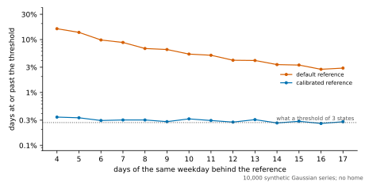
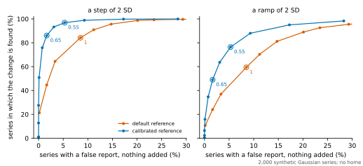

# The baseline's thresholds on days with nothing in them

The personal baseline calls a day deviating when it lies three robust standard deviations from its reference. This page measures how often that happens when nothing has changed, for the default reference and for the opt-in calibrated one, `BaselineConfig.calibrated`, and what each finds when something has. It is generated from the record, `artifacts/threshold_calibration/threshold-null.json`, by `sensor_modeling.datasets.threshold_null_summary.render_page`, and a test checks that the committed page is exactly that rendering.

**The values are synthetic.** Each series is 120 independent draws from one Gaussian, one a day, given to the baseline directly. No home is simulated and no state is inferred. A real day is not an independent Gaussian draw, so this says what each reference does when its own assumptions hold, and nothing about a home.

- **Run.** Commit `d418378`, with no uncommitted change; recorded 2026-10-08T02:13:14.078513+00:00.
- **Series.** 10,000 behind the shares of days and 2,000 behind the shares of series, all derived from root `20261010`. Every reference, shape and threshold is run on the same series.
- **Standing.** A measurement, not a test. The calibrated reference was designed on series of this kind, drawn from other seeds. The 0.368 degrees of freedom for each residual were settled in exploratory runs that are not recorded. This measurement was made once before in full, from another root and with fewer multiples, when the calibrated reference fitted its trend to the days as they are. With a weekly rhythm added it then reported a gradual drift more often, as the default does. Its trend was changed because of that, to be fitted to each day's distance from its own weekday, and a shape with both a rhythm and a step was added. That first record is not published. None of the series here was used to choose anything.
- **Standard errors** are in brackets, in the unit of the figure beside them. A share of days treats the series as the unit, since the days of one series share a history.

## What a threshold of 3 means

A Gaussian value lies 3 standard deviations or more from its mean 0.27% of the time. That is what the threshold states. The table gives how often a day reaches it, by the days its reference rests on.

| Days behind the centre | Default | Calibrated |
| --- | --- | --- |
| All the earlier days, 14 to 27 | 2.29% (0.05) | 0.19% (0.01) |
| 4 of the same weekday | 16.02% (0.14) | 0.34% (0.02) |
| 5 of the same weekday | 13.66% (0.13) | 0.33% (0.02) |
| 6 of the same weekday | 9.82% (0.11) | 0.30% (0.02) |
| 7 of the same weekday | 8.81% (0.11) | 0.30% (0.02) |
| 8 of the same weekday | 6.77% (0.09) | 0.30% (0.02) |
| 9 of the same weekday | 6.49% (0.09) | 0.28% (0.02) |
| 10 of the same weekday | 5.31% (0.08) | 0.32% (0.02) |
| 11 of the same weekday | 5.05% (0.08) | 0.30% (0.02) |
| 12 of the same weekday | 4.07% (0.07) | 0.28% (0.02) |
| 13 of the same weekday | 4.02% (0.07) | 0.31% (0.02) |
| 14 of the same weekday | 3.37% (0.07) | 0.27% (0.02) |
| 15 of the same weekday | 3.30% (0.07) | 0.29% (0.02) |
| 16 of the same weekday | 2.74% (0.06) | 0.26% (0.02) |
| 17 of the same weekday | 2.89% (0.17) | 0.28% (0.05) |
| **Every evaluable day** | **6.24% (0.03)** | **0.28% (0.01)** |

- **The default reference passes its threshold on 6.24% of days**, 23 times what it states. With 4 days of the weekday behind it the share is 16.0%, and with 17 it is still 2.9%.
- **The calibrated reference passes it on 0.28%.** Its centre rests on the same few days. Its scale rests on all of them.
- **The scale is where the default goes wrong.** The spread of four values is often far too small, and the day is then divided by it.

## The calibrated reference at other thresholds

A threshold that means what it says should do so wherever it is set. The share of evaluable days at or past each threshold:

| Threshold | Stated | Default | Calibrated | Calibrated, before the reference is weekday-aware | Calibrated, once it is |
| --- | --- | --- | --- | --- | --- |
| 1.5 | 13.36% | 25.44% (0.05) | 12.62% (0.05) | 11.16% (0.10) | 12.84% (0.05) |
| 1.8 | 7.19% | 18.78% (0.04) | 6.76% (0.04) | 5.80% (0.08) | 6.91% (0.04) |
| 2 | 4.55% | 15.40% (0.04) | 4.28% (0.03) | 3.54% (0.06) | 4.40% (0.03) |
| 2.5 | 1.24% | 9.61% (0.04) | 1.21% (0.01) | 0.94% (0.03) | 1.25% (0.02) |
| 3 | 0.27% | 6.24% (0.03) | 0.28% (0.01) | 0.19% (0.01) | 0.30% (0.01) |

The calibrated reference by week of the series, since the days behind its scale grow from week to week:

| Week | At 1.5 | At 1.8 | At 2 | At 2.5 | At 3 |
| --- | --- | --- | --- | --- | --- |
| 3 | 11.85% (0.14) | 6.16% (0.11) | 3.77% (0.08) | 0.96% (0.04) | 0.18% (0.02) |
| 4 | 10.46% (0.13) | 5.44% (0.10) | 3.32% (0.07) | 0.92% (0.04) | 0.20% (0.02) |
| 5 | 12.19% (0.14) | 6.61% (0.10) | 4.24% (0.08) | 1.28% (0.05) | 0.34% (0.02) |
| 6 | 12.77% (0.14) | 6.84% (0.10) | 4.36% (0.08) | 1.28% (0.04) | 0.33% (0.02) |
| 7 | 12.53% (0.14) | 6.74% (0.10) | 4.31% (0.08) | 1.24% (0.04) | 0.30% (0.02) |
| 8 | 12.79% (0.13) | 6.99% (0.10) | 4.40% (0.08) | 1.25% (0.04) | 0.30% (0.02) |
| 9 | 12.69% (0.14) | 6.77% (0.10) | 4.23% (0.08) | 1.23% (0.04) | 0.30% (0.02) |
| 10 | 13.00% (0.13) | 7.00% (0.10) | 4.45% (0.08) | 1.26% (0.04) | 0.28% (0.02) |
| 11 | 12.89% (0.13) | 7.02% (0.10) | 4.49% (0.08) | 1.26% (0.04) | 0.32% (0.02) |
| 12 | 13.03% (0.13) | 7.06% (0.10) | 4.48% (0.08) | 1.21% (0.04) | 0.30% (0.02) |
| 13 | 12.81% (0.13) | 6.90% (0.10) | 4.35% (0.08) | 1.27% (0.04) | 0.28% (0.02) |
| 14 | 13.15% (0.13) | 7.15% (0.10) | 4.57% (0.08) | 1.24% (0.04) | 0.31% (0.02) |
| 15 | 12.96% (0.13) | 6.86% (0.10) | 4.30% (0.08) | 1.24% (0.04) | 0.27% (0.02) |
| 16 | 13.22% (0.13) | 7.06% (0.10) | 4.53% (0.08) | 1.22% (0.04) | 0.29% (0.02) |
| 17 | 12.84% (0.13) | 6.84% (0.10) | 4.39% (0.08) | 1.24% (0.04) | 0.26% (0.02) |
| 18 | 12.99% (0.34) | 6.90% (0.25) | 4.60% (0.21) | 1.40% (0.12) | 0.28% (0.05) |

Over the 80 cells of that table the share is between 0.66 and 1.27 times what the threshold states.

## What is reported when nothing changed

The baseline's verdicts on the same days, at the declared thresholds. A persistent change, an abrupt change and a gradual drift are the three the pipeline can raise a behavioural alert about. The second pair of columns adds a weekly rhythm to the days, which is not a change.

| Verdict | Default | Calibrated | Default, weekly rhythm | Calibrated, weekly rhythm |
| --- | --- | --- | --- | --- |
| Ordinary | 93.294% (0.031) | 99.717% (0.006) | 92.943% (0.033) | 99.705% (0.006) |
| Temporary disturbance | 6.219% (0.028) | 0.283% (0.006) | 6.227% (0.028) | 0.294% (0.006) |
| Persistent change | 0.010% (0.001) | 0.000% (0.000) | 0.007% (0.001) | 0.000% (0.000) |
| Abrupt change | 0.006% (0.001) | 0.000% (0.000) | 0.009% (0.001) | 0.000% (0.000) |
| Gradual drift | 0.471% (0.008) | 0.000% (0.000) | 0.813% (0.011) | 0.000% (0.000) |
| **A change of any kind** | **0.487% (0.008)** | **0.000% (0.000)** | **0.830% (0.011)** | **0.000% (0.000)** |

- **The default reports a change on 0.487% of days with nothing in them**, and 97% of those reports are of a gradual drift. The drift's movement is divided by the same scale as the deviation, so a scale that is too small makes a trend out of noise.
- **With a weekly rhythm added**, gradual drifts go from 0.471% to 0.813% of days for the default and stay at 0.000% for the calibrated one. The default fits its trend to the days as they are. The calibrated reference fits it to each day's distance from the centre of its own weekday, so once every weekday has a centre of its own a rhythm is no part of its trend.

## The threshold a reference of a few days would need

The other way to make the threshold honest is to leave the reference as it is and raise the threshold with the sample size. The table gives, for a median and MAD of that many other days, how often a Gaussian day passes 3, and the value it passes 0.27% of the time, from 2,000,000 draws for each size. The interval is at 95%.

| Days behind the reference | Passes 3 | Threshold needed |
| --- | --- | --- |
| 4 | 17.53% (0.03) | 30.8 [30.4, 31.3] |
| 5 | 15.22% (0.03) | 28.6 [28.2, 29.0] |
| 6 | 10.31% (0.02) | 13.2 [13.0, 13.3] |
| 8 | 7.04% (0.02) | 8.7 [8.7, 8.8] |
| 10 | 5.21% (0.02) | 6.9 [6.9, 7.0] |
| 12 | 4.09% (0.01) | 6.0 [5.9, 6.0] |
| 14 | 3.36% (0.01) | 5.4 [5.4, 5.4] |
| 17 | 2.75% (0.01) | 5.0 [4.9, 5.0] |
| 27 | 1.56% (0.01) | 4.1 [4.0, 4.1] |

With 4 days the threshold would have to be 31, and with 27 it is still 4.1. A threshold that high is passed only by a day far outside anything the others showed, so a weekday reference would say nothing for its first months. This is why the calibrated reference changes the scale and not the threshold.

## Finding a change at the same rate of false reports

Two rules that do not fire equally often cannot be compared at one threshold. Each reference is run here at multiples of its declared thresholds, both multiplied together, on the same series: with nothing added, with a step, and with a slow ramp. A series counts when a change verdict falls on a day from 56 to 76, the three weeks from the step.

**The default reference.** Share of series with a change verdict in the window:

| Multiple | Thresholds | Nothing added | A weekly rhythm | A step of 2 SD | A step of 3 SD | A ramp of 2 SD | A rhythm and a step of 2 SD |
| --- | --- | --- | --- | --- | --- | --- | --- |
| 0.4 | 1.2 and 1.4 | 60.5% (1.1) | 75.2% (1.0) | 100.0% (0.0) | 100.0% (0.0) | 99.9% (0.1) | 100.0% (0.0) |
| 0.45 | 1.35 and 1.57 | 50.5% (1.1) | 67.0% (1.1) | 100.0% (0.0) | 100.0% (0.0) | 99.6% (0.1) | 100.0% (0.0) |
| 0.5 | 1.5 and 1.75 | 43.0% (1.1) | 59.9% (1.1) | 100.0% (0.0) | 100.0% (0.0) | 98.6% (0.3) | 100.0% (0.0) |
| 0.55 | 1.65 and 1.93 | 35.4% (1.1) | 51.0% (1.1) | 99.9% (0.1) | 100.0% (0.0) | 97.2% (0.4) | 99.9% (0.1) |
| 0.6 | 1.8 and 2.1 | 29.3% (1.0) | 44.5% (1.1) | 99.7% (0.1) | 100.0% (0.0) | 95.5% (0.5) | 99.7% (0.1) |
| 0.65 | 1.95 and 2.27 | 23.4% (0.9) | 38.7% (1.1) | 99.2% (0.2) | 100.0% (0.0) | 92.6% (0.6) | 99.4% (0.2) |
| 0.7 | 2.1 and 2.45 | 20.1% (0.9) | 32.6% (1.0) | 98.7% (0.3) | 100.0% (0.0) | 88.9% (0.7) | 99.2% (0.2) |
| 0.8 | 2.4 and 2.8 | 14.8% (0.8) | 24.9% (1.0) | 95.6% (0.5) | 99.9% (0.1) | 81.2% (0.9) | 96.2% (0.4) |
| 0.9 | 2.7 and 3.15 | 11.2% (0.7) | 18.4% (0.9) | 90.9% (0.6) | 99.5% (0.2) | 70.3% (1.0) | 92.0% (0.6) |
| 1 | 3 and 3.5 | 8.5% (0.6) | 14.5% (0.8) | 84.2% (0.8) | 98.5% (0.3) | 59.4% (1.1) | 86.0% (0.8) |
| 1.25 | 3.75 and 4.38 | 3.4% (0.4) | 7.2% (0.6) | 64.5% (1.1) | 89.3% (0.7) | 37.0% (1.1) | 67.6% (1.0) |
| 1.5 | 4.5 and 5.25 | 1.7% (0.3) | 3.4% (0.4) | 44.6% (1.1) | 76.3% (1.0) | 24.0% (1.0) | 47.8% (1.1) |
| 2 | 6 and 7 | 0.1% (0.1) | 0.5% (0.2) | 21.2% (0.9) | 45.9% (1.1) | 10.7% (0.7) | 23.3% (0.9) |

**The calibrated reference.** Share of series with a change verdict in the window:

| Multiple | Thresholds | Nothing added | A weekly rhythm | A step of 2 SD | A step of 3 SD | A ramp of 2 SD | A rhythm and a step of 2 SD |
| --- | --- | --- | --- | --- | --- | --- | --- |
| 0.4 | 1.2 and 1.4 | 28.3% (1.0) | 28.3% (1.0) | 100.0% (0.0) | 100.0% (0.0) | 98.3% (0.3) | 100.0% (0.0) |
| 0.45 | 1.35 and 1.57 | 17.2% (0.8) | 17.2% (0.8) | 99.8% (0.1) | 100.0% (0.0) | 95.0% (0.5) | 99.8% (0.1) |
| 0.5 | 1.5 and 1.75 | 9.3% (0.6) | 9.3% (0.6) | 98.9% (0.2) | 100.0% (0.0) | 87.9% (0.7) | 98.9% (0.2) |
| 0.55 | 1.65 and 1.93 | 5.3% (0.5) | 5.3% (0.5) | 96.9% (0.4) | 100.0% (0.0) | 76.4% (0.9) | 96.9% (0.4) |
| 0.6 | 1.8 and 2.1 | 3.1% (0.4) | 3.1% (0.4) | 93.2% (0.6) | 100.0% (0.0) | 63.6% (1.1) | 93.2% (0.6) |
| 0.65 | 1.95 and 2.27 | 1.7% (0.3) | 1.7% (0.3) | 86.1% (0.8) | 99.7% (0.1) | 49.0% (1.1) | 86.1% (0.8) |
| 0.7 | 2.1 and 2.45 | 0.8% (0.2) | 0.8% (0.2) | 75.8% (1.0) | 98.9% (0.2) | 34.6% (1.1) | 75.8% (1.0) |
| 0.8 | 2.4 and 2.8 | 0.1% (0.1) | 0.1% (0.1) | 50.8% (1.1) | 94.2% (0.5) | 15.8% (0.8) | 50.8% (1.1) |
| 0.9 | 2.7 and 3.15 | 0.0% (0.0) | 0.0% (0.0) | 27.5% (1.0) | 80.1% (0.9) | 6.4% (0.5) | 27.5% (1.0) |
| 1 | 3 and 3.5 | 0.0% (0.0) | 0.0% (0.0) | 12.8% (0.7) | 59.5% (1.1) | 2.3% (0.3) | 12.8% (0.7) |
| 1.25 | 3.75 and 4.38 | 0.0% (0.0) | 0.0% (0.0) | 1.1% (0.2) | 15.8% (0.8) | 0.1% (0.1) | 1.1% (0.2) |
| 1.5 | 4.5 and 5.25 | 0.0% (0.0) | 0.0% (0.0) | 0.1% (0.1) | 2.5% (0.3) | 0.1% (0.0) | 0.1% (0.1) |
| 2 | 6 and 7 | 0.0% (0.0) | 0.0% (0.0) | 0.0% (0.0) | 0.1% (0.0) | 0.0% (0.0) | 0.0% (0.0) |

Read the two tables against each other. For each multiple the default was run at, is there a calibrated multiple that reports a change no more often when no change was added, and finds the change no less often? Comparing the estimates, without their errors:

- **A step of 2 SD:** for 11 of the 13 multiples.
- **A step of 3 SD:** for 13 of the 13 multiples.
- **A ramp of 2 SD:** for 10 of the 13 multiples.
- **A rhythm and a step of 2 SD:** for 11 of the 13 multiples.

## Where the calibrated reference matches the default

At the declared thresholds the two references are far apart, so the calibrated one is also read where it matches the default as declared, by a rule fixed before the measurement:

- **The same detection:** the largest multiple at which the calibrated reference finds the step of two standard deviations in at least as many series as the default does at its declared thresholds; the smallest multiple if there is none.
- **The same false reports:** the smallest multiple at which the calibrated reference reports a change, with no step added, in no more series than the default does at its declared thresholds; the largest multiple if there is none.

When this measurement was made, the threshold-calibration protocol was to read two multiples off some of its homes by this rule and test them on the others, as the record says. It now places its match between the multiples of a finer grid, at the same false alerts alone, and finds it again in every resample of its homes. What is found here is what that match can be set against.

### Days with no weekly rhythm

No change added is `none`, and the step is `step2`.

| Reference | Thresholds | Nothing added | A weekly rhythm | A step of 2 SD | A step of 3 SD | A ramp of 2 SD | A rhythm and a step of 2 SD |
| --- | --- | --- | --- | --- | --- | --- | --- |
| Default, as declared | 3 and 3.5 | 8.5% (0.6) | 14.5% (0.8) | 84.2% (0.8) | 98.5% (0.3) | 59.4% (1.1) | 86.0% (0.8) |
| Calibrated at 0.55 | 1.65 and 1.93 | 5.3% (0.5) | 5.3% (0.5) | 96.9% (0.4) | 100.0% (0.0) | 76.4% (0.9) | 96.9% (0.4) |
| minus the default, in points |  | -3.2 (0.7) | -9.2 (0.8) | +12.7 (0.8) | +1.6 (0.3) | +17.0 (1.2) | +10.8 (0.8) |
| Calibrated at 0.65 | 1.95 and 2.27 | 1.7% (0.3) | 1.7% (0.3) | 86.1% (0.8) | 99.7% (0.1) | 49.0% (1.1) | 86.1% (0.8) |
| minus the default, in points |  | -6.9 (0.7) | -12.8 (0.8) | +1.8 (0.9) | +1.2 (0.3) | -10.4 (1.2) | +0.1 (0.9) |
| Calibrated at 1 | 3 and 3.5 | 0.0% (0.0) | 0.0% (0.0) | 12.8% (0.7) | 59.5% (1.1) | 2.3% (0.3) | 12.8% (0.7) |
| minus the default, in points |  | -8.5 (0.6) | -14.5 (0.8) | -71.5 (1.0) | -39.0 (1.1) | -57.1 (1.1) | -73.2 (1.0) |

- **The same detection is at 0.65.** There the calibrated reference finds the step in 86.1% of series against the default's 84.2%, and reports falsely in 1.7% against 8.5%.
- **The same false reports are at 0.55.** There it reports falsely in 5.3% of series against 8.5%, and finds the step in 96.9% against 84.2%.
- **At the declared thresholds** it finds the step in 12.8% of series and reports falsely in 0.0%.

### Days with a weekly rhythm

No change added is `weekend`, and the step is `weekend_step2`.

| Reference | Thresholds | Nothing added | A weekly rhythm | A step of 2 SD | A step of 3 SD | A ramp of 2 SD | A rhythm and a step of 2 SD |
| --- | --- | --- | --- | --- | --- | --- | --- |
| Default, as declared | 3 and 3.5 | 8.5% (0.6) | 14.5% (0.8) | 84.2% (0.8) | 98.5% (0.3) | 59.4% (1.1) | 86.0% (0.8) |
| Calibrated at 0.5 | 1.5 and 1.75 | 9.3% (0.6) | 9.3% (0.6) | 98.9% (0.2) | 100.0% (0.0) | 87.9% (0.7) | 98.9% (0.2) |
| minus the default, in points |  | +0.8 (0.8) | -5.2 (0.9) | +14.6 (0.8) | +1.6 (0.3) | +28.5 (1.1) | +12.8 (0.8) |
| Calibrated at 0.65 | 1.95 and 2.27 | 1.7% (0.3) | 1.7% (0.3) | 86.1% (0.8) | 99.7% (0.1) | 49.0% (1.1) | 86.1% (0.8) |
| minus the default, in points |  | -6.9 (0.7) | -12.8 (0.8) | +1.8 (0.9) | +1.2 (0.3) | -10.4 (1.2) | +0.1 (0.9) |
| Calibrated at 1 | 3 and 3.5 | 0.0% (0.0) | 0.0% (0.0) | 12.8% (0.7) | 59.5% (1.1) | 2.3% (0.3) | 12.8% (0.7) |
| minus the default, in points |  | -8.5 (0.6) | -14.5 (0.8) | -71.5 (1.0) | -39.0 (1.1) | -57.1 (1.1) | -73.2 (1.0) |

- **The same detection is at 0.65.** There the calibrated reference finds the step in 86.1% of series against the default's 86.0%, and reports falsely in 1.7% against 14.5%.
- **The same false reports are at 0.5.** There it reports falsely in 9.3% of series against 14.5%, and finds the step in 98.9% against 86.0%.
- **At the declared thresholds** it finds the step in 12.8% of series and reports falsely in 0.0%.

## What this does not show

- **Nothing about a home.** A day's hours of sleep are not independent Gaussian draws: they have long tails, they depend on the day before, and the hours of a state that is seldom entered pile up at zero. The Student t behind the calibrated score is exact for none of that.
- **Nothing about alerts.** Verdicts are counted. The alert policy, which grades a verdict and withholds a repeat, is not applied.
- **The floor on the scale is 0.25 of a standard deviation here.** In a home it is a quarter of an hour, whatever the spread of the feature, so it binds more or less often than it does on these series.
- **Where the references match here is not where they match in a home.** The threshold-calibration protocol finds that on simulated homes of its own, again in every resample of them.
