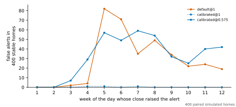
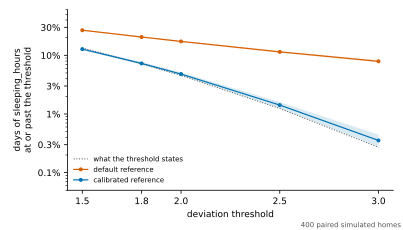
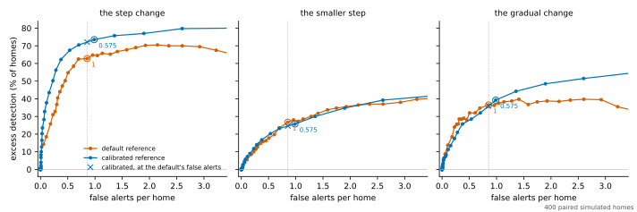
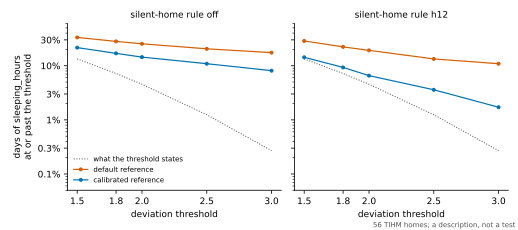

# Threshold calibration: results

The frozen [threshold-calibration protocol](THRESHOLD_CALIBRATION_PROTOCOL.md) run as declared. This page is generated from the record, `artifacts/threshold_calibration/threshold-calibration.json`, and its part on TIHM from a second record, `artifacts/threshold_calibration/threshold-calibration-tihm.json`, by `sensor_modeling.datasets.threshold_calibration_summary.render_page`, and a test checks that the committed page is exactly that rendering.

**The evidence is simulated.** 400 paired simulated homes of 84 days, each run in 4 arms and replayed under 84 conditions. Every result is a statement about this repository's simulator.

- **Protocol.** SHA-256 `c452b592ff664a5dec6eafa600f38119ce6cc1e105dcfd02ab6cf5ca52ba145a`, checked against the frozen file before the run.
- **Run.** Commit `b0f6035`, with no uncommitted change; recorded 2026-10-08T06:35:12.029634+00:00.
- **Code.** The source files, the libraries' versions and the default settings recorded at the freeze are those the run used.
- **The option.** `BaselineConfig.calibrated`, off by default.
- **Homes.** Seeds from root `20261008`; sensors `front_door`, `bedroom_motion`, `bathroom_motion`, `kitchen_motion`, `living_motion`, `fridge_contact`.
- **Pre-specified.** The protocol was frozen before any simulated home was run with the calibrated reference.
- **The replay was checked.** Under the default reference it returned the pipeline's own verdicts and alerts in all 1,600 runs. On 10 of the homes, the ones the protocol names, the pipeline was also run with the calibrated reference itself, and the replay returned all 120 of those runs.

## The criteria

Each was fixed, with its margin, before any simulated home had been run with the calibrated reference. They are decided on the 400 homes. The intervals resample those homes and are not adjusted for there being two criteria.

| Criterion | Claim | Verdict | What decided it |
| --- | --- | --- | --- |
| C1 | More is detected at the same false alerts | **success** | The default's excess detection is 0.63 [0.58, 0.68], where below 0.2 nothing is claimed, and the match is bracketed. E1 is +0.09 [+0.03, +0.16]. |
| C2, at 3 | The threshold means what it says | **holds** | 0.35% [0.28, 0.44] of days are at or past 3, which on Gaussian days is a threshold of 2.92 [2.85, 2.99]; the band is 2.75 to 3.25. |
| C2, at 2 | The threshold means what it says | **holds** | 4.79% [4.47, 5.13] of days are at or past 2, which on Gaussian days is a threshold of 1.98 [1.95, 2.01]; the band is 1.75 to 2.25. |
| C2, at 1.5 | The threshold means what it says | **holds** | 12.75% [12.26, 13.24] of days are at or past 1.5, which on Gaussian days is a threshold of 1.52 [1.50, 1.54]; the band is 1.25 to 1.75. |

Read as the protocol fixed it:

- **At the false alerts of the default as it ships, the calibrated reference finds more of the step change than the default.**
- **Whether the calibrated reference's threshold means what it says on these homes, at all three thresholds together:** holds.
- **Not shown is not no difference.** An inconclusive verdict means the interval reached the value it was judged against, or that one of its bounds does not exist because too many resamples had no match.

## At the same false alerts (E1, E4)

Take the smallest multiple of the calibrated reference, which is its most sensitive thresholds, whose mean false alerts per home are at most those of `default@1`. The match is on the line from that multiple to the next smaller one, where the false alerts equal the default's. The calibrated reference's excess detection is read there, in each change arm. The rule is applied to the means over the homes in hand. In the bootstrap those are the resampled homes, so the match moves from one resample to the next and the interval carries that.

- **The default.** `default@1` raises 0.86 false alerts per home.
- **The match.** On the 400 homes it is at 0.587 times the declared thresholds, between the multiples 0.575 and 0.6 of the grid.
- **The condition described in full.** `calibrated@0.575`, at the multiple of the grid the protocol's rule gives for the match. It is chosen from the data, and no criterion reads it.

| Change | Default | Calibrated, at the match | Calibrated minus default | Resamples |
| --- | --- | --- | --- | --- |
| the step change | 0.63 | 0.72 | +0.09 [+0.03, +0.16], SE 0.03 | 5,000 of 5,000 resamples bracketed, 0 not reached and 0 at the end of the grid |
| the smaller step | 0.27 | 0.25 | -0.02 [-0.09, +0.04], SE 0.03 | 5,000 of 5,000 resamples bracketed, 0 not reached and 0 at the end of the grid |
| the gradual change | 0.37 | 0.36 | -0.01 [-0.10, +0.09], SE 0.05 | 5,000 of 5,000 resamples bracketed, 0 not reached and 0 at the end of the grid |

The numbers are mean excess detection: the share of homes detected minus the share falsely detected. The first row is E1, on which C1 is decided, and the others are E4, on which nothing is. A bound shown as none does not exist: too many resamples had no match.

## False alerts (E2, E5)

Nothing is injected in the stable arm, so every behavioural alert there is a false one. 400 homes, 33,600 person-days.

| Condition | Thresholds | False alerts | Per home | Per person-day | Homes with one | Minus the default, per home |
| --- | --- | --- | --- | --- | --- | --- |
| `default@1`, the default, as it ships | 3 and 3.5 | 342 | 0.86 [0.75, 0.97] | 0.0102 | 196 | – |
| `calibrated@1`, calibrated, at the declared thresholds | 3 and 3.5 | 3 | 0.01 [0.00, 0.02] | 0.0001 | 3 | -0.85 [-0.96, -0.74], SE 0.06 |
| `calibrated@0.575`, calibrated, at the multiple nearest the same false alerts | 1.73 and 2.01 | 394 | 0.99 [0.82, 1.16] | 0.0117 | 160 | +0.13 [-0.04, +0.31], SE 0.09 |

What raised them:

| Condition | By verdict | By feature | By direction |
| --- | --- | --- | --- |
| `default@1` | gradual drift 323, persistent change 10, abrupt change 9 | sleeping hours 250, away hours 92 | decrease 225, increase 117 |
| `calibrated@1` | gradual drift 2, persistent change 1 | away hours 3 | decrease 2, increase 1 |
| `calibrated@0.575` | gradual drift 329, persistent change 45, abrupt change 20 | away hours 168, sleeping hours 130, kitchen activity hours 87, bathroom activity hours 9 | increase 226, decrease 168 |

By the week of the record whose day, on closing, raised them:

| Condition | 1 | 2 | 3 | 4 | 5 | 6 | 7 | 8 | 9 | 10 | 11 | 12 |
| --- | --- | --- | --- | --- | --- | --- | --- | --- | --- | --- | --- | --- |
| `default@1` | 0 | 0 | 2 | 4 | 82 | 71 | 35 | 49 | 34 | 22 | 24 | 19 |
| `calibrated@1` | 0 | 0 | 0 | 1 | 1 | 0 | 1 | 0 | 0 | 0 | 0 | 0 |
| `calibrated@0.575` | 0 | 0 | 7 | 29 | 57 | 49 | 59 | 54 | 32 | 25 | 40 | 42 |

## Detection (E2, E5)

A home is detected when a behavioural alert about its hours of sleep is raised in the arm's window. A false detection is the same in the same home's stable record, and the excess is the one minus the other: what a condition finds beyond what it would have raised anyway. These tables are of conditions that were run; C1 is decided at the match, above, and not here. The calibrated reference at the multiple nearest the match was chosen from these homes: its differences from the default describe it, and their intervals do not carry the choice.

### The step change, `change`

The detection study's step change from day 56: the resident wakes 1.6 hours earlier, with 1.2 more night-time bathroom trips expected a night.

| Condition | Detected | False detections | Excess detection | Excess, minus the default | Detected, minus the default | False detections, minus the default | Median delay, days |
| --- | --- | --- | --- | --- | --- | --- | --- |
| `default@1` | 293 of 400 (73%) [69%, 77%] | 42 of 400 (11%) [8%, 14%] | 0.63 [0.58, 0.68] | – | – | – | 11.0 [10.0, 11.0] |
| `calibrated@1` | 16 of 400 (4%) [2%, 6%] | 0 of 400 (0%) [0%, 1%] | 0.04 [0.02, 0.06] | -0.59 [-0.64, -0.54], SE 0.03 | -0.69 [-0.74, -0.65], SE 0.02 | -0.11 [-0.14, -0.08], SE 0.02 | 11.5 [8.0, 12.5] |
| `calibrated@0.575` | 316 of 400 (79%) [75%, 83%] | 22 of 400 (6%) [4%, 8%] | 0.74 [0.69, 0.78] | +0.11 [+0.05, +0.17], SE 0.03 | +0.06 [+0.01, +0.11], SE 0.02 | -0.05 [-0.08, -0.02], SE 0.02 | 9.0 [8.0, 9.0] |

The first alert that counts, by the verdict behind it and by its direction:

| Condition | Verdict | Direction |
| --- | --- | --- |
| `default@1` | gradual drift 262, abrupt change 31 | decrease 293 |
| `calibrated@1` | gradual drift 16 | decrease 16 |
| `calibrated@0.575` | gradual drift 249, abrupt change 67 | decrease 316 |

When the alert must also be of a decrease, which is the direction of the injected change:

| Condition | Detected | False detections | Excess detection |
| --- | --- | --- | --- |
| `default@1` | 293 of 400 (73%) [69%, 77%] | 26 of 400 (7%) [4%, 9%] | 0.67 [0.62, 0.72] |
| `calibrated@1` | 16 of 400 (4%) [2%, 6%] | 0 of 400 (0%) [0%, 1%] | 0.04 [0.02, 0.06] |
| `calibrated@0.575` | 316 of 400 (79%) [75%, 83%] | 10 of 400 (3%) [1%, 5%] | 0.77 [0.72, 0.81] |

### The smaller step, `small_change`

A step from day 56 of 0.5 of that size: 0.8 hours and 0.6 trips.

| Condition | Detected | False detections | Excess detection | Excess, minus the default | Detected, minus the default | False detections, minus the default | Median delay, days |
| --- | --- | --- | --- | --- | --- | --- | --- |
| `default@1` | 149 of 400 (37%) [33%, 42%] | 42 of 400 (11%) [8%, 14%] | 0.27 [0.21, 0.32] | – | – | – | 11.0 [10.0, 11.0] |
| `calibrated@1` | 2 of 400 (1%) [0%, 2%] | 0 of 400 (0%) [0%, 1%] | 0.01 [0.00, 0.01] | -0.26 [-0.32, -0.21], SE 0.03 | -0.37 [-0.42, -0.32], SE 0.02 | -0.11 [-0.14, -0.08], SE 0.02 | 15.5 [13.0, 18.0] |
| `calibrated@0.575` | 125 of 400 (31%) [27%, 36%] | 22 of 400 (6%) [4%, 8%] | 0.26 [0.21, 0.31] | -0.01 [-0.07, +0.05], SE 0.03 | -0.06 [-0.12, -0.01], SE 0.03 | -0.05 [-0.08, -0.02], SE 0.02 | 11.0 [10.0, 12.0] |

The first alert that counts, by the verdict behind it and by its direction:

| Condition | Verdict | Direction |
| --- | --- | --- |
| `default@1` | gradual drift 149 | decrease 145, increase 4 |
| `calibrated@1` | gradual drift 2 | decrease 2 |
| `calibrated@0.575` | gradual drift 113, abrupt change 12 | decrease 125 |

When the alert must also be of a decrease, which is the direction of the injected change:

| Condition | Detected | False detections | Excess detection |
| --- | --- | --- | --- |
| `default@1` | 146 of 400 (37%) [32%, 41%] | 26 of 400 (7%) [4%, 9%] | 0.30 [0.25, 0.35] |
| `calibrated@1` | 2 of 400 (1%) [0%, 2%] | 0 of 400 (0%) [0%, 1%] | 0.01 [0.00, 0.01] |
| `calibrated@0.575` | 125 of 400 (31%) [27%, 36%] | 10 of 400 (3%) [1%, 5%] | 0.29 [0.24, 0.33] |

### The gradual change, `gradual_change`

The step change's size reached gradually, declared from day 35 over 28 days. The simulator leaves day 35 itself unchanged, so the first changed day is day 36, by one part in 28.

| Condition | Detected | False detections | Excess detection | Excess, minus the default | Detected, minus the default | False detections, minus the default | Median delay, days |
| --- | --- | --- | --- | --- | --- | --- | --- |
| `default@1` | 258 of 400 (65%) [60%, 69%] | 112 of 400 (28%) [24%, 33%] | 0.37 [0.30, 0.43] | – | – | – | 18.0 [17.0, 18.5] |
| `calibrated@1` | 5 of 400 (1%) [1%, 3%] | 0 of 400 (0%) [0%, 1%] | 0.01 [0.00, 0.03] | -0.35 [-0.42, -0.29], SE 0.03 | -0.63 [-0.68, -0.59], SE 0.02 | -0.28 [-0.32, -0.24], SE 0.02 | 24.0 [10.0, 34.0] |
| `calibrated@0.575` | 199 of 400 (50%) [45%, 55%] | 42 of 400 (11%) [8%, 14%] | 0.39 [0.34, 0.45] | +0.03 [-0.05, +0.11], SE 0.04 | -0.15 [-0.21, -0.09], SE 0.03 | -0.18 [-0.22, -0.13], SE 0.02 | 22.0 [21.0, 24.0] |

The first alert that counts, by the verdict behind it and by its direction:

| Condition | Verdict | Direction |
| --- | --- | --- |
| `default@1` | gradual drift 249, abrupt change 9 | decrease 246, increase 12 |
| `calibrated@1` | gradual drift 5 | decrease 5 |
| `calibrated@0.575` | gradual drift 163, abrupt change 36 | decrease 195, increase 4 |

When the alert must also be of a decrease, which is the direction of the injected change:

| Condition | Detected | False detections | Excess detection |
| --- | --- | --- | --- |
| `default@1` | 257 of 400 (64%) [59%, 69%] | 78 of 400 (20%) [16%, 24%] | 0.45 [0.39, 0.51] |
| `calibrated@1` | 5 of 400 (1%) [1%, 3%] | 0 of 400 (0%) [0%, 1%] | 0.01 [0.00, 0.03] |
| `calibrated@0.575` | 199 of 400 (50%) [45%, 55%] | 20 of 400 (5%) [3%, 8%] | 0.45 [0.40, 0.50] |

Homes first detected in the gradual change, and homes with a first false detection in the stable record, by week of the window:

| Condition | Record | 1 | 2 | 3 | 4 | 5 | 6 |
| --- | --- | --- | --- | --- | --- | --- | --- |
| `default@1` | gradual change | 49 | 45 | 68 | 56 | 34 | 6 |
| `default@1` | stable | 42 | 22 | 22 | 12 | 7 | 7 |
| `calibrated@1` | gradual change | 0 | 1 | 1 | 1 | 2 | 0 |
| `calibrated@1` | stable | 0 | 0 | 0 | 0 | 0 | 0 |
| `calibrated@0.575` | gradual change | 16 | 27 | 49 | 66 | 32 | 9 |
| `calibrated@0.575` | stable | 8 | 7 | 9 | 4 | 5 | 9 |

## Does the threshold mean what it says (E3, C2)

The share of evaluable days of `sleeping_hours` in the stable records whose deviation is at or past a threshold, beside what the threshold states for Gaussian days, and the threshold that share is equivalent to. A day's deviation does not depend on the threshold it is read against, so the rows of one reference are points on one curve.

| Reference | Threshold | Stated | Deviating | Equivalent threshold | C2 |
| --- | --- | --- | --- | --- | --- |
| default | 3 | 0.27% | 7.91% [7.56, 8.28] | 1.76 [1.73, 1.78] | described |
| calibrated | 3 | 0.27% | 0.35% [0.28, 0.44] | 2.92 [2.85, 2.99] | holds |
| default | 2 | 4.55% | 17.26% [16.78, 17.77] | 1.36 [1.35, 1.38] | described |
| calibrated | 2 | 4.55% | 4.79% [4.47, 5.13] | 1.98 [1.95, 2.01] | holds |
| default | 1.5 | 13.36% | 26.80% [26.23, 27.34] | 1.11 [1.10, 1.12] | described |
| calibrated | 1.5 | 13.36% | 12.75% [12.26, 13.24] | 1.52 [1.50, 1.54] | holds |

The whole tail, for each reference:

| Reference | At 1.5 | At 1.8 | At 2 | At 2.5 | At 3 |
| --- | --- | --- | --- | --- | --- |
| default | 26.80% [26.23, 27.34] | 20.52% [19.99, 21.04] | 17.26% [16.78, 17.77] | 11.45% [11.02, 11.88] | 7.91% [7.56, 8.28] |
| calibrated | 12.75% [12.26, 13.24] | 7.28% [6.90, 7.69] | 4.79% [4.47, 5.13] | 1.42% [1.25, 1.60] | 0.35% [0.28, 0.44] |

What the thresholds state: 13.36% at 1.5, 7.19% at 1.8, 4.55% at 2, 1.24% at 2.5, 0.27% at 3.

Before and after the reference becomes weekday-aware:

| Reference | Threshold | All the earlier days behind it | Its own weekday behind it |
| --- | --- | --- | --- |
| default | 3 | 2.34% [1.89, 2.82] | 9.30% [8.89, 9.74] |
| calibrated | 3 | 0.29% [0.16, 0.43] | 0.37% [0.28, 0.47] |
| default | 2 | 8.95% [8.02, 9.89] | 19.34% [18.79, 19.90] |
| calibrated | 2 | 3.95% [3.36, 4.54] | 5.00% [4.65, 5.38] |
| default | 1.5 | 18.21% [17.04, 19.45] | 28.94% [28.33, 29.55] |
| calibrated | 1.5 | 10.98% [10.05, 11.93] | 13.19% [12.65, 13.75] |

The other features, on which no criterion is stated:

| Reference | Threshold | `away_hours` | `bathroom_activity_hours` | `kitchen_activity_hours` |
| --- | --- | --- | --- | --- |
| default | 3 | 7.72% [7.38, 8.06] | 0.28% [0.21, 0.34] | 1.67% [1.52, 1.83] |
| calibrated | 3 | 1.66% [1.47, 1.86] | 0.09% [0.06, 0.13] | 0.16% [0.11, 0.22] |
| default | 2 | 16.00% [15.55, 16.45] | 2.29% [2.12, 2.47] | 9.29% [8.96, 9.63] |
| calibrated | 2 | 8.56% [8.12, 8.99] | 1.42% [1.28, 1.56] | 3.36% [3.11, 3.62] |
| default | 1.5 | 24.89% [24.37, 25.41] | 6.73% [6.40, 7.05] | 19.60% [19.14, 20.06] |
| calibrated | 1.5 | 16.49% [15.94, 17.04] | 5.51% [5.23, 5.80] | 11.44% [10.94, 11.95] |

## From a verdict to an alert (E5)

The alert policy stands between a change verdict and an alert. It asks that the day be attributable enough, grades the verdict against its threshold, and withholds a repeat. A verdict on a day that was attributable enough and raised no alert was graded below the minimum score, repeated one inside the cooldown, or fell in a burst; the record does not tell those apart.

| Arm | Condition | Change verdicts | By kind | Raised an alert | Not attributable enough | Graded too low, or withheld | Notices of a burst |
| --- | --- | --- | --- | --- | --- | --- | --- |
| `stable` | `default@1` | 342 | gradual drift 323, persistent change 10, abrupt change 9 | 342 | 0 | 0 | 0 |
| `stable` | `calibrated@1` | 3 | gradual drift 2, persistent change 1 | 3 | 0 | 0 | 0 |
| `stable` | `calibrated@0.575` | 394 | gradual drift 329, persistent change 45, abrupt change 20 | 394 | 0 | 0 | 0 |
| `change` | `default@1` | 993 | gradual drift 925, abrupt change 53, persistent change 15 | 993 | 0 | 0 | 0 |
| `change` | `calibrated@1` | 35 | gradual drift 35 | 35 | 0 | 0 | 0 |
| `change` | `calibrated@0.575` | 2,283 | gradual drift 2,041, abrupt change 164, persistent change 78 | 2,283 | 0 | 0 | 0 |
| `small_change` | `default@1` | 579 | gradual drift 553, persistent change 16, abrupt change 10 | 579 | 0 | 0 | 0 |
| `small_change` | `calibrated@1` | 5 | gradual drift 4, persistent change 1 | 5 | 0 | 0 | 0 |
| `small_change` | `calibrated@0.575` | 835 | gradual drift 733, persistent change 75, abrupt change 27 | 835 | 0 | 0 | 0 |
| `gradual_change` | `default@1` | 733 | gradual drift 694, abrupt change 22, persistent change 17 | 733 | 0 | 0 | 0 |
| `gradual_change` | `calibrated@1` | 10 | gradual drift 8, persistent change 2 | 10 | 0 | 0 | 0 |
| `gradual_change` | `calibrated@0.575` | 1,165 | gradual drift 973, abrupt change 99, persistent change 93 | 1,164 | 0 | 1 | 0 |

## The operating curves (E6)

Both references at every multiple of the declared thresholds: mean false alerts per home, and in each change arm the excess detection and, after it, the share of homes detected. No criterion is stated on these.

**The default reference.**

| Multiple | False alerts per home | The step change | The smaller step | The gradual change |
| --- | --- | --- | --- | --- |
| 0.3 | 21.45 [20.80, 22.12] | 0.14 [0.11, 0.18]; 100% detected | 0.13 [0.09, 0.16]; 98% detected | 0.02 [0.01, 0.04]; 100% detected |
| 0.325 | 18.76 [18.15, 19.39] | 0.19 [0.15, 0.22]; 100% detected | 0.16 [0.12, 0.20]; 97% detected | 0.04 [0.02, 0.06]; 100% detected |
| 0.35 | 16.44 [15.86, 17.03] | 0.23 [0.19, 0.27]; 100% detected | 0.20 [0.16, 0.24]; 97% detected | 0.05 [0.03, 0.08]; 100% detected |
| 0.375 | 14.48 [13.94, 15.04] | 0.26 [0.22, 0.30]; 100% detected | 0.22 [0.17, 0.26]; 95% detected | 0.08 [0.05, 0.10]; 100% detected |
| 0.4 | 12.69 [12.18, 13.20] | 0.30 [0.25, 0.34]; 100% detected | 0.23 [0.19, 0.28]; 94% detected | 0.09 [0.06, 0.12]; 100% detected |
| 0.425 | 11.13 [10.65, 11.61] | 0.34 [0.29, 0.39]; 100% detected | 0.26 [0.21, 0.31]; 92% detected | 0.11 [0.08, 0.14]; 100% detected |
| 0.45 | 9.68 [9.25, 10.12] | 0.38 [0.33, 0.43]; 100% detected | 0.29 [0.24, 0.34]; 90% detected | 0.15 [0.11, 0.18]; 100% detected |
| 0.475 | 8.52 [8.11, 8.94] | 0.43 [0.38, 0.48]; 100% detected | 0.33 [0.27, 0.38]; 89% detected | 0.17 [0.14, 0.21]; 100% detected |
| 0.5 | 7.47 [7.08, 7.87] | 0.48 [0.43, 0.53]; 100% detected | 0.36 [0.31, 0.42]; 88% detected | 0.20 [0.16, 0.24]; 99% detected |
| 0.525 | 6.49 [6.12, 6.87] | 0.52 [0.47, 0.57]; 99% detected | 0.40 [0.34, 0.45]; 87% detected | 0.23 [0.18, 0.27]; 98% detected |
| 0.55 | 5.81 [5.47, 6.16] | 0.57 [0.53, 0.62]; 99% detected | 0.42 [0.36, 0.48]; 84% detected | 0.25 [0.21, 0.30]; 98% detected |
| 0.575 | 5.12 [4.80, 5.44] | 0.62 [0.57, 0.67]; 99% detected | 0.43 [0.37, 0.49]; 80% detected | 0.28 [0.24, 0.33]; 96% detected |
| 0.6 | 4.55 [4.25, 4.85] | 0.63 [0.58, 0.67]; 99% detected | 0.41 [0.35, 0.47]; 78% detected | 0.30 [0.25, 0.35]; 96% detected |
| 0.625 | 4.10 [3.82, 4.37] | 0.64 [0.59, 0.69]; 99% detected | 0.41 [0.35, 0.47]; 76% detected | 0.32 [0.27, 0.37]; 95% detected |
| 0.65 | 3.60 [3.34, 3.85] | 0.65 [0.60, 0.70]; 97% detected | 0.41 [0.35, 0.46]; 73% detected | 0.33 [0.28, 0.38]; 94% detected |
| 0.675 | 3.23 [2.99, 3.46] | 0.68 [0.63, 0.72]; 97% detected | 0.40 [0.34, 0.46]; 69% detected | 0.36 [0.31, 0.41]; 93% detected |
| 0.7 | 2.92 [2.70, 3.15] | 0.70 [0.65, 0.74]; 96% detected | 0.38 [0.32, 0.44]; 64% detected | 0.40 [0.34, 0.45]; 92% detected |
| 0.725 | 2.60 [2.40, 2.81] | 0.70 [0.65, 0.75]; 95% detected | 0.37 [0.31, 0.43]; 62% detected | 0.40 [0.35, 0.45]; 91% detected |
| 0.75 | 2.36 [2.16, 2.56] | 0.70 [0.65, 0.75]; 93% detected | 0.37 [0.31, 0.43]; 60% detected | 0.39 [0.34, 0.45]; 88% detected |
| 0.775 | 2.15 [1.96, 2.34] | 0.71 [0.66, 0.75]; 91% detected | 0.37 [0.31, 0.42]; 57% detected | 0.39 [0.33, 0.44]; 85% detected |
| 0.8 | 1.93 [1.75, 2.11] | 0.70 [0.66, 0.75]; 90% detected | 0.36 [0.30, 0.41]; 55% detected | 0.39 [0.33, 0.45]; 82% detected |
| 0.825 | 1.75 [1.58, 1.91] | 0.69 [0.64, 0.74]; 87% detected | 0.35 [0.29, 0.41]; 53% detected | 0.38 [0.32, 0.44]; 80% detected |
| 0.85 | 1.58 [1.43, 1.73] | 0.68 [0.63, 0.73]; 85% detected | 0.34 [0.28, 0.39]; 51% detected | 0.37 [0.31, 0.43]; 77% detected |
| 0.875 | 1.41 [1.27, 1.55] | 0.67 [0.62, 0.72]; 83% detected | 0.32 [0.26, 0.37]; 48% detected | 0.40 [0.34, 0.46]; 76% detected |
| 0.9 | 1.28 [1.14, 1.42] | 0.65 [0.60, 0.70]; 81% detected | 0.30 [0.24, 0.36]; 46% detected | 0.39 [0.33, 0.45]; 73% detected |
| 0.925 | 1.14 [1.00, 1.27] | 0.66 [0.61, 0.71]; 80% detected | 0.29 [0.23, 0.34]; 42% detected | 0.38 [0.32, 0.45]; 70% detected |
| 0.95 | 1.04 [0.92, 1.17] | 0.65 [0.60, 0.69]; 78% detected | 0.27 [0.22, 0.33]; 40% detected | 0.38 [0.31, 0.44]; 69% detected |
| 0.975 | 0.96 [0.84, 1.08] | 0.65 [0.60, 0.70]; 76% detected | 0.28 [0.23, 0.33]; 39% detected | 0.36 [0.30, 0.43]; 66% detected |
| 1 | 0.86 [0.75, 0.97] | 0.63 [0.58, 0.68]; 73% detected | 0.27 [0.21, 0.32]; 37% detected | 0.37 [0.30, 0.43]; 65% detected |
| 1.05 | 0.70 [0.60, 0.79] | 0.63 [0.58, 0.68]; 71% detected | 0.24 [0.19, 0.29]; 32% detected | 0.35 [0.28, 0.41]; 59% detected |
| 1.1 | 0.61 [0.52, 0.70] | 0.59 [0.54, 0.64]; 66% detected | 0.20 [0.15, 0.24]; 27% detected | 0.32 [0.26, 0.39]; 54% detected |
| 1.15 | 0.51 [0.42, 0.59] | 0.55 [0.49, 0.60]; 61% detected | 0.18 [0.13, 0.22]; 24% detected | 0.32 [0.26, 0.38]; 50% detected |
| 1.2 | 0.45 [0.38, 0.53] | 0.50 [0.45, 0.56]; 56% detected | 0.16 [0.12, 0.21]; 22% detected | 0.28 [0.22, 0.34]; 46% detected |
| 1.25 | 0.40 [0.33, 0.48] | 0.47 [0.42, 0.53]; 53% detected | 0.16 [0.12, 0.20]; 22% detected | 0.29 [0.23, 0.35]; 46% detected |
| 1.3 | 0.36 [0.29, 0.43] | 0.44 [0.39, 0.49]; 49% detected | 0.15 [0.11, 0.19]; 20% detected | 0.29 [0.23, 0.35]; 43% detected |
| 1.35 | 0.32 [0.26, 0.38] | 0.41 [0.35, 0.46]; 45% detected | 0.14 [0.10, 0.19]; 19% detected | 0.29 [0.23, 0.34]; 42% detected |
| 1.4 | 0.30 [0.24, 0.36] | 0.37 [0.32, 0.42]; 41% detected | 0.13 [0.09, 0.17]; 17% detected | 0.26 [0.20, 0.32]; 39% detected |
| 1.45 | 0.27 [0.21, 0.33] | 0.33 [0.28, 0.38]; 37% detected | 0.12 [0.08, 0.16]; 16% detected | 0.26 [0.20, 0.31]; 37% detected |
| 1.5 | 0.23 [0.18, 0.28] | 0.31 [0.26, 0.36]; 35% detected | 0.10 [0.06, 0.14]; 14% detected | 0.24 [0.18, 0.30]; 35% detected |
| 1.6 | 0.18 [0.14, 0.23] | 0.26 [0.21, 0.31]; 29% detected | 0.09 [0.05, 0.12]; 12% detected | 0.19 [0.14, 0.24]; 28% detected |
| 1.8 | 0.11 [0.07, 0.14] | 0.19 [0.15, 0.23]; 20% detected | 0.06 [0.03, 0.08]; 7% detected | 0.14 [0.10, 0.18]; 19% detected |
| 2 | 0.06 [0.03, 0.08] | 0.14 [0.11, 0.18]; 15% detected | 0.05 [0.02, 0.07]; 5% detected | 0.09 [0.06, 0.12]; 12% detected |

**The calibrated reference.**

| Multiple | False alerts per home | The step change | The smaller step | The gradual change |
| --- | --- | --- | --- | --- |
| 0.3 | 19.70 [18.84, 20.54] | 0.37 [0.32, 0.42]; 100% detected | 0.29 [0.24, 0.35]; 91% detected | 0.15 [0.12, 0.19]; 100% detected |
| 0.325 | 16.11 [15.31, 16.89] | 0.46 [0.41, 0.51]; 99% detected | 0.36 [0.30, 0.41]; 89% detected | 0.23 [0.19, 0.27]; 100% detected |
| 0.35 | 12.90 [12.17, 13.62] | 0.55 [0.50, 0.60]; 99% detected | 0.42 [0.37, 0.48]; 86% detected | 0.31 [0.26, 0.35]; 99% detected |
| 0.375 | 10.08 [9.45, 10.70] | 0.60 [0.55, 0.65]; 99% detected | 0.42 [0.36, 0.48]; 80% detected | 0.37 [0.32, 0.42]; 97% detected |
| 0.4 | 7.68 [7.14, 8.21] | 0.66 [0.61, 0.71]; 98% detected | 0.43 [0.37, 0.49]; 75% detected | 0.41 [0.35, 0.46]; 93% detected |
| 0.425 | 6.00 [5.54, 6.46] | 0.72 [0.67, 0.76]; 96% detected | 0.44 [0.38, 0.51]; 69% detected | 0.50 [0.44, 0.55]; 90% detected |
| 0.45 | 4.57 [4.17, 4.96] | 0.76 [0.71, 0.80]; 95% detected | 0.43 [0.37, 0.49]; 62% detected | 0.51 [0.45, 0.56]; 85% detected |
| 0.475 | 3.45 [3.11, 3.80] | 0.80 [0.76, 0.84]; 93% detected | 0.42 [0.36, 0.47]; 55% detected | 0.55 [0.49, 0.60]; 81% detected |
| 0.5 | 2.60 [2.30, 2.90] | 0.80 [0.76, 0.84]; 91% detected | 0.39 [0.34, 0.45]; 50% detected | 0.52 [0.46, 0.57]; 74% detected |
| 0.525 | 1.90 [1.65, 2.16] | 0.77 [0.73, 0.81]; 87% detected | 0.35 [0.29, 0.40]; 44% detected | 0.49 [0.43, 0.54]; 66% detected |
| 0.55 | 1.36 [1.17, 1.57] | 0.76 [0.71, 0.80]; 83% detected | 0.30 [0.25, 0.35]; 38% detected | 0.44 [0.39, 0.50]; 58% detected |
| 0.575 | 0.99 [0.82, 1.16] | 0.74 [0.69, 0.78]; 79% detected | 0.26 [0.21, 0.31]; 31% detected | 0.39 [0.34, 0.45]; 50% detected |
| 0.6 | 0.70 [0.57, 0.84] | 0.71 [0.66, 0.75]; 75% detected | 0.23 [0.19, 0.28]; 27% detected | 0.32 [0.27, 0.38]; 40% detected |
| 0.625 | 0.54 [0.42, 0.66] | 0.68 [0.63, 0.72]; 70% detected | 0.20 [0.16, 0.25]; 23% detected | 0.29 [0.24, 0.34]; 33% detected |
| 0.65 | 0.38 [0.29, 0.47] | 0.62 [0.58, 0.67]; 64% detected | 0.17 [0.13, 0.21]; 19% detected | 0.26 [0.21, 0.31]; 29% detected |
| 0.675 | 0.28 [0.21, 0.36] | 0.56 [0.51, 0.61]; 58% detected | 0.14 [0.10, 0.18]; 15% detected | 0.21 [0.17, 0.26]; 24% detected |
| 0.7 | 0.23 [0.17, 0.29] | 0.50 [0.45, 0.55]; 51% detected | 0.12 [0.09, 0.15]; 13% detected | 0.18 [0.14, 0.22]; 20% detected |
| 0.725 | 0.16 [0.11, 0.21] | 0.44 [0.39, 0.49]; 45% detected | 0.09 [0.06, 0.12]; 10% detected | 0.14 [0.10, 0.18]; 16% detected |
| 0.75 | 0.11 [0.07, 0.16] | 0.38 [0.33, 0.43]; 39% detected | 0.07 [0.05, 0.10]; 8% detected | 0.11 [0.08, 0.15]; 13% detected |
| 0.775 | 0.08 [0.04, 0.11] | 0.33 [0.28, 0.37]; 33% detected | 0.06 [0.04, 0.08]; 6% detected | 0.08 [0.05, 0.12]; 10% detected |
| 0.8 | 0.06 [0.04, 0.09] | 0.28 [0.24, 0.33]; 28% detected | 0.04 [0.02, 0.06]; 4% detected | 0.07 [0.05, 0.10]; 8% detected |
| 0.825 | 0.04 [0.02, 0.06] | 0.24 [0.20, 0.28]; 24% detected | 0.03 [0.01, 0.05]; 3% detected | 0.07 [0.04, 0.09]; 7% detected |
| 0.85 | 0.03 [0.01, 0.05] | 0.20 [0.16, 0.24]; 20% detected | 0.03 [0.01, 0.04]; 3% detected | 0.06 [0.04, 0.08]; 6% detected |
| 0.875 | 0.03 [0.01, 0.05] | 0.17 [0.13, 0.20]; 17% detected | 0.02 [0.01, 0.03]; 2% detected | 0.05 [0.03, 0.07]; 5% detected |
| 0.9 | 0.02 [0.01, 0.04] | 0.13 [0.10, 0.16]; 13% detected | 0.01 [0.00, 0.02]; 1% detected | 0.04 [0.02, 0.06]; 4% detected |
| 0.925 | 0.01 [0.00, 0.03] | 0.10 [0.07, 0.13]; 10% detected | 0.01 [0.00, 0.01]; 1% detected | 0.03 [0.01, 0.05]; 3% detected |
| 0.95 | 0.01 [0.00, 0.02] | 0.08 [0.06, 0.11]; 8% detected | 0.01 [0.00, 0.01]; 1% detected | 0.02 [0.01, 0.04]; 2% detected |
| 0.975 | 0.01 [0.00, 0.02] | 0.07 [0.04, 0.09]; 7% detected | 0.01 [0.00, 0.01]; 1% detected | 0.02 [0.01, 0.03]; 2% detected |
| 1 | 0.01 [0.00, 0.02] | 0.04 [0.02, 0.06]; 4% detected | 0.01 [0.00, 0.01]; 1% detected | 0.01 [0.00, 0.03]; 1% detected |
| 1.05 | 0.01 [0.00, 0.02] | 0.02 [0.01, 0.04]; 2% detected | 0.00 [0.00, 0.01]; 0% detected | 0.01 [0.00, 0.02]; 1% detected |
| 1.1 | 0.01 [0.00, 0.02] | 0.01 [0.00, 0.03]; 1% detected | 0.00 [0.00, 0.01]; 0% detected | 0.00 [0.00, 0.01]; 0% detected |
| 1.15 | 0.00 [0.00, 0.01] | 0.01 [0.00, 0.02]; 1% detected | 0.00 [0.00, 0.01]; 0% detected | 0.00 [0.00, 0.00]; 0% detected |
| 1.2 | 0.00 [0.00, 0.00] | 0.01 [0.00, 0.02]; 1% detected | 0.00 [0.00, 0.00]; 0% detected | 0.00 [0.00, 0.00]; 0% detected |
| 1.25 | 0.00 [0.00, 0.00] | 0.01 [0.00, 0.01]; 1% detected | 0.00 [0.00, 0.00]; 0% detected | 0.00 [0.00, 0.00]; 0% detected |
| 1.3 | 0.00 [0.00, 0.00] | 0.00 [0.00, 0.01]; 0% detected | 0.00 [0.00, 0.00]; 0% detected | 0.00 [0.00, 0.00]; 0% detected |
| 1.35 | 0.00 [0.00, 0.00] | 0.00 [0.00, 0.00]; 0% detected | 0.00 [0.00, 0.00]; 0% detected | 0.00 [0.00, 0.00]; 0% detected |
| 1.4 | 0.00 [0.00, 0.00] | 0.00 [0.00, 0.00]; 0% detected | 0.00 [0.00, 0.00]; 0% detected | 0.00 [0.00, 0.00]; 0% detected |
| 1.45 | 0.00 [0.00, 0.00] | 0.00 [0.00, 0.00]; 0% detected | 0.00 [0.00, 0.00]; 0% detected | 0.00 [0.00, 0.00]; 0% detected |
| 1.5 | 0.00 [0.00, 0.00] | 0.00 [0.00, 0.00]; 0% detected | 0.00 [0.00, 0.00]; 0% detected | 0.00 [0.00, 0.00]; 0% detected |
| 1.6 | 0.00 [0.00, 0.00] | 0.00 [0.00, 0.00]; 0% detected | 0.00 [0.00, 0.00]; 0% detected | 0.00 [0.00, 0.00]; 0% detected |
| 1.8 | 0.00 [0.00, 0.00] | 0.00 [0.00, 0.00]; 0% detected | 0.00 [0.00, 0.00]; 0% detected | 0.00 [0.00, 0.00]; 0% detected |
| 2 | 0.00 [0.00, 0.00] | 0.00 [0.00, 0.00]; 0% detected | 0.00 [0.00, 0.00]; 0% detected | 0.00 [0.00, 0.00]; 0% detected |

The reading the protocol fixed, which compares the estimates on the same homes, takes the best of the multiples and carries no uncertainty. For how many of the 42 multiples of one reference does some multiple of the other have no more false alerts and no less excess detection:

| Change | Default multiples matched by a calibrated one | Calibrated multiples matched by a default one |
| --- | --- | --- |
| the step change | 42 | 5 |
| the smaller step | 25 | 9 |
| the gradual change | 27 | 13 |

## What the days look like

Not an estimand. The calibrated score is exact for independent Gaussian days, and this says how far the days of the stable records are from that: each feature's spread, how much a weekend day differs from a weekday, and how often the feature is all but absent from a day.

| Feature | Median SD, hours | Weekend minus weekday, hours | Days under a hundredth of an hour |
| --- | --- | --- | --- |
| `away_hours` | 0.68 | -0.50 | 0.0% |
| `bathroom_activity_hours` | 0.19 | +0.00 | 26.1% |
| `kitchen_activity_hours` | 0.32 | -0.01 | 0.0% |
| `sleeping_hours` | 1.41 | +1.56 | 0.0% |

## Between the freeze and the run

What was run and read after the protocol was frozen and before it was run. None of it touched a home of the protocol.

- The protocol's code was run end to end with the calibrated reference on four simulated homes that are not the protocol's, from root 32, seeds 202932, 264766, 900254, 995257, with 500 resamples, to see that the run, the record, the page and the figure data work with it. In the two of them checked, the replay under the calibrated reference returned what the pipeline run with it concluded in all 24 runs. Its page was read: on those four homes the match fell at 0.625 times the declared thresholds, and the calibrated reference passed a threshold of 3 on 0.36% of days. Nothing was changed after it.

## TIHM: what the references do on the homes that showed the problem

**A description, not a test: the calibrated reference was built from what these homes showed.** Fewer alerts on these homes are not better alerts. Nothing here says whether an alert that is no longer raised was a false one.

- **Run.** Commit `b0f6035`, with no uncommitted change; recorded 2026-10-08T06:43:28.313329+00:00. 56 homes.
- **Code.** The source files, the libraries' versions and the default settings recorded at the freeze are those the run used.
- **Checked.** The replay under the default reference returned each run's verdicts and alerts. In 5 homes, the first by identifier, the pipeline was also run with the calibrated reference itself, and the replay under `calibrated@1` returned what those runs concluded. The homes are the published record's, and the runs gave the published records' counts: 2,850 monitored days and 183 behavioural alerts with the rule `off`; 2,850 monitored days and 49 behavioural alerts with the rule `h12`.
- **Not reported.** Any relation to the dataset's labels. Whether what the pipeline raises relates to what a clinical team verified is the alert-burden protocol's question. Those labels have been read against the pipeline's output before, and more conditions would be more looks at them.
- **The dataset.** Palermo, F.; Chen, Y.; Capstick, A.; Fletcher-Lloyd, N.; Walsh, C.; Kouchaki, S.; True, J.; Balazikova, O.; Soreq, E.; Scott, G.; Rostill, H.; Nilforooshan, R.; Barnaghi, P. TIHM: An open dataset for remote healthcare monitoring in dementia. Scientific Data 10, 606 (2023). https://doi.org/10.1038/s41597-023-02519-y CC BY 4.0; the dataset's repository asks that Surrey and Borders Partnership NHS Foundation Trust and Howz be acknowledged in any publication or use. The dataset is not redistributed here.

### The silent-home rule `off`

2,850 monitored days, 2,793 usable and 2,075 evaluable.

Behavioural alerts, and in brackets the homes with one, at each multiple of the declared thresholds. The last column says what a multiple was shown as on the simulated homes.

| Multiple | Default | Calibrated | On the simulated homes |
| --- | --- | --- | --- |
| 0.3 | 816 (47) | 843 (47) |  |
| 0.325 | 745 (47) | 763 (47) |  |
| 0.35 | 679 (47) | 691 (46) |  |
| 0.375 | 617 (47) | 621 (46) |  |
| 0.4 | 583 (47) | 550 (45) |  |
| 0.425 | 563 (47) | 493 (45) |  |
| 0.45 | 529 (46) | 451 (44) |  |
| 0.475 | 498 (46) | 405 (45) |  |
| 0.5 | 469 (46) | 370 (43) |  |
| 0.525 | 427 (46) | 332 (42) |  |
| 0.55 | 413 (46) | 300 (42) |  |
| 0.575 | 394 (45) | 281 (40) | calibrated, at the multiple nearest the same false alerts |
| 0.6 | 374 (45) | 254 (38) |  |
| 0.625 | 349 (44) | 237 (35) |  |
| 0.65 | 332 (44) | 210 (35) |  |
| 0.675 | 308 (44) | 200 (33) |  |
| 0.7 | 294 (44) | 189 (32) |  |
| 0.725 | 289 (44) | 176 (32) |  |
| 0.75 | 277 (44) | 162 (30) |  |
| 0.775 | 269 (44) | 152 (28) |  |
| 0.8 | 257 (42) | 144 (28) |  |
| 0.825 | 246 (42) | 131 (25) |  |
| 0.85 | 233 (42) | 122 (25) |  |
| 0.875 | 221 (42) | 116 (25) |  |
| 0.9 | 211 (42) | 112 (23) |  |
| 0.925 | 202 (42) | 106 (22) |  |
| 0.95 | 194 (42) | 94 (20) |  |
| 0.975 | 187 (39) | 86 (19) |  |
| 1 | 183 (39) | 84 (17) | the default, as it ships; calibrated, at the declared thresholds |
| 1.05 | 170 (38) | 72 (16) |  |
| 1.1 | 162 (37) | 67 (15) |  |
| 1.15 | 144 (36) | 58 (15) |  |
| 1.2 | 138 (35) | 49 (12) |  |
| 1.25 | 125 (35) | 46 (11) |  |
| 1.3 | 120 (35) | 42 (9) |  |
| 1.35 | 112 (35) | 37 (6) |  |
| 1.4 | 103 (33) | 38 (6) |  |
| 1.45 | 98 (33) | 34 (5) |  |
| 1.5 | 91 (31) | 30 (5) |  |
| 1.6 | 86 (31) | 23 (3) |  |
| 1.8 | 72 (30) | 21 (2) |  |
| 2 | 60 (26) | 15 (1) |  |

What raised them, under the conditions described in full on the simulated homes:

| Condition | Behavioural alerts | By verdict | Change verdicts |
| --- | --- | --- | --- |
| `default@1` | 183 | gradual drift 94, abrupt change 77, persistent change 12 | 188 |
| `calibrated@1` | 84 | gradual drift 43, abrupt change 34, persistent change 7 | 95 |
| `calibrated@0.575` | 281 | gradual drift 161, abrupt change 96, persistent change 24 | 287 |

The share of evaluable days of `away_hours` at or past a threshold, and in brackets the threshold that share is equivalent to on Gaussian days:

| Reference | At 1.5 | At 1.8 | At 2 | At 2.5 | At 3 |
| --- | --- | --- | --- | --- | --- |
| default | 27.8% (1.09) | 20.7% (1.26) | 17.2% (1.37) | 11.8% (1.56) | 8.4% (1.73) |
| calibrated | 14.5% (1.46) | 8.9% (1.70) | 6.7% (1.83) | 3.0% (2.17) | 1.1% (2.54) |

The share of evaluable days of `bathroom_activity_hours` at or past a threshold, and in brackets the threshold that share is equivalent to on Gaussian days:

| Reference | At 1.5 | At 1.8 | At 2 | At 2.5 | At 3 |
| --- | --- | --- | --- | --- | --- |
| default | 0.1% (3.30) | 0.0% (3.49) | 0.0% (none passed) | 0.0% (none passed) | 0.0% (none passed) |
| calibrated | 0.1% (3.30) | 0.0% (none passed) | 0.0% (none passed) | 0.0% (none passed) | 0.0% (none passed) |

The share of evaluable days of `kitchen_activity_hours` at or past a threshold, and in brackets the threshold that share is equivalent to on Gaussian days:

| Reference | At 1.5 | At 1.8 | At 2 | At 2.5 | At 3 |
| --- | --- | --- | --- | --- | --- |
| default | 6.2% (1.87) | 4.3% (2.02) | 3.3% (2.13) | 1.9% (2.35) | 1.1% (2.56) |
| calibrated | 4.7% (1.99) | 2.8% (2.20) | 1.9% (2.34) | 0.9% (2.61) | 0.5% (2.82) |

The share of evaluable days of `sleeping_hours` at or past a threshold, and in brackets the threshold that share is equivalent to on Gaussian days:

| Reference | At 1.5 | At 1.8 | At 2 | At 2.5 | At 3 |
| --- | --- | --- | --- | --- | --- |
| default | 33.3% (0.97) | 28.1% (1.08) | 25.4% (1.14) | 20.5% (1.27) | 17.4% (1.36) |
| calibrated | 21.6% (1.24) | 16.9% (1.37) | 14.4% (1.46) | 10.9% (1.60) | 8.1% (1.75) |

### The silent-home rule `h12`

2,850 monitored days, 2,472 usable and 1,754 evaluable.

Behavioural alerts, and in brackets the homes with one, at each multiple of the declared thresholds. The last column says what a multiple was shown as on the simulated homes.

| Multiple | Default | Calibrated | On the simulated homes |
| --- | --- | --- | --- |
| 0.3 | 375 (43) | 317 (36) |  |
| 0.325 | 325 (43) | 268 (36) |  |
| 0.35 | 290 (42) | 224 (30) |  |
| 0.375 | 261 (42) | 190 (29) |  |
| 0.4 | 245 (42) | 163 (28) |  |
| 0.425 | 219 (41) | 134 (25) |  |
| 0.45 | 213 (40) | 114 (20) |  |
| 0.475 | 185 (34) | 97 (16) |  |
| 0.5 | 173 (34) | 78 (14) |  |
| 0.525 | 156 (34) | 66 (12) |  |
| 0.55 | 141 (31) | 62 (11) |  |
| 0.575 | 131 (28) | 54 (10) | calibrated, at the multiple nearest the same false alerts |
| 0.6 | 124 (28) | 51 (9) |  |
| 0.625 | 107 (28) | 48 (8) |  |
| 0.65 | 103 (27) | 43 (6) |  |
| 0.675 | 93 (23) | 42 (5) |  |
| 0.7 | 90 (23) | 36 (5) |  |
| 0.725 | 85 (22) | 34 (5) |  |
| 0.75 | 78 (20) | 31 (5) |  |
| 0.775 | 70 (19) | 31 (5) |  |
| 0.8 | 71 (19) | 28 (5) |  |
| 0.825 | 66 (18) | 25 (5) |  |
| 0.85 | 62 (16) | 22 (4) |  |
| 0.875 | 59 (13) | 23 (4) |  |
| 0.9 | 53 (13) | 24 (4) |  |
| 0.925 | 52 (13) | 23 (4) |  |
| 0.95 | 50 (13) | 19 (4) |  |
| 0.975 | 50 (13) | 17 (4) |  |
| 1 | 49 (13) | 16 (4) | the default, as it ships; calibrated, at the declared thresholds |
| 1.05 | 47 (13) | 13 (3) |  |
| 1.1 | 41 (12) | 8 (3) |  |
| 1.15 | 37 (12) | 6 (3) |  |
| 1.2 | 33 (13) | 5 (3) |  |
| 1.25 | 28 (13) | 3 (3) |  |
| 1.3 | 26 (13) | 2 (2) |  |
| 1.35 | 27 (13) | 0 (0) |  |
| 1.4 | 22 (12) | 0 (0) |  |
| 1.45 | 19 (10) | 0 (0) |  |
| 1.5 | 16 (9) | 0 (0) |  |
| 1.6 | 10 (7) | 0 (0) |  |
| 1.8 | 5 (5) | 0 (0) |  |
| 2 | 3 (3) | 0 (0) |  |

What raised them, under the conditions described in full on the simulated homes:

| Condition | Behavioural alerts | By verdict | Change verdicts |
| --- | --- | --- | --- |
| `default@1` | 49 | gradual drift 37, abrupt change 8, persistent change 4 | 49 |
| `calibrated@1` | 16 | gradual drift 8, abrupt change 5, persistent change 3 | 16 |
| `calibrated@0.575` | 54 | gradual drift 38, abrupt change 10, persistent change 6 | 55 |

The share of evaluable days of `away_hours` at or past a threshold, and in brackets the threshold that share is equivalent to on Gaussian days:

| Reference | At 1.5 | At 1.8 | At 2 | At 2.5 | At 3 |
| --- | --- | --- | --- | --- | --- |
| default | 24.2% (1.17) | 18.4% (1.33) | 15.0% (1.44) | 10.5% (1.62) | 7.8% (1.77) |
| calibrated | 12.3% (1.54) | 7.9% (1.76) | 6.0% (1.88) | 3.0% (2.17) | 1.4% (2.45) |

The share of evaluable days of `bathroom_activity_hours` at or past a threshold, and in brackets the threshold that share is equivalent to on Gaussian days:

| Reference | At 1.5 | At 1.8 | At 2 | At 2.5 | At 3 |
| --- | --- | --- | --- | --- | --- |
| default | 0.1% (3.25) | 0.0% (none passed) | 0.0% (none passed) | 0.0% (none passed) | 0.0% (none passed) |
| calibrated | 0.1% (3.25) | 0.0% (none passed) | 0.0% (none passed) | 0.0% (none passed) | 0.0% (none passed) |

The share of evaluable days of `kitchen_activity_hours` at or past a threshold, and in brackets the threshold that share is equivalent to on Gaussian days:

| Reference | At 1.5 | At 1.8 | At 2 | At 2.5 | At 3 |
| --- | --- | --- | --- | --- | --- |
| default | 5.8% (1.89) | 3.9% (2.07) | 3.1% (2.15) | 1.7% (2.38) | 1.0% (2.57) |
| calibrated | 4.0% (2.05) | 2.5% (2.25) | 1.8% (2.37) | 1.0% (2.59) | 0.5% (2.80) |

The share of evaluable days of `sleeping_hours` at or past a threshold, and in brackets the threshold that share is equivalent to on Gaussian days:

| Reference | At 1.5 | At 1.8 | At 2 | At 2.5 | At 3 |
| --- | --- | --- | --- | --- | --- |
| default | 28.7% (1.07) | 22.3% (1.22) | 19.2% (1.30) | 13.3% (1.50) | 10.9% (1.60) |
| calibrated | 14.3% (1.46) | 9.3% (1.68) | 6.6% (1.84) | 3.6% (2.10) | 1.7% (2.38) |

## What this does not show

- The simulated resident's days are drawn from distributions this project wrote down. How far a real day's hours are from them, and so how a threshold behaves on a real home, is not something a simulated home can say.
- One size of step, half of it and one gradual change are injected, in one feature's direction, from one weekday. A reference that finds these may not find another kind of change.
- The homes have event sensors alone. With sensors that report on a cadence the day's hours are inferred differently.
- Every home has the same calendar, so nothing here varies the weekday a change begins on or where the short day of the clock change falls.
- The match is placed on the same homes it is read on. The interval carries that, and what it does not say is how a multiple chosen on one population of homes would do on another: these homes come from one simulator with one set of settings.
- Between two multiples the curve is taken to be a straight line, which can lie to either side of the true curve. The grid is fine where a match is likely, so that the gap is small beside the interval, and the trials on curves written down by hand say how often it moved a verdict there. Where the grid is coarse, above 1.5 times the declared thresholds, it can move one more often.
- No estimate is given of how many fewer false alerts the calibrated reference raises at the same detection, for the reason the matching rule gives.

## Every simulated home

False alerts under `default@1`, `calibrated@1`, `calibrated@0.575`, in that order. Each string has one character for each of those conditions, in the same order: 1 where the home is detected, and after the stroke 1 where its stable record is falsely detected.

| Seed | Usable days | False alerts | The step change | The smaller step | The gradual change |
| --- | --- | --- | --- | --- | --- |
| `2739` | 84 | 1 0 0 | 101 / 000 | 000 / 000 | 101 / 000 |
| `5651` | 84 | 1 0 3 | 001 / 000 | 000 / 000 | 101 / 100 |
| `5853` | 84 | 1 0 1 | 101 / 000 | 001 / 000 | 101 / 000 |
| `6355` | 84 | 2 0 0 | 101 / 000 | 001 / 000 | 100 / 100 |
| `8702` | 84 | 0 0 0 | 001 / 000 | 001 / 000 | 000 / 000 |
| `8848` | 84 | 0 0 1 | 111 / 000 | 101 / 000 | 101 / 000 |
| `9671` | 84 | 0 0 1 | 101 / 000 | 101 / 000 | 001 / 000 |
| `9997` | 84 | 4 0 6 | 000 / 000 | 000 / 000 | 000 / 000 |
| `11546` | 84 | 1 0 0 | 000 / 000 | 000 / 000 | 000 / 100 |
| `12179` | 84 | 0 0 0 | 101 / 000 | 000 / 000 | 101 / 000 |
| `19303` | 84 | 0 0 0 | 101 / 000 | 100 / 000 | 101 / 000 |
| `21304` | 84 | 0 0 0 | 101 / 000 | 001 / 000 | 001 / 000 |
| `21825` | 84 | 0 0 2 | 101 / 000 | 000 / 000 | 100 / 000 |
| `27183` | 84 | 3 0 7 | 101 / 001 | 000 / 001 | 100 / 101 |
| `27748` | 84 | 0 0 0 | 101 / 000 | 000 / 000 | 100 / 000 |
| `31682` | 84 | 1 0 1 | 101 / 000 | 000 / 000 | 101 / 001 |
| `37447` | 84 | 0 0 2 | 101 / 000 | 100 / 000 | 100 / 000 |
| `39822` | 84 | 4 0 0 | 001 / 100 | 101 / 100 | 000 / 100 |
| `42093` | 84 | 1 0 2 | 100 / 000 | 000 / 000 | 100 / 000 |
| `43617` | 84 | 0 0 4 | 101 / 000 | 001 / 000 | 100 / 000 |
| `47220` | 84 | 2 0 1 | 101 / 101 | 000 / 101 | 100 / 101 |
| `47479` | 84 | 1 0 0 | 101 / 000 | 100 / 000 | 100 / 000 |
| `47989` | 84 | 0 0 0 | 111 / 000 | 100 / 000 | 000 / 000 |
| `48813` | 84 | 1 0 1 | 000 / 000 | 000 / 000 | 101 / 100 |
| `51820` | 84 | 0 0 1 | 001 / 000 | 000 / 000 | 001 / 000 |
| `52915` | 84 | 2 0 7 | 001 / 000 | 000 / 000 | 101 / 000 |
| `55096` | 84 | 0 0 0 | 101 / 000 | 100 / 000 | 000 / 000 |
| `56751` | 84 | 2 0 0 | 100 / 000 | 000 / 000 | 000 / 100 |
| `57152` | 84 | 0 0 2 | 101 / 000 | 101 / 000 | 000 / 000 |
| `58502` | 84 | 0 0 0 | 101 / 000 | 101 / 000 | 100 / 000 |
| `62107` | 84 | 1 0 2 | 001 / 000 | 111 / 000 | 101 / 000 |
| `65886` | 84 | 0 0 4 | 101 / 000 | 100 / 000 | 101 / 000 |
| `67745` | 84 | 1 0 2 | 101 / 000 | 100 / 000 | 000 / 000 |
| `68996` | 84 | 1 0 1 | 101 / 000 | 000 / 000 | 100 / 000 |
| `76079` | 84 | 1 0 0 | 100 / 000 | 000 / 000 | 000 / 000 |
| `76696` | 84 | 1 0 1 | 000 / 000 | 000 / 000 | 100 / 100 |
| `83524` | 84 | 0 0 0 | 101 / 000 | 100 / 000 | 100 / 000 |
| `85809` | 84 | 2 0 0 | 101 / 000 | 001 / 000 | 000 / 000 |
| `88439` | 84 | 1 0 0 | 101 / 000 | 100 / 000 | 101 / 100 |
| `90454` | 84 | 0 0 0 | 101 / 000 | 000 / 000 | 101 / 000 |
| `90820` | 84 | 0 0 0 | 101 / 000 | 000 / 000 | 100 / 000 |
| `91388` | 84 | 3 0 0 | 101 / 000 | 001 / 000 | 000 / 000 |
| `92395` | 84 | 0 0 0 | 101 / 000 | 000 / 000 | 101 / 000 |
| `94990` | 84 | 0 0 0 | 101 / 000 | 000 / 000 | 101 / 000 |
| `100084` | 84 | 0 0 0 | 101 / 000 | 000 / 000 | 101 / 000 |
| `104628` | 84 | 1 0 0 | 001 / 100 | 000 / 100 | 100 / 100 |
| `105773` | 84 | 3 0 1 | 101 / 000 | 000 / 000 | 000 / 100 |
| `106241` | 84 | 0 0 0 | 101 / 000 | 100 / 000 | 000 / 000 |
| `106474` | 84 | 6 0 0 | 101 / 100 | 100 / 100 | 101 / 100 |
| `107709` | 84 | 0 0 0 | 100 / 000 | 000 / 000 | 101 / 000 |
| `110364` | 84 | 1 0 2 | 000 / 001 | 000 / 001 | 001 / 001 |
| `118138` | 84 | 0 0 1 | 001 / 000 | 000 / 000 | 100 / 000 |
| `121283` | 84 | 0 0 0 | 101 / 000 | 000 / 000 | 100 / 000 |
| `121411` | 84 | 0 0 0 | 101 / 000 | 101 / 000 | 100 / 000 |
| `122227` | 84 | 0 0 1 | 000 / 000 | 000 / 000 | 000 / 000 |
| `126648` | 84 | 1 0 0 | 000 / 000 | 000 / 000 | 000 / 000 |
| `128131` | 84 | 1 0 0 | 111 / 000 | 101 / 000 | 101 / 100 |
| `134755` | 84 | 0 0 0 | 101 / 000 | 000 / 000 | 100 / 000 |
| `136867` | 84 | 2 0 1 | 000 / 000 | 000 / 000 | 000 / 100 |
| `139894` | 84 | 0 0 0 | 101 / 000 | 000 / 000 | 100 / 000 |
| `140274` | 84 | 0 0 0 | 111 / 000 | 000 / 000 | 101 / 000 |
| `140982` | 84 | 0 0 0 | 101 / 000 | 000 / 000 | 000 / 000 |
| `141813` | 84 | 0 0 0 | 101 / 000 | 001 / 000 | 101 / 000 |
| `146411` | 84 | 0 0 0 | 111 / 000 | 000 / 000 | 100 / 000 |
| `149993` | 84 | 0 0 0 | 101 / 000 | 001 / 000 | 000 / 000 |
| `154189` | 84 | 0 0 1 | 000 / 000 | 100 / 000 | 001 / 000 |
| `155695` | 84 | 0 0 0 | 000 / 000 | 000 / 000 | 000 / 000 |
| `157670` | 84 | 2 0 0 | 101 / 000 | 100 / 000 | 100 / 000 |
| `158716` | 84 | 1 0 1 | 000 / 101 | 100 / 101 | 101 / 101 |
| `160877` | 84 | 2 0 0 | 000 / 000 | 000 / 000 | 101 / 100 |
| `169741` | 84 | 2 0 0 | 101 / 000 | 101 / 000 | 111 / 100 |
| `169855` | 84 | 0 0 0 | 101 / 000 | 000 / 000 | 000 / 000 |
| `171201` | 84 | 0 0 1 | 101 / 001 | 100 / 001 | 101 / 001 |
| `173555` | 84 | 2 0 1 | 100 / 000 | 100 / 000 | 000 / 000 |
| `173612` | 84 | 0 0 1 | 101 / 000 | 000 / 000 | 001 / 000 |
| `173933` | 84 | 0 0 0 | 101 / 000 | 101 / 000 | 101 / 000 |
| `174894` | 84 | 1 0 4 | 001 / 000 | 000 / 000 | 101 / 000 |
| `179079` | 84 | 3 0 8 | 101 / 100 | 101 / 100 | 101 / 101 |
| `180015` | 84 | 2 0 3 | 101 / 000 | 100 / 000 | 000 / 101 |
| `181543` | 84 | 0 0 0 | 101 / 000 | 000 / 000 | 100 / 000 |
| `183567` | 84 | 1 0 0 | 001 / 000 | 101 / 000 | 100 / 000 |
| `184994` | 84 | 3 0 2 | 101 / 101 | 000 / 101 | 100 / 101 |
| `188530` | 84 | 1 0 0 | 001 / 000 | 100 / 000 | 101 / 000 |
| `188540` | 84 | 0 0 1 | 101 / 000 | 101 / 000 | 000 / 000 |
| `199972` | 84 | 1 0 0 | 000 / 000 | 001 / 000 | 101 / 000 |
| `200339` | 84 | 1 0 0 | 000 / 000 | 000 / 000 | 000 / 000 |
| `204645` | 84 | 0 0 0 | 101 / 000 | 101 / 000 | 100 / 000 |
| `205981` | 84 | 3 0 2 | 101 / 000 | 000 / 000 | 100 / 000 |
| `208031` | 84 | 1 0 0 | 001 / 000 | 001 / 000 | 001 / 100 |
| `214386` | 84 | 2 0 0 | 100 / 100 | 100 / 100 | 001 / 100 |
| `215367` | 84 | 0 0 1 | 000 / 000 | 000 / 000 | 000 / 000 |
| `215913` | 84 | 0 0 0 | 101 / 000 | 100 / 000 | 101 / 000 |
| `220349` | 84 | 1 0 1 | 101 / 000 | 000 / 000 | 001 / 000 |
| `220622` | 84 | 0 0 0 | 101 / 000 | 100 / 000 | 101 / 000 |
| `221133` | 84 | 3 0 0 | 101 / 000 | 001 / 000 | 101 / 100 |
| `227237` | 84 | 0 0 0 | 001 / 000 | 000 / 000 | 000 / 000 |
| `228566` | 84 | 0 0 0 | 101 / 000 | 000 / 000 | 100 / 000 |
| `230657` | 84 | 4 0 0 | 000 / 000 | 000 / 000 | 000 / 100 |
| `231026` | 84 | 0 0 0 | 000 / 000 | 000 / 000 | 000 / 000 |
| `232950` | 84 | 0 0 0 | 101 / 000 | 101 / 000 | 000 / 000 |
| `235188` | 84 | 0 0 0 | 101 / 000 | 000 / 000 | 100 / 000 |
| `236653` | 84 | 0 0 0 | 001 / 000 | 000 / 000 | 101 / 000 |
| `237102` | 84 | 5 0 0 | 101 / 100 | 100 / 100 | 101 / 100 |
| `244321` | 84 | 0 0 0 | 001 / 000 | 000 / 000 | 101 / 000 |
| `244358` | 84 | 0 0 0 | 101 / 000 | 101 / 000 | 101 / 000 |
| `246776` | 84 | 2 0 1 | 001 / 000 | 100 / 000 | 000 / 100 |
| `255440` | 84 | 0 0 0 | 100 / 000 | 101 / 000 | 100 / 000 |
| `257095` | 84 | 1 0 2 | 000 / 000 | 000 / 000 | 100 / 001 |
| `259724` | 84 | 1 0 0 | 100 / 000 | 000 / 000 | 100 / 100 |
| `264853` | 84 | 1 0 0 | 101 / 100 | 101 / 100 | 101 / 100 |
| `267045` | 84 | 0 0 0 | 101 / 000 | 000 / 000 | 000 / 000 |
| `268609` | 84 | 0 0 0 | 101 / 000 | 000 / 000 | 101 / 000 |
| `270589` | 84 | 2 0 0 | 101 / 100 | 000 / 100 | 100 / 100 |
| `270749` | 84 | 0 0 0 | 001 / 000 | 000 / 000 | 100 / 000 |
| `270977` | 84 | 2 0 2 | 101 / 000 | 101 / 000 | 101 / 000 |
| `279584` | 84 | 0 0 0 | 000 / 000 | 000 / 000 | 101 / 000 |
| `283827` | 84 | 1 0 0 | 101 / 100 | 001 / 100 | 000 / 100 |
| `285926` | 84 | 0 0 0 | 101 / 000 | 001 / 000 | 101 / 000 |
| `289741` | 84 | 4 0 0 | 101 / 100 | 001 / 100 | 100 / 100 |
| `291482` | 84 | 0 0 0 | 000 / 000 | 000 / 000 | 100 / 000 |
| `292467` | 84 | 1 0 1 | 101 / 000 | 100 / 000 | 101 / 101 |
| `293252` | 84 | 0 0 0 | 100 / 000 | 100 / 000 | 000 / 000 |
| `295886` | 84 | 0 0 1 | 111 / 001 | 001 / 001 | 101 / 001 |
| `298680` | 84 | 0 0 0 | 101 / 000 | 000 / 000 | 101 / 000 |
| `301585` | 84 | 0 0 1 | 101 / 000 | 101 / 000 | 101 / 000 |
| `301694` | 84 | 0 0 0 | 101 / 000 | 101 / 000 | 101 / 000 |
| `303808` | 84 | 3 0 0 | 101 / 000 | 101 / 000 | 001 / 100 |
| `304438` | 84 | 0 0 0 | 101 / 000 | 000 / 000 | 000 / 000 |
| `307587` | 84 | 3 0 7 | 100 / 000 | 000 / 000 | 101 / 000 |
| `310193` | 84 | 0 0 0 | 101 / 000 | 101 / 000 | 101 / 000 |
| `314515` | 84 | 2 0 1 | 101 / 100 | 000 / 100 | 000 / 100 |
| `315485` | 84 | 0 0 0 | 101 / 000 | 000 / 000 | 000 / 000 |
| `324638` | 84 | 1 0 0 | 101 / 000 | 001 / 000 | 001 / 100 |
| `326842` | 84 | 1 0 0 | 101 / 000 | 100 / 000 | 101 / 000 |
| `331938` | 84 | 0 0 0 | 101 / 000 | 100 / 000 | 101 / 000 |
| `341463` | 84 | 0 0 0 | 101 / 000 | 000 / 000 | 001 / 000 |
| `341980` | 84 | 0 0 0 | 000 / 000 | 000 / 000 | 100 / 000 |
| `352266` | 84 | 2 0 0 | 101 / 000 | 101 / 000 | 101 / 000 |
| `355613` | 84 | 3 0 0 | 000 / 100 | 000 / 100 | 001 / 100 |
| `355688` | 84 | 1 0 1 | 101 / 000 | 101 / 000 | 101 / 100 |
| `356369` | 84 | 2 0 1 | 100 / 000 | 000 / 000 | 101 / 101 |
| `357486` | 84 | 1 0 7 | 111 / 000 | 101 / 000 | 101 / 000 |
| `363649` | 84 | 2 0 5 | 101 / 001 | 000 / 001 | 101 / 001 |
| `364021` | 84 | 1 0 2 | 101 / 100 | 100 / 100 | 100 / 100 |
| `365284` | 84 | 1 0 0 | 101 / 000 | 101 / 000 | 101 / 100 |
| `367337` | 84 | 1 0 0 | 000 / 000 | 000 / 000 | 101 / 000 |
| `368874` | 84 | 0 0 2 | 101 / 000 | 000 / 000 | 000 / 000 |
| `369368` | 84 | 2 0 1 | 101 / 100 | 101 / 100 | 101 / 100 |
| `370642` | 84 | 0 0 5 | 101 / 000 | 000 / 000 | 100 / 000 |
| `372611` | 84 | 0 0 4 | 100 / 000 | 100 / 000 | 000 / 000 |
| `378228` | 84 | 1 0 0 | 101 / 000 | 000 / 000 | 000 / 000 |
| `381584` | 84 | 1 0 0 | 100 / 000 | 000 / 000 | 000 / 000 |
| `382283` | 84 | 3 0 0 | 101 / 000 | 100 / 000 | 101 / 100 |
| `382410` | 84 | 0 0 2 | 101 / 000 | 100 / 000 | 001 / 000 |
| `385901` | 84 | 0 0 1 | 101 / 000 | 000 / 000 | 101 / 000 |
| `386477` | 84 | 0 0 0 | 101 / 000 | 101 / 000 | 101 / 000 |
| `389958` | 84 | 1 0 0 | 101 / 000 | 101 / 000 | 101 / 100 |
| `396462` | 84 | 0 0 2 | 101 / 000 | 000 / 000 | 001 / 000 |
| `396891` | 84 | 0 0 0 | 000 / 000 | 000 / 000 | 001 / 000 |
| `401263` | 84 | 0 0 0 | 111 / 000 | 001 / 000 | 100 / 000 |
| `401857` | 84 | 3 0 5 | 000 / 000 | 000 / 000 | 100 / 100 |
| `404881` | 84 | 2 0 3 | 000 / 000 | 000 / 000 | 101 / 000 |
| `406218` | 84 | 0 0 4 | 101 / 000 | 100 / 000 | 101 / 000 |
| `408289` | 84 | 0 0 0 | 101 / 000 | 000 / 000 | 101 / 000 |
| `414522` | 84 | 0 0 1 | 101 / 001 | 100 / 001 | 101 / 001 |
| `415097` | 84 | 2 0 3 | 101 / 000 | 001 / 000 | 001 / 101 |
| `416100` | 84 | 0 0 0 | 101 / 000 | 000 / 000 | 100 / 000 |
| `416626` | 84 | 0 0 1 | 101 / 001 | 101 / 001 | 000 / 001 |
| `417700` | 84 | 3 0 0 | 101 / 000 | 100 / 000 | 000 / 100 |
| `419212` | 84 | 3 0 2 | 101 / 000 | 000 / 000 | 100 / 100 |
| `419875` | 84 | 0 0 1 | 100 / 000 | 000 / 000 | 101 / 000 |
| `423143` | 84 | 0 0 6 | 101 / 000 | 000 / 000 | 100 / 000 |
| `428010` | 84 | 0 0 2 | 100 / 000 | 000 / 000 | 001 / 000 |
| `437041` | 84 | 1 0 3 | 101 / 000 | 101 / 000 | 101 / 100 |
| `437093` | 84 | 0 0 1 | 101 / 000 | 101 / 000 | 001 / 000 |
| `439788` | 84 | 0 0 0 | 101 / 000 | 000 / 000 | 100 / 000 |
| `443509` | 84 | 1 0 1 | 100 / 000 | 000 / 000 | 101 / 000 |
| `446620` | 84 | 1 0 5 | 101 / 000 | 100 / 000 | 000 / 000 |
| `447129` | 84 | 0 0 1 | 001 / 000 | 100 / 000 | 000 / 000 |
| `448316` | 84 | 0 0 0 | 101 / 000 | 000 / 000 | 100 / 000 |
| `450255` | 84 | 0 0 0 | 101 / 000 | 000 / 000 | 101 / 000 |
| `450464` | 84 | 4 1 5 | 101 / 100 | 101 / 100 | 100 / 100 |
| `454328` | 84 | 0 0 0 | 101 / 000 | 001 / 000 | 100 / 000 |
| `454917` | 84 | 1 0 0 | 001 / 000 | 101 / 000 | 101 / 100 |
| `455628` | 84 | 1 0 2 | 000 / 000 | 000 / 000 | 000 / 100 |
| `457867` | 84 | 0 0 0 | 001 / 000 | 000 / 000 | 100 / 000 |
| `459048` | 84 | 2 0 2 | 101 / 000 | 100 / 000 | 101 / 100 |
| `462399` | 84 | 0 0 1 | 101 / 001 | 001 / 001 | 101 / 001 |
| `462581` | 84 | 0 0 0 | 101 / 000 | 100 / 000 | 000 / 000 |
| `463618` | 84 | 0 0 0 | 001 / 000 | 100 / 000 | 101 / 000 |
| `465597` | 84 | 0 0 0 | 101 / 000 | 100 / 000 | 100 / 000 |
| `466061` | 84 | 0 0 0 | 101 / 000 | 101 / 000 | 101 / 000 |
| `466593` | 84 | 0 0 0 | 001 / 000 | 000 / 000 | 000 / 000 |
| `469797` | 84 | 2 0 0 | 001 / 000 | 000 / 000 | 101 / 000 |
| `470845` | 84 | 2 0 2 | 101 / 000 | 000 / 000 | 101 / 000 |
| `476259` | 84 | 1 0 0 | 101 / 000 | 100 / 000 | 101 / 000 |
| `479947` | 84 | 1 0 1 | 101 / 000 | 001 / 000 | 100 / 000 |
| `485263` | 84 | 2 0 0 | 101 / 000 | 100 / 000 | 101 / 000 |
| `487813` | 84 | 1 0 3 | 101 / 000 | 000 / 000 | 000 / 000 |
| `488256` | 84 | 0 0 3 | 001 / 000 | 101 / 000 | 101 / 000 |
| `489339` | 84 | 5 0 4 | 101 / 000 | 101 / 000 | 101 / 000 |
| `489765` | 84 | 0 0 0 | 101 / 000 | 000 / 000 | 101 / 000 |
| `491676` | 84 | 2 0 5 | 111 / 000 | 101 / 000 | 100 / 101 |
| `493469` | 84 | 1 0 8 | 101 / 001 | 101 / 001 | 101 / 101 |
| `495693` | 84 | 1 0 2 | 101 / 000 | 101 / 000 | 101 / 000 |
| `503108` | 84 | 1 0 3 | 000 / 000 | 000 / 000 | 000 / 000 |
| `505093` | 84 | 0 0 0 | 101 / 000 | 000 / 000 | 100 / 000 |
| `510121` | 84 | 1 0 0 | 101 / 000 | 101 / 000 | 101 / 000 |
| `510775` | 84 | 0 0 0 | 101 / 000 | 101 / 000 | 100 / 000 |
| `514117` | 84 | 0 0 7 | 101 / 000 | 101 / 000 | 101 / 000 |
| `515263` | 84 | 0 0 0 | 111 / 000 | 100 / 000 | 101 / 000 |
| `517859` | 84 | 0 0 0 | 001 / 000 | 000 / 000 | 101 / 000 |
| `521856` | 84 | 0 0 1 | 001 / 000 | 000 / 000 | 100 / 000 |
| `523513` | 84 | 4 0 4 | 100 / 000 | 000 / 000 | 101 / 000 |
| `526254` | 84 | 0 0 0 | 101 / 000 | 100 / 000 | 000 / 000 |
| `529420` | 84 | 1 0 0 | 000 / 000 | 000 / 000 | 100 / 100 |
| `529717` | 84 | 1 0 1 | 001 / 000 | 000 / 000 | 100 / 000 |
| `530800` | 84 | 0 0 0 | 101 / 000 | 000 / 000 | 000 / 000 |
| `535820` | 84 | 0 0 4 | 001 / 000 | 000 / 000 | 100 / 000 |
| `536540` | 84 | 0 0 0 | 101 / 000 | 001 / 000 | 101 / 000 |
| `536965` | 84 | 1 0 0 | 101 / 000 | 100 / 000 | 101 / 000 |
| `537910` | 84 | 0 0 1 | 100 / 001 | 000 / 001 | 111 / 001 |
| `539247` | 84 | 0 0 0 | 101 / 000 | 001 / 000 | 000 / 000 |
| `539710` | 84 | 1 0 1 | 001 / 000 | 000 / 000 | 001 / 000 |
| `540733` | 84 | 0 0 0 | 101 / 000 | 001 / 000 | 000 / 000 |
| `546343` | 84 | 0 0 0 | 101 / 000 | 000 / 000 | 000 / 000 |
| `547511` | 84 | 1 0 3 | 100 / 000 | 000 / 000 | 001 / 100 |
| `548271` | 84 | 2 0 1 | 101 / 100 | 001 / 100 | 100 / 101 |
| `552367` | 84 | 2 0 3 | 101 / 000 | 001 / 000 | 101 / 101 |
| `552449` | 84 | 1 0 3 | 100 / 101 | 100 / 101 | 000 / 101 |
| `553937` | 84 | 3 1 8 | 111 / 000 | 101 / 000 | 101 / 101 |
| `556711` | 84 | 0 0 1 | 100 / 000 | 000 / 000 | 001 / 000 |
| `561690` | 84 | 0 0 0 | 101 / 000 | 000 / 000 | 101 / 000 |
| `569533` | 84 | 2 0 0 | 101 / 100 | 100 / 100 | 000 / 100 |
| `574217` | 84 | 0 0 9 | 100 / 000 | 001 / 000 | 100 / 000 |
| `577096` | 84 | 0 0 0 | 101 / 000 | 101 / 000 | 101 / 000 |
| `581655` | 84 | 1 0 3 | 101 / 100 | 000 / 100 | 101 / 100 |
| `587244` | 84 | 0 0 0 | 000 / 000 | 000 / 000 | 101 / 000 |
| `588205` | 84 | 0 0 1 | 000 / 000 | 000 / 000 | 100 / 000 |
| `592444` | 84 | 1 0 0 | 100 / 000 | 000 / 000 | 111 / 000 |
| `592877` | 84 | 2 0 0 | 101 / 100 | 100 / 100 | 101 / 100 |
| `593058` | 84 | 0 0 0 | 101 / 000 | 000 / 000 | 000 / 000 |
| `594021` | 84 | 1 0 0 | 101 / 000 | 101 / 000 | 100 / 100 |
| `605955` | 84 | 0 1 5 | 001 / 000 | 101 / 000 | 001 / 000 |
| `606447` | 84 | 3 0 0 | 000 / 000 | 001 / 000 | 101 / 100 |
| `610200` | 84 | 0 0 0 | 001 / 000 | 000 / 000 | 100 / 000 |
| `610412` | 84 | 3 0 6 | 101 / 101 | 101 / 101 | 100 / 101 |
| `611650` | 84 | 0 0 0 | 101 / 000 | 000 / 000 | 100 / 000 |
| `614080` | 84 | 4 0 0 | 101 / 000 | 101 / 000 | 000 / 100 |
| `615335` | 84 | 3 0 1 | 001 / 000 | 101 / 000 | 000 / 100 |
| `615428` | 84 | 3 0 1 | 101 / 000 | 000 / 000 | 101 / 101 |
| `616592` | 84 | 0 0 0 | 001 / 000 | 000 / 000 | 000 / 000 |
| `617539` | 84 | 2 0 2 | 000 / 000 | 001 / 000 | 101 / 101 |
| `622882` | 84 | 2 0 0 | 001 / 100 | 001 / 100 | 001 / 100 |
| `627111` | 84 | 2 0 0 | 111 / 000 | 001 / 000 | 001 / 100 |
| `629824` | 84 | 2 0 0 | 101 / 000 | 000 / 000 | 101 / 100 |
| `630171` | 84 | 0 0 2 | 101 / 000 | 000 / 000 | 101 / 001 |
| `630388` | 84 | 1 0 2 | 101 / 000 | 000 / 000 | 101 / 000 |
| `634567` | 84 | 3 0 0 | 101 / 100 | 101 / 100 | 001 / 100 |
| `634958` | 84 | 0 0 0 | 101 / 000 | 000 / 000 | 100 / 000 |
| `637267` | 84 | 1 0 3 | 001 / 000 | 000 / 000 | 100 / 000 |
| `639115` | 84 | 0 0 1 | 000 / 000 | 000 / 000 | 100 / 000 |
| `639592` | 84 | 0 0 0 | 101 / 000 | 101 / 000 | 101 / 000 |
| `640147` | 84 | 1 0 0 | 001 / 000 | 000 / 000 | 000 / 000 |
| `640588` | 84 | 0 0 0 | 101 / 000 | 001 / 000 | 101 / 000 |
| `642609` | 84 | 1 0 0 | 100 / 000 | 000 / 000 | 000 / 000 |
| `644266` | 84 | 2 0 0 | 001 / 000 | 000 / 000 | 100 / 000 |
| `652543` | 84 | 2 0 4 | 101 / 101 | 001 / 101 | 101 / 101 |
| `655381` | 84 | 0 0 0 | 000 / 000 | 000 / 000 | 000 / 000 |
| `656768` | 84 | 1 0 3 | 101 / 000 | 101 / 000 | 101 / 100 |
| `659143` | 84 | 1 0 4 | 101 / 000 | 000 / 000 | 001 / 001 |
| `664767` | 84 | 0 0 1 | 101 / 000 | 101 / 000 | 101 / 000 |
| `665280` | 84 | 0 0 0 | 101 / 000 | 100 / 000 | 100 / 000 |
| `667809` | 84 | 2 0 0 | 100 / 000 | 000 / 000 | 101 / 100 |
| `675715` | 84 | 0 0 0 | 000 / 000 | 000 / 000 | 000 / 000 |
| `676881` | 84 | 0 0 3 | 000 / 001 | 000 / 001 | 000 / 001 |
| `677838` | 84 | 1 0 0 | 101 / 000 | 101 / 000 | 100 / 000 |
| `681227` | 84 | 0 0 0 | 101 / 000 | 000 / 000 | 100 / 000 |
| `687862` | 84 | 2 0 2 | 101 / 100 | 100 / 100 | 101 / 100 |
| `688129` | 84 | 0 0 1 | 001 / 000 | 101 / 000 | 111 / 000 |
| `689250` | 84 | 1 0 0 | 101 / 000 | 101 / 000 | 101 / 100 |
| `691751` | 84 | 0 0 0 | 000 / 000 | 000 / 000 | 100 / 000 |
| `691960` | 84 | 2 0 4 | 101 / 000 | 100 / 000 | 101 / 000 |
| `692832` | 84 | 3 0 1 | 101 / 100 | 000 / 100 | 100 / 100 |
| `696521` | 84 | 0 0 1 | 101 / 000 | 000 / 000 | 101 / 000 |
| `700995` | 84 | 0 0 0 | 101 / 000 | 001 / 000 | 100 / 000 |
| `702375` | 84 | 5 0 1 | 101 / 000 | 000 / 000 | 101 / 000 |
| `703352` | 84 | 0 0 0 | 001 / 000 | 000 / 000 | 000 / 000 |
| `703985` | 84 | 1 0 0 | 101 / 000 | 000 / 000 | 001 / 000 |
| `706934` | 84 | 0 0 2 | 101 / 000 | 000 / 000 | 101 / 000 |
| `715601` | 84 | 0 0 0 | 101 / 000 | 100 / 000 | 100 / 000 |
| `718217` | 84 | 0 0 0 | 001 / 000 | 100 / 000 | 000 / 000 |
| `718323` | 84 | 4 0 6 | 000 / 100 | 000 / 100 | 001 / 100 |
| `724660` | 84 | 0 0 1 | 101 / 000 | 000 / 000 | 000 / 000 |
| `724847` | 84 | 0 0 0 | 001 / 000 | 001 / 000 | 101 / 000 |
| `725162` | 84 | 1 0 1 | 111 / 101 | 101 / 101 | 001 / 101 |
| `726585` | 84 | 0 0 1 | 100 / 000 | 000 / 000 | 101 / 000 |
| `726586` | 84 | 3 0 0 | 101 / 000 | 000 / 000 | 000 / 100 |
| `729734` | 84 | 0 0 0 | 101 / 000 | 000 / 000 | 000 / 000 |
| `730606` | 84 | 0 0 0 | 001 / 000 | 000 / 000 | 100 / 000 |
| `735536` | 84 | 0 0 0 | 101 / 000 | 000 / 000 | 000 / 000 |
| `736869` | 84 | 1 0 0 | 001 / 000 | 000 / 000 | 001 / 000 |
| `738771` | 84 | 1 0 0 | 100 / 000 | 000 / 000 | 100 / 000 |
| `739904` | 84 | 1 0 0 | 101 / 000 | 000 / 000 | 101 / 000 |
| `740233` | 84 | 1 0 0 | 000 / 000 | 000 / 000 | 000 / 000 |
| `740988` | 84 | 1 0 1 | 101 / 000 | 101 / 000 | 100 / 101 |
| `741223` | 84 | 1 0 6 | 101 / 101 | 001 / 101 | 101 / 101 |
| `741621` | 84 | 1 0 0 | 101 / 100 | 001 / 100 | 000 / 100 |
| `741794` | 84 | 0 0 0 | 101 / 000 | 101 / 000 | 100 / 000 |
| `746280` | 84 | 0 0 0 | 101 / 000 | 001 / 000 | 000 / 000 |
| `747005` | 84 | 1 0 1 | 101 / 000 | 000 / 000 | 100 / 100 |
| `750981` | 84 | 0 0 0 | 101 / 000 | 100 / 000 | 001 / 000 |
| `751216` | 84 | 3 0 0 | 101 / 000 | 001 / 000 | 101 / 100 |
| `753215` | 84 | 3 0 0 | 101 / 100 | 100 / 100 | 100 / 100 |
| `755661` | 84 | 1 0 0 | 101 / 000 | 100 / 000 | 101 / 000 |
| `756070` | 84 | 0 0 3 | 101 / 000 | 100 / 000 | 101 / 000 |
| `759492` | 84 | 1 0 0 | 000 / 000 | 000 / 000 | 101 / 000 |
| `761017` | 84 | 0 0 1 | 101 / 000 | 100 / 000 | 100 / 000 |
| `763505` | 84 | 0 0 2 | 101 / 000 | 100 / 000 | 101 / 000 |
| `765154` | 84 | 0 0 0 | 101 / 000 | 000 / 000 | 101 / 000 |
| `765924` | 84 | 0 0 0 | 001 / 000 | 000 / 000 | 100 / 000 |
| `766678` | 84 | 2 0 0 | 101 / 100 | 101 / 100 | 100 / 100 |
| `771497` | 84 | 0 0 1 | 001 / 000 | 000 / 000 | 000 / 001 |
| `771901` | 84 | 1 0 0 | 101 / 000 | 100 / 000 | 000 / 000 |
| `775450` | 84 | 3 0 1 | 101 / 100 | 000 / 100 | 000 / 100 |
| `775494` | 84 | 0 0 0 | 100 / 000 | 000 / 000 | 101 / 000 |
| `777285` | 84 | 1 0 0 | 101 / 000 | 000 / 000 | 000 / 000 |
| `779792` | 84 | 0 0 0 | 001 / 000 | 001 / 000 | 000 / 000 |
| `784245` | 84 | 0 0 0 | 001 / 000 | 101 / 000 | 100 / 000 |
| `785512` | 84 | 2 0 0 | 101 / 000 | 000 / 000 | 100 / 100 |
| `786233` | 84 | 1 0 0 | 001 / 000 | 000 / 000 | 100 / 000 |
| `792351` | 84 | 2 0 0 | 001 / 000 | 100 / 000 | 101 / 100 |
| `793294` | 84 | 0 0 0 | 000 / 000 | 000 / 000 | 100 / 000 |
| `793690` | 84 | 2 0 2 | 101 / 100 | 000 / 100 | 101 / 100 |
| `797406` | 84 | 2 0 0 | 101 / 000 | 000 / 000 | 101 / 100 |
| `802139` | 84 | 0 0 0 | 101 / 000 | 000 / 000 | 100 / 000 |
| `803132` | 84 | 0 0 0 | 101 / 000 | 001 / 000 | 000 / 000 |
| `806372` | 84 | 0 0 0 | 101 / 000 | 100 / 000 | 001 / 000 |
| `807699` | 84 | 1 0 0 | 000 / 000 | 000 / 000 | 000 / 100 |
| `808343` | 84 | 0 0 0 | 101 / 000 | 100 / 000 | 101 / 000 |
| `809398` | 84 | 1 0 0 | 111 / 000 | 001 / 000 | 101 / 100 |
| `814926` | 84 | 1 0 0 | 100 / 000 | 000 / 000 | 101 / 000 |
| `828390` | 84 | 2 0 6 | 001 / 001 | 000 / 001 | 000 / 101 |
| `828917` | 84 | 0 0 0 | 001 / 000 | 001 / 000 | 111 / 000 |
| `833822` | 84 | 0 0 1 | 000 / 000 | 000 / 000 | 000 / 000 |
| `838156` | 84 | 0 0 0 | 101 / 000 | 000 / 000 | 101 / 000 |
| `848994` | 84 | 1 0 1 | 101 / 000 | 101 / 000 | 100 / 100 |
| `855516` | 84 | 2 0 2 | 101 / 000 | 000 / 000 | 101 / 100 |
| `856818` | 84 | 1 0 0 | 100 / 000 | 101 / 000 | 101 / 000 |
| `859554` | 84 | 2 0 2 | 101 / 000 | 000 / 000 | 000 / 100 |
| `860088` | 84 | 1 0 5 | 001 / 000 | 000 / 000 | 101 / 100 |
| `864996` | 84 | 0 0 0 | 101 / 000 | 000 / 000 | 001 / 000 |
| `866489` | 84 | 2 0 7 | 100 / 101 | 000 / 101 | 101 / 101 |
| `866976` | 84 | 0 0 0 | 101 / 000 | 101 / 000 | 000 / 000 |
| `868131` | 84 | 0 0 0 | 101 / 000 | 000 / 000 | 101 / 000 |
| `871256` | 84 | 0 0 0 | 101 / 000 | 101 / 000 | 101 / 000 |
| `875112` | 84 | 0 0 0 | 101 / 000 | 000 / 000 | 100 / 000 |
| `876384` | 84 | 2 0 0 | 101 / 000 | 100 / 000 | 100 / 000 |
| `878702` | 84 | 1 0 2 | 111 / 000 | 111 / 000 | 100 / 000 |
| `879288` | 84 | 0 0 0 | 100 / 000 | 000 / 000 | 101 / 000 |
| `880327` | 84 | 1 0 0 | 101 / 000 | 101 / 000 | 001 / 000 |
| `880620` | 84 | 1 0 0 | 001 / 000 | 000 / 000 | 101 / 100 |
| `883658` | 84 | 0 0 0 | 101 / 000 | 100 / 000 | 100 / 000 |
| `885945` | 84 | 0 0 0 | 000 / 000 | 000 / 000 | 100 / 000 |
| `889690` | 84 | 0 0 0 | 000 / 000 | 100 / 000 | 000 / 000 |
| `895871` | 84 | 0 0 1 | 000 / 000 | 000 / 000 | 000 / 000 |
| `897500` | 84 | 0 0 2 | 101 / 000 | 000 / 000 | 000 / 000 |
| `898379` | 84 | 0 0 0 | 001 / 000 | 000 / 000 | 000 / 000 |
| `907581` | 84 | 0 0 0 | 101 / 000 | 000 / 000 | 000 / 000 |
| `909593` | 84 | 0 0 0 | 101 / 000 | 101 / 000 | 100 / 000 |
| `911149` | 84 | 0 0 0 | 001 / 000 | 000 / 000 | 100 / 000 |
| `913820` | 84 | 0 0 1 | 100 / 000 | 100 / 000 | 101 / 000 |
| `914904` | 84 | 1 0 0 | 101 / 100 | 000 / 100 | 101 / 100 |
| `916324` | 84 | 3 0 3 | 001 / 000 | 100 / 000 | 000 / 100 |
| `917510` | 84 | 1 0 2 | 001 / 000 | 101 / 000 | 101 / 101 |
| `917558` | 84 | 0 0 1 | 101 / 000 | 001 / 000 | 101 / 000 |
| `918948` | 84 | 1 0 0 | 101 / 000 | 100 / 000 | 001 / 000 |
| `918954` | 84 | 0 0 1 | 001 / 001 | 101 / 001 | 101 / 001 |
| `918997` | 84 | 1 0 0 | 001 / 000 | 001 / 000 | 000 / 000 |
| `922196` | 84 | 0 0 1 | 100 / 000 | 100 / 000 | 001 / 000 |
| `925373` | 84 | 0 0 0 | 101 / 000 | 000 / 000 | 100 / 000 |
| `928669` | 84 | 0 0 0 | 101 / 000 | 000 / 000 | 001 / 000 |
| `936488` | 84 | 0 0 0 | 101 / 000 | 000 / 000 | 101 / 000 |
| `937213` | 84 | 1 0 0 | 100 / 000 | 000 / 000 | 101 / 000 |
| `940363` | 84 | 1 0 1 | 101 / 100 | 101 / 100 | 000 / 101 |
| `944686` | 84 | 1 0 0 | 101 / 100 | 000 / 100 | 001 / 100 |
| `945003` | 84 | 0 0 0 | 101 / 000 | 101 / 000 | 100 / 000 |
| `947254` | 84 | 1 0 0 | 100 / 000 | 000 / 000 | 101 / 000 |
| `947749` | 84 | 1 0 0 | 101 / 000 | 000 / 000 | 001 / 000 |
| `948358` | 84 | 2 0 1 | 101 / 000 | 001 / 000 | 001 / 100 |
| `953717` | 84 | 0 0 0 | 101 / 000 | 000 / 000 | 001 / 000 |
| `957877` | 84 | 0 0 2 | 000 / 000 | 100 / 000 | 000 / 000 |
| `958206` | 84 | 1 0 3 | 101 / 000 | 100 / 000 | 001 / 000 |
| `975601` | 84 | 0 0 0 | 101 / 000 | 000 / 000 | 000 / 000 |
| `985185` | 84 | 1 0 0 | 101 / 000 | 001 / 000 | 000 / 000 |
| `988419` | 84 | 0 0 2 | 101 / 000 | 101 / 000 | 100 / 000 |
| `988559` | 84 | 0 0 0 | 101 / 000 | 001 / 000 | 100 / 000 |
| `991264` | 84 | 0 0 0 | 111 / 000 | 000 / 000 | 000 / 000 |
| `992280` | 84 | 1 0 3 | 101 / 000 | 100 / 000 | 000 / 000 |
| `993400` | 84 | 3 0 2 | 101 / 100 | 101 / 100 | 101 / 101 |
