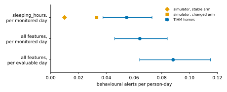
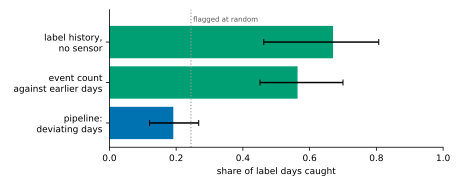
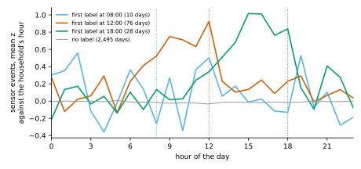
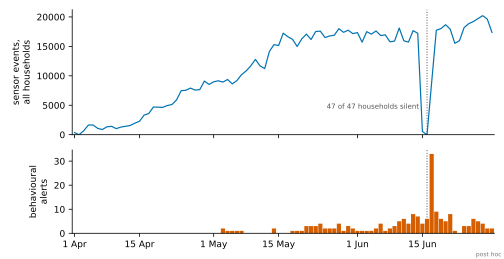
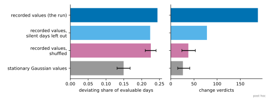
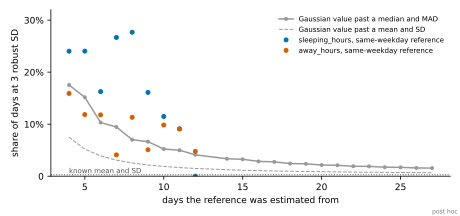

# TIHM: alert-burden results

The frozen [alert-burden protocol](TIHM_ALERT_BURDEN_PROTOCOL.md) run as declared on the 56 homes of the TIHM dataset. This page is generated entirely from the record, `artifacts/tihm/tihm-alert-burden.json`, and its last part from a second record, `artifacts/tihm/tihm-alert-burden-post-hoc.json`, by `sensor_modeling.datasets.tihm_summary.render_page`, and a test checks that the committed page is exactly that rendering.

**Status: exploratory: descriptive of these homes; no threshold, mapping or model setting is chosen from them, and nothing here is a held-out or confirmatory claim.**

- **Protocol.** SHA-256 `7f6c0eff69ab91dbbe51aeef432b941cc512c096298f3d7294c96b3eb2fc304a`, checked against the frozen file, with the mapping and every dataset file's digest, before the run.
- **Run.** Commit `b15126f`, with no uncommitted change; recorded 2026-10-07T09:44:32.946023+00:00.
- Exploratory. The dataset's labels had been analysed before the protocol was written; the protocol was committed before any pipeline output was compared with a label.
- Nothing was fitted on TIHM. The pipeline's emissions, baseline and alert policy are the declared defaults.
- The labels are alerts a monitoring team verified after an earlier model raised them. A day without a label is not a day without an episode.
- Intervals resample households. Every figure describes these homes and is not an estimate for other homes.
- **Dataset.** Palermo, F.; Chen, Y.; Capstick, A.; Fletcher-Lloyd, N.; Walsh, C.; Kouchaki, S.; True, J.; Balazikova, O.; Soreq, E.; Scott, G.; Rostill, H.; Nilforooshan, R.; Barnaghi, P. TIHM: An open dataset for remote healthcare monitoring in dementia. Scientific Data 10, 606 (2023). https://doi.org/10.1038/s41597-023-02519-y Licence: CC BY 4.0; the dataset's repository asks that Surrey and Borders Partnership NHS Foundation Trust and Howz be acknowledged in any publication or use. The dataset is not redistributed here.

## What the contract converts

|  | Count |
| --- | --- |
| households | 56 |
| converted and run | 56 |
| refused by the contract | none |
| sensor events, emitted | 1,030,559 |
| labels, as point annotations | 608 |
| annotated seconds that map to a behavioural state | 0 |
| validation notice `point_annotations` | 608 |
| validation notice `sensor_semantics` | 432 |

No annotated time maps to a behavioural state, so state inference is not scored on this dataset. Everything below is about what the pipeline raises, not about whether its states are right.

## How much of the record the pipeline uses (H1)

|  | Value |
| --- | --- |
| monitored days | 2,850 |
| usable days | 2,793, 98.0% [97.6%, 98.3%] |
| evaluable days | 2,075, 72.8% [69.9%, 75.2%] |
| households with an evaluable day | 49 of 56 |
| mean sensor coverage | 0.989 |
| mean observed fraction of the day | 0.982 |
| mean abstention on usable days | 0.06% |
| system-health alerts | none |
| data-quality alerts | none |

Feature-days by the baseline's verdict:

| Verdict | Feature-days |
| --- | --- |
| abrupt change | 79 |
| gradual drift | 94 |
| insufficient data | 3,100 |
| ordinary | 7,648 |
| persistent change | 15 |
| temporary disturbance | 464 |

## The alert burden (B1 to B3)

| Estimand | Behavioural alerts per person-day |
| --- | --- |
| B1: all features, per monitored day | 0.0642 [0.0461, 0.0840] |
| B2: `sleeping_hours` alone, per monitored day | 0.0547 [0.0377, 0.0730] |
| simulator, stable arm, `sleeping_hours`: a reference, not a test | 0.010 |
| simulator, changed arm, `sleeping_hours`: a reference, not a test | 0.033 |
| B3: all features, per evaluable day | 0.0882 [0.0641, 0.1151] |

The simulator's figures are from docs/ADVERSARIAL_REVIEW.md, item i4; docs/RESEARCH_QUESTIONS.md, RQ4.

|  | Value |
| --- | --- |
| behavioural alerts | 183 |
| about `away_hours` | 20 |
| about `kitchen_activity_hours` | 7 |
| about `sleeping_hours` | 156 |
| of severity attention | 56 |
| of severity information | 127 |
| alert days | 174, 8.4% [6.1%, 10.9%] of evaluable days |
| deviating days | 507, 24.4% [21.9%, 27.1%] of evaluable days |
| households with an alert | 39 of 56 |
| most alerts in one household | 20 |

## Whether the flags relate to the verified labels (A1 to A3)

Of the 2,075 evaluable days, 94 are `Agitation` label days, in 26 households: 4.5% [2.8%, 6.5%] of evaluable days.

| Flag | Label days flagged | Share of label days | Share of other days | Difference, points | The interval of the difference | Share of flagged days that are label days |
| --- | --- | --- | --- | --- | --- | --- |
| A1: alert day | 5 of 94 | 5.3% [1.4%, 10.1%] | 8.5% [6.1%, 11.2%] | -3.2 [-7.9, +1.9] | includes zero | 2.9% [0.7%, 5.6%] |
| A2: deviating day | 18 of 94 | 19.1% [12.0%, 26.8%] | 24.7% [22.1%, 27.5%] | -5.5 [-13.0, +2.5] | includes zero | 3.6% [1.9%, 5.5%] |

- **A3.** A label day has a higher deviation score than another evaluable day of the same household with probability 0.466 [0.410, 0.530], over 3,867 pairs in 26 households. A score unrelated to the labels gives 0.5; the interval includes 0.5.

The same against a label of any type:

| Flag | Label days flagged | Share of label days | Share of other days | Difference, points | The interval of the difference | Share of flagged days that are label days |
| --- | --- | --- | --- | --- | --- | --- |
| alert day | 17 of 341 | 5.0% [2.7%, 7.7%] | 9.1% [6.5%, 11.8%] | -4.1 [-6.9, -1.2] | below zero | 9.8% [5.9%, 14.4%] |
| deviating day | 63 of 341 | 18.5% [14.7%, 22.5%] | 25.6% [22.8%, 28.6%] | -7.1 [-11.3, -2.7] | below zero | 12.4% [8.5%, 17.0%] |

- **Deviation score.** Concordance 0.452 [0.417, 0.490], over 10,828 pairs in 45 households; the interval below 0.5.

## What a flag has to beat (R1)

Each rule flags 507 of the 2,075 evaluable days, as many as the pipeline has deviating days. There are 94 label days.

| Rule | Label days caught | Share of label days | Minus the pipeline, points |
| --- | --- | --- | --- |
| pipeline: deviating days | 18 | 19.1% [12.0%, 26.8%] | — |
| flagged at random, expected | 23.0 | 24.4% | — |
| event count against the household's earlier days | 53 | 56.4% [45.1%, 70.0%] | +37.2 [+26.5, +50.0] |
| label history, no sensor | 63 | 67.0% [46.2%, 80.7%] | +47.9 [+23.4, +64.5] |

- **Event count, without a cut.** A label day has a higher event-count score than another evaluable day of the same household with probability 0.793 [0.722, 0.855]; the interval above 0.5.

## On the published baseline's protocol (P1)

Every test period rebuilt here has the published number of person-days and label days:

| Test week, newest first | Person-days | Label days |
| --- | --- | --- |
| 1 | 357 | 10 |
| 2 | 314 | 8 |
| 3 | 310 | 13 |
| 4 | 307 | 17 |
| 5 | 304 | 23 |

Each rule raises the published model's 341 alerts, week by week, over 1,592 person-days with 71 label days.

| Rule | Label days caught | Share of label days |
| --- | --- | --- |
| published logistic regression, quoted | 55 | 77.5% |
| label history, no sensor | 51.4 | 72.4% [46.5%, 85.9%] |
| event count against the household's earlier days | 36 | 50.7% [39.7%, 67.4%] |
| flagged at random, expected | 15.2 | 21.4% |

- **The published model, quoted.** Mean weekly sensitivity 0.799 and specificity 0.812; 286 of its alerts are on other days, so 16.1% of its alerts are on label days; 6.52 alerts per person-month, 5.47 of them on other days.
- **Concentration.** 55 households have a test day, 23 of them a label day, and the five with most hold 60.6% of the label days.

## What the labels are

| Label | Rows | Label days | Households |
| --- | --- | --- | --- |
| `Agitation` | 135 | 115 | 27 |
| `Blood pressure` | 305 | 251 | 42 |
| `Body temperature` | 1 | 1 | 1 |
| `Body water` | 68 | 63 | 6 |
| `Pulse` | 95 | 76 | 16 |
| `Weight` | 4 | 4 | 3 |

7 households have no label of any type. Of the 135 `Agitation` rows, on 115 days:

- **When.** 10 at 08:00, 79 at 12:00, 45 at 18:00, 1 elsewhere; the latest on a slot is 154 seconds past it.
- **Who.** 27 households have one and 29 never do; the household with most holds 19.1% of the label days and the five with most 54.8%.
- **After a label day.** 25.2% of the days after a label day are label days, against 3.2% of the days after another monitored day.

Sensor events in each block of the day, as a mean z-score against the same household's block over its full monitored days:

| Slot of the day's first label | Days | 00-06 | 06-12 | 12-18 | 18-24 |
| --- | --- | --- | --- | --- | --- |
| 08:00 | 10 | +0.36 | +0.10 | +0.26 | +0.04 |
| 12:00 | 76 | +0.13 | +1.01 | +0.53 | +0.28 |
| 18:00 | 28 | +0.02 | +0.09 | +1.13 | +0.51 |
| no label | 2,495 | -0.01 | -0.03 | -0.03 | -0.01 |

Label days against the limits the dataset paper states:

| Label | Label days | Days with a reading | Days meeting the limits | Label days meeting them | Label days without a reading | Days meeting them without a label | Readings, lowest to highest |
| --- | --- | --- | --- | --- | --- | --- | --- |
| `Blood pressure` | 251 | 1,733 | 63 | 58 | 3 | 5 | Diastolic blood pressure 40 to 194; Systolic blood pressure 70 to 211 |
| `Body temperature` | 1 | 2,082 | 39 | 1 | 0 | 38 | Body Temperature 32.147 to 42.96 |
| `Body water` | 63 | 1,143 | 15 | 13 | 50 | 2 | Total body water 36 to 78 |
| `Pulse` | 76 | 1,733 | 142 | 70 | 0 | 72 | Heart rate 42 to 132 |

## Every household

| Household | Monitored days | Usable | Evaluable | Behavioural alerts | Alert days | Deviating days | Agitation label days | Days with any label | Sensor events |
| --- | --- | --- | --- | --- | --- | --- | --- | --- | --- |
| `0697d` | 3 | 2 | 0 | 0 | 0 | 0 | 0 | 3 | 1,044 |
| `099bc` | 47 | 46 | 32 | 1 | 1 | 9 | 1 | 8 | 11,938 |
| `0cda9` | 77 | 76 | 62 | 1 | 1 | 11 | 1 | 49 | 30,947 |
| `0d5ef` | 49 | 48 | 34 | 5 | 4 | 12 | 10 | 17 | 19,500 |
| `0efe8` | 48 | 47 | 33 | 5 | 5 | 14 | 0 | 4 | 14,367 |
| `0f352` | 6 | 5 | 0 | 0 | 0 | 0 | 0 | 0 | 2,468 |
| `16f4b` | 91 | 91 | 77 | 7 | 7 | 19 | 11 | 13 | 33,066 |
| `1fbe4` | 68 | 67 | 53 | 11 | 8 | 19 | 0 | 9 | 29,804 |
| `201d8` | 74 | 73 | 59 | 12 | 12 | 13 | 1 | 7 | 26,416 |
| `28710` | 46 | 45 | 31 | 3 | 3 | 9 | 0 | 21 | 23,063 |
| `2b131` | 5 | 4 | 0 | 0 | 0 | 0 | 0 | 0 | 2,801 |
| `2f54b` | 60 | 59 | 45 | 2 | 2 | 10 | 0 | 6 | 20,476 |
| `30a32` | 66 | 65 | 51 | 0 | 0 | 17 | 0 | 19 | 20,265 |
| `385de` | 21 | 20 | 6 | 0 | 0 | 2 | 0 | 3 | 6,520 |
| `393cb` | 68 | 67 | 53 | 3 | 3 | 7 | 1 | 34 | 21,197 |
| `3fb61` | 72 | 71 | 57 | 7 | 7 | 22 | 2 | 6 | 17,971 |
| `46286` | 38 | 37 | 23 | 6 | 6 | 13 | 1 | 20 | 11,075 |
| `55cd4` | 77 | 76 | 62 | 10 | 9 | 23 | 0 | 2 | 18,187 |
| `561af` | 32 | 31 | 17 | 0 | 0 | 2 | 0 | 5 | 5,490 |
| `56b6b` | 60 | 59 | 45 | 11 | 11 | 14 | 0 | 5 | 18,825 |
| `65db4` | 52 | 51 | 37 | 2 | 2 | 8 | 0 | 7 | 14,165 |
| `6b29b` | 74 | 73 | 59 | 10 | 10 | 18 | 2 | 24 | 28,943 |
| `714d7` | 40 | 38 | 24 | 5 | 5 | 11 | 0 | 1 | 8,433 |
| `73f7c` | 49 | 48 | 34 | 3 | 2 | 8 | 22 | 24 | 34,114 |
| `76230` | 5 | 3 | 0 | 0 | 0 | 0 | 0 | 0 | 1,610 |
| `7db78` | 69 | 68 | 54 | 3 | 2 | 15 | 7 | 9 | 32,560 |
| `8a835` | 75 | 74 | 60 | 1 | 1 | 14 | 2 | 6 | 28,230 |
| `8d0d4` | 69 | 68 | 54 | 1 | 1 | 13 | 1 | 3 | 24,898 |
| `93c14` | 49 | 48 | 34 | 0 | 0 | 6 | 11 | 14 | 19,568 |
| `95899` | 45 | 44 | 30 | 1 | 1 | 3 | 1 | 1 | 17,614 |
| `96adf` | 55 | 54 | 40 | 1 | 1 | 9 | 1 | 1 | 21,457 |
| `a2849` | 61 | 60 | 46 | 1 | 1 | 10 | 6 | 6 | 23,760 |
| `a380e` | 26 | 24 | 10 | 0 | 0 | 3 | 0 | 5 | 9,403 |
| `a539e` | 59 | 58 | 44 | 4 | 4 | 11 | 0 | 1 | 12,706 |
| `ab47a` | 42 | 40 | 26 | 1 | 1 | 5 | 0 | 6 | 11,243 |
| `b0455` | 10 | 9 | 0 | 0 | 0 | 0 | 0 | 0 | 3,776 |
| `b45c2` | 76 | 75 | 61 | 7 | 7 | 8 | 0 | 5 | 25,964 |
| `b9d58` | 91 | 91 | 77 | 6 | 6 | 12 | 4 | 4 | 46,654 |
| `c5031` | 47 | 46 | 32 | 3 | 3 | 1 | 9 | 9 | 20,892 |
| `c55f8` | 91 | 91 | 77 | 1 | 1 | 13 | 0 | 11 | 36,197 |
| `c5785` | 68 | 67 | 53 | 1 | 1 | 10 | 0 | 9 | 22,778 |
| `c8574` | 54 | 53 | 39 | 1 | 1 | 6 | 0 | 0 | 22,329 |
| `ca44d` | 41 | 40 | 26 | 0 | 0 | 8 | 0 | 33 | 11,652 |
| `d263a` | 69 | 68 | 54 | 1 | 1 | 11 | 1 | 3 | 27,842 |
| `d44d2` | 18 | 17 | 3 | 0 | 0 | 0 | 0 | 4 | 3,344 |
| `d7a46` | 24 | 23 | 9 | 0 | 0 | 2 | 1 | 4 | 9,324 |
| `d8d97` | 7 | 6 | 0 | 0 | 0 | 0 | 0 | 0 | 1,600 |
| `d93d8` | 54 | 53 | 39 | 1 | 1 | 8 | 6 | 23 | 29,660 |
| `e2472` | 33 | 32 | 18 | 0 | 0 | 8 | 0 | 4 | 12,923 |
| `e4959` | 67 | 66 | 52 | 3 | 3 | 11 | 4 | 6 | 26,335 |
| `e87bd` | 42 | 41 | 27 | 1 | 1 | 4 | 1 | 4 | 14,375 |
| `e8a78` | 76 | 75 | 61 | 20 | 19 | 23 | 3 | 4 | 30,702 |
| `ec812` | 79 | 78 | 64 | 12 | 12 | 19 | 4 | 6 | 24,486 |
| `eca1f` | 55 | 54 | 40 | 9 | 8 | 5 | 1 | 4 | 26,821 |
| `f220c` | 66 | 65 | 51 | 0 | 0 | 8 | 0 | 0 | 7,129 |
| `fd100` | 4 | 3 | 0 | 0 | 0 | 0 | 0 | 1 | 1,652 |

## After the run: post hoc descriptions

**Status: post hoc: every description here was chosen after the protocol's results had been read; none is part of the protocol, enters an estimand or changes a result.**

This part is generated from a second record, `artifacts/tihm/tihm-alert-burden-post-hoc.json`. It describes the run recorded 2026-10-07T09:44:32.946023+00:00 at commit `b15126f`: the households were run again, and the descriptions were refused unless scoring them gave the results above.

The protocol reports with no retuning and no added reference after scoring, and that holds for everything above. What follows adds comparisons and one changed replay to explain those results. It replaces none of them, it carries no interval over households, and every heading and figure below is post hoc.

- Post hoc. Every description was chosen after the protocol's results had been read. None is part of the protocol.
- A replay that leaves silent days out is a diagnosis of the run, not a corrected result.
- The dataset holds sensor activations and no signal that a sensor or its gateway was working. A silent day may be an empty home or an apparatus that was not reporting; the data cannot say which. The dataset paper attributes a large drop in the activity data in mid-June 2019 to a technical failure in the data collection server.
- The stationary and shuffled replays re-run the baseline alone. They count verdicts, not alerts: the alert policy is not replayed.

### Post hoc: what the filter infers

Expected hours per state over the 2,793 usable days. No annotation says what the residents were doing, so these are not scored; they are what the baseline's features are made of.

| State | Median hours | Tenth percentile | Ninetieth percentile |
| --- | --- | --- | --- |
| away | 1.25 | 0.19 | 2.81 |
| bathroom activity | 0.00 | 0.00 | 0.05 |
| bed awake | 0.38 | 0.11 | 1.17 |
| home active | 2.06 | 0.34 | 4.73 |
| home inactive | 7.51 | 1.39 | 11.03 |
| kitchen activity | 0.06 | 0.00 | 0.52 |
| sleeping | 10.94 | 7.52 | 19.72 |

A household's median day has between 5.6 and 20.2 hours inferred as sleeping, with a median of 10.8 over 56 households.

### Post hoc: silent days

A silent day is a monitored day on which no sensor of the home reported an event.

|  | Value |
| --- | --- |
| silent days | 128 of 2,850 monitored days, 4.5% |
| households with one | 47 |
| longest run of silent days | 12 |
| runs by length in days | 1: 46, 2: 11, 3: 4, 4: 2, 5: 3, 6: 1, 7: 1, 12: 1 |
| silent days the pipeline counts as usable | 128 |
| silent days that are evaluable | 108 |
| median hours inferred as sleeping, silent days | 23.8 |
| median hours inferred as sleeping, other usable days | 10.8 |
| change verdicts on a silent day | 44 of 188 |
| behavioural alerts on a silent day | 44 of 183 |
| of them, `away_hours: gradual_drift` | 1 |
| of them, `sleeping_hours: abrupt_change` | 39 |
| of them, `sleeping_hours: persistent_change` | 4 |

| Evaluable days | Days | Silent | Share silent |
| --- | --- | --- | --- |
| alert days | 174 | 43 | 24.7% |
| deviating days | 507 | 92 | 18.1% |
| label days | 94 | 1 | 1.1% |
| all evaluable days | 2,075 | 108 | 5.2% |

### Post hoc: the calendar

The date on which most households are silent is 2019-06-16: 47 of the 47 monitored that day. The days around it:

| Date | Households monitored | Silent | Sensor events, all households | Behavioural alerts |
| --- | --- | --- | --- | --- |
| 2019-06-13 | 47 | 3 | 17,670 | 8 |
| 2019-06-14 | 47 | 3 | 17,227 | 7 |
| 2019-06-15 | 47 | 10 | 544 | 4 |
| 2019-06-16 | 47 | 47 | 0 | 6 |
| 2019-06-17 | 47 | 2 | 8,906 | 33 |
| 2019-06-18 | 47 | 0 | 17,738 | 9 |
| 2019-06-19 | 47 | 1 | 18,013 | 6 |

The day after it, 2019-06-17, holds 33 of the 183 behavioural alerts, 18.0%.

### Post hoc: replays of the baseline

- **Recorded.** The baseline over each household's recorded feature values; it must give the run's own verdicts.
- **Silent days left out.** The same, with every silent day left out of the history as an unobserved day is.
- **Shuffled.** Each household's recorded days in a random order, a day's features kept together, which keeps the values and what occurs on the same day and removes their order in time, weekly rhythm included.
- **Stationary Gaussian.** Independent Gaussian values with each household's own median and MAD-based spread of each feature, on the same days.

| Values | Evaluable days | Deviating share of evaluable days | Change verdicts | Abrupt change | Gradual drift | Persistent change | Temporary disturbance |
| --- | --- | --- | --- | --- | --- | --- | --- |
| Recorded | 2,075 | 24.4% | 188 | 79 | 94 | 15 | 464 |
| Silent days left out | 1,947 | 22.4% | 78 | 17 | 53 | 8 | 449 |
| Shuffled | 2,075 | 22.6% (21.0% to 24.1%) | 37.9 (24.0 to 53.0) | 5.2 (1.0 to 12.0) | 30.8 (19.0 to 43.0) | 1.9 (0.0 to 5.0) | 511.8 (473.0 to 551.0) |
| Stationary Gaussian | 2,075 | 14.9% (13.1% to 16.8%) | 26.2 (15.0 to 41.0) | 0.7 (0.0 to 3.0) | 25.1 (14.0 to 40.0) | 0.4 (0.0 to 2.0) | 327.1 (285.9 to 367.0) |

The shuffled and stationary rows are the mean over 200 replicates, with the range that holds the central 95% of them. A change verdict is one of abrupt change, persistent change or gradual drift.

- **The recorded replay gives the run's own verdicts:** yes, with 0 of 11,400 feature-days differing in verdict or deviation.
- **What leaving silent days out removes.** 44 of the run's 188 change verdicts are on silent days themselves, which the changed replay does not judge; the rest of the difference is on later days whose history no longer holds them. The two rows count different numbers of evaluable days.
- **Label days, as a description and not the protocol's A2.** With silent days left out, 18.7% of 91 label days deviate, against 22.6% of other evaluable days. The rule was written after the alerts had been read, and the figures carry no interval.

### Post hoc: reference size

The baseline calls a day deviating at 3 robust standard deviations from a median, with the spread taken from the median absolute deviation. Against a known mean and standard deviation a Gaussian value is that far out 0.27% of the time. The reference is pooled until 4 days of the same weekday exist, and is then estimated from those days alone; the first verdict needs 14 days. The table gives how often a Gaussian value reaches the threshold against a mean and standard deviation of that many others, which is exact, and against a median and MAD of that many others, from 2,000,000 draws per size, beside the share of feature-days that reach it here. Those shares are raw: a cell of a few dozen feature-days is noisy, and none has an interval.

| Same-weekday days in the reference | Gaussian value past a mean and SD | Gaussian value past a median and MAD | `away_hours` past its reference | `bathroom_activity_hours` past its reference | `kitchen_activity_hours` past its reference | `sleeping_hours` past its reference |
| --- | --- | --- | --- | --- | --- | --- |
| 4 | 7.5% | 17.5% | 15.9% of 308 | 0.0% of 308 | 0.6% of 308 | 24.0% of 308 |
| 5 | 5.2% | 15.2% | 11.8% of 287 | 0.0% of 287 | 0.3% of 287 | 24.0% of 287 |
| 6 | 3.9% | 10.3% | 11.8% of 246 | 0.0% of 246 | 0.4% of 246 | 16.3% of 246 |
| 7 | 3.1% | 9.5% | 4.1% of 195 | 0.0% of 195 | 0.0% of 195 | 26.7% of 195 |
| 8 | 2.5% | 7.0% | 11.3% of 159 | 0.0% of 159 | 1.3% of 159 | 27.7% of 159 |
| 9 | 2.2% | 6.6% | 5.1% of 118 | 0.0% of 118 | 2.5% of 118 | 16.1% of 118 |
| 10 | 1.9% | 5.2% | 9.8% of 61 | 0.0% of 61 | 3.3% of 61 | 11.5% of 61 |
| 11 | 1.7% | 5.0% | 9.1% of 22 | 0.0% of 22 | 13.6% of 22 | 9.1% of 22 |
| 12 | 1.5% | 4.1% | 4.8% of 21 | 0.0% of 21 | 14.3% of 21 | 0.0% of 21 |

| Feature | Feature-days with a verdict | At the threshold | Above | Below | Gaussian value past a median and MAD, same reference sizes | At the threshold, pooled reference | At the threshold, same-weekday reference | References at the scale floor |
| --- | --- | --- | --- | --- | --- | --- | --- | --- |
| `away_hours` | 2,075 | 8.4% | 5.8% | 2.6% | 8.7% | 3.2% of 658 | 10.8% of 1,417 | 11.3% |
| `bathroom_activity_hours` | 2,075 | 0.0% | 0.0% | 0.0% | 8.7% | 0.0% of 658 | 0.0% of 1,417 | 100.0% |
| `kitchen_activity_hours` | 2,075 | 1.1% | 1.0% | 0.1% | 8.7% | 0.8% of 658 | 1.2% of 1,417 | 86.8% |
| `sleeping_hours` | 2,075 | 17.4% | 14.9% | 2.6% | 8.7% | 8.4% of 658 | 21.7% of 1,417 | 1.3% |

The scale floor is 0.25 hours; the Gaussian rate applies no floor to the scale, so it overstates a feature whose references sit at the floor. The Monte Carlo standard error of a simulated rate is at most 0.03 points.

### Post hoc: direction

The feature with the largest deviation on each deviating day, and which side of its reference the day fell:

| Driver | Label days | Other days |
| --- | --- | --- |
| `away_hours`, above | 4 | 108 |
| `away_hours`, below | 1 | 26 |
| `kitchen_activity_hours`, above | 0 | 19 |
| `kitchen_activity_hours`, below | 0 | 1 |
| `sleeping_hours`, above | 8 | 293 |
| `sleeping_hours`, below | 5 | 42 |
| all deviating days | 18 | 489 |

| Feature | Median deviation, label days | Median deviation, other days | At the threshold, label days | At the threshold, other days |
| --- | --- | --- | --- | --- |
| `away_hours` | -0.24 | -0.03 | 5.3% | 8.5% |
| `bathroom_activity_hours` | 0.00 | 0.00 | 0.0% | 0.0% |
| `kitchen_activity_hours` | 0.00 | -0.01 | 0.0% | 1.1% |
| `sleeping_hours` | -0.32 | +0.13 | 13.8% | 17.6% |

The event-count score is the day's sensor event count against the household's previous monitored days, as the protocol's event-count reference computes it:

| Evaluable days | Days | Mean event-count score | Median |
| --- | --- | --- | --- |
| alert days | 174 | -0.91 | -0.93 |
| deviating days | 507 | -1.17 | -1.01 |
| label days | 94 | +0.86 | +0.80 |
| all evaluable days | 2,075 | -0.18 | +0.03 |

Behavioural alerts by feature and the verdict behind them:

| Feature and verdict | Alerts |
| --- | --- |
| `away_hours`, gradual drift | 20 |
| `kitchen_activity_hours`, gradual drift | 5 |
| `kitchen_activity_hours`, persistent change | 2 |
| `sleeping_hours`, abrupt change | 77 |
| `sleeping_hours`, gradual drift | 69 |
| `sleeping_hours`, persistent change | 10 |
